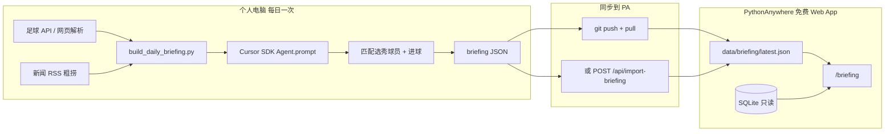
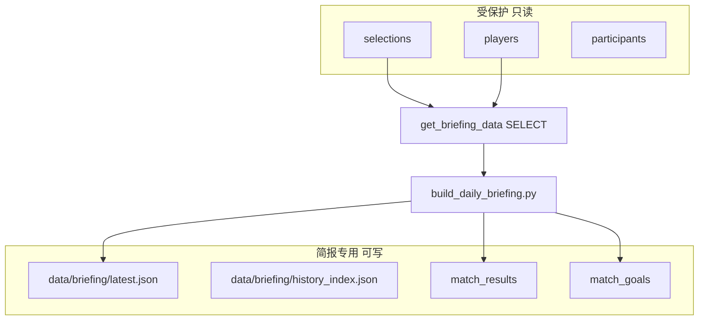
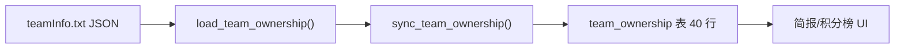
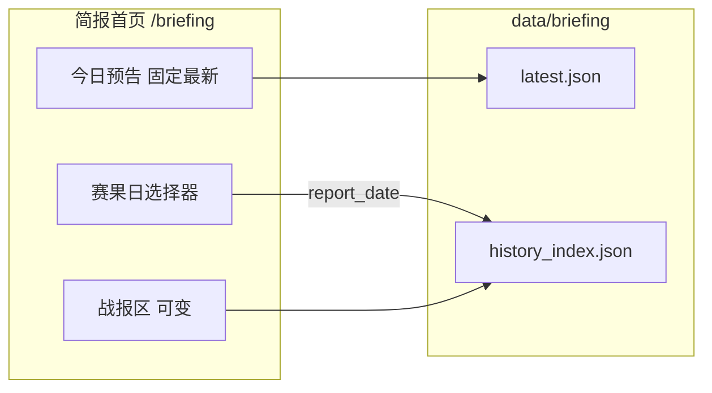
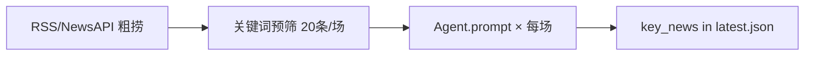
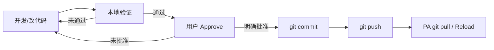
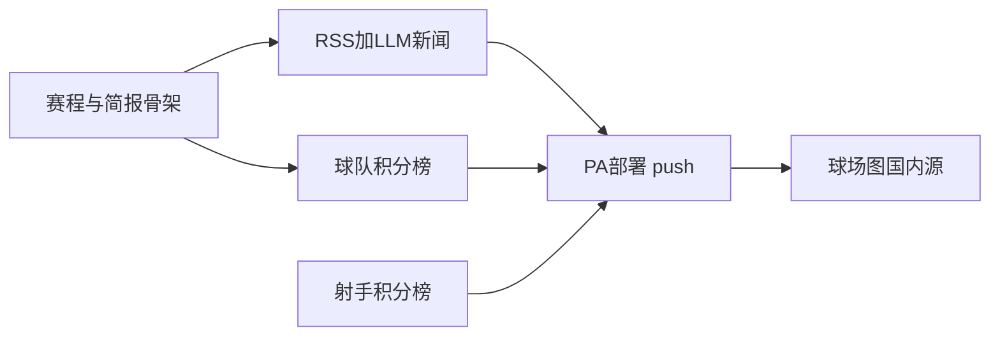

# 世界杯每日简报（最终计划）

> **计划文档约定**：本仓库「每日简报 / 战报 / 今日预告 / 关键新闻 / LLM 筛选 / 历史战报 / 积分榜」等相关需求，**只更新本文件**（`世界杯比赛介绍页_249a23ba.plan.md`）。使用 `CreatePlan` 工具时，生成后须**立即合并进本文件**，不保留仅存在于 Cursor 临时目录的平行 plan。子计划（如实时得分榜）可保留独立文件，但须在本文增加交叉引用。

## 产品定位（需求变更）

前端 Mock 已确认，**保持现有视觉**（`[templates/match_intro_mock.html](templates/match_intro_mock.html)`）。

**功能首页**：[`GET /briefing`](app.py) 为简报主入口（非选秀页 `/`）。选秀页 header 增加「每日简报」链回首页；可选将站点根路径重定向到 `/briefing`（实现时再定，默认保留 `/` 选秀、简报为并列主入口）。

产品从「赛程浏览站」调整为 **每天一份情况简报**：


| 区块       | 内容                                                         |
| -------- | ---------------------------------------------------------- |
| **战报** | 默认显示**昨日**完场；可通过赛果日选择器回看 **6/11、6/12…** 任意历史日：比分 + 我方选秀射手 **+N**（见 [历史战报](#历史战报按赛果日查看)） |
| **今日预告** | 北京时间**单个日历日**的全部比赛：当日有赛则显示当日；**无赛则仅前滚至最近下一个有赛日**（如 6/7 → 只显示 6/11，**不含** 6/18、6/25）。含对阵、开球北京时间（含月日）、归属；**每场附 3 条最关键新闻**（见下节）；可进入 PES 风格单场页 |
| **积分榜入口** | 链至球队 / 射手实时得分榜（见 [实时得分榜计划](.cursor/plans/实时得分榜页面_957f9947.plan.md)） |

### 今日预告 · 每场 3 条关键新闻（新增）

在「今日预告」每个对阵卡片内，展示 **最多 3 条** 可能影响比分的新闻，面向当日参赛 **双方球队**（主队 + 客队各可出现）。

**筛选标准（按影响程度优先）**：

| 优先级 | 类别 `category` | 示例 |
|--------|-----------------|------|
| 高 | `injury` 伤病 | 主力前锋赛前受伤、门将出战成疑 |
| 高 | `suspension` 停赛 | 核心中场累积黄牌缺阵 |
| 中 | `lineup` 阵容 | 主教练暗示轮换、战术体系调整 |
| 中 | `discord` 队内不和 | 更衣室矛盾、球员与教练公开分歧 |
| 中 | `form` 状态 | 关键球员连续多场未进球、体能隐患 |
| 低 | `other` 其他 | 天气极端、旅途疲劳等 |

**筛选实现（已确认）**：本机 **Windows 任务计划 + Cursor SDK**（`composer-2.5`，扣 Pro Composer 用量池）。流程为 RSS/NewsAPI **粗捞** → 关键词 **预筛至约 20 条/场** → **`Agent.prompt` 精排 Top 3**（每场 1 次，不用 Agent 读仓库工具）。失败时回退关键词打分或 `news_overrides.json`。

示例（今日预告卡片内）：

```
巴西 vs 摩洛哥 · 22:00 · 归属：耗子 vs NA
① [伤病·巴西] 维尼修斯大腿不适，训练缺席 — 影响：高
② [停赛·摩洛哥] 阿什拉夫上一场红牌，本场禁赛 — 影响：高
③ [阵容·巴西] 主帅暗示可能变阵三中卫 — 影响：中
[进入比赛]
```


示例（昨日战报卡片内）：

```
墨西哥 2 — 1 南非
耗子的射手：亚历克西斯·贝加 ★ +1
庆爷的射手：珀西·塔乌 +1
```

---

## 已确认配置（用户提供）

> **安全原则**：计划文档只记录**文件路径与变量名**；[`AIKey.txt`](static/basedata/AIKey.txt)、[`football-data.txt`](static/basedata/football-data.txt) 中的密钥**禁止**写入 plan 或提交 git。实现阶段将 `static/basedata/*.txt` 加入 [`.gitignore`](.gitignore)。

| 配置项 | 路径 / 值 | 说明 |
|--------|-----------|------|
| 48 队归属 | [`static/basedata/teamInfo.txt`](static/basedata/teamInfo.txt) | **已填入**；5 人各 8 队 + 8 队 NA（详见 [§9](#9-已确认配置)） |
| football-data API | [`static/basedata/football-data.txt`](static/basedata/football-data.txt) | **已填入**；单行 token；构建脚本读取 |
| Cursor API | [`static/basedata/AIKey.txt`](static/basedata/AIKey.txt) | **已落盘**；仅 PC 本地 SDK 使用 |
| PythonAnywhere | `https://tolerance.pythonanywhere.com/` | `scraper_config`、部署说明、可选 `--upload` 目标 |

### teamInfo.txt 格式（JSON）

```json
{
  "耗子": ["墨西哥", "巴西", "..."],
  "庆爷": ["..."],
  "李总": ["..."],
  "老闫": ["..."],
  "老王": ["..."]
}
```

- 键名与 [`seed_data.py`](seed_data.py) 中 5 名 `participants` 一致
- 队名与 `teams` 表中文名一致
- 每人 **恰好 8 队**；全文件合计 **40 队**（48 队中 **8 队无归属**，UI 显示 **`NA`**，球队积分榜**不计分**）

### 密钥加载策略（PC 构建脚本）

- 默认从 `static/basedata/*.txt` 读取单行 token（`read_secret(path)`，strip 空白）
- 环境变量 `FOOTBALL_DATA_TOKEN` / `CURSOR_API_KEY` 作为**可选覆盖**（若已设置则优先于文件）
- `scripts/smoke_cursor_sdk.py` 同样读 `AIKey.txt`（或 env 覆盖）

---

## 架构：个人电脑采集 + PA 只读展示




### 为何这样设计（PA 免费版限制）


| PA 限制                   | 对策                                           |
| ----------------------- | -------------------------------------------- |
| 出站 HTTP 仅白名单            | **不在 PA 上拉外部 API**；个人电脑无此限制                  |
| 无 Scheduled Tasks（新免费号） | **不在 PA 上跑定时爬虫**；PC 用 Windows 任务计划程序每日执行构建脚本 |
| 100 CPU 秒/日             | PA 只读 JSON + 渲染 HTML，消耗极低                    |
| 512MB 磁盘                | 赛程 JSON + 每日简报 JSON + 已有球场/国旗图片，足够           |


**PA 上仅保留**：读 `data/briefing/latest.json`（及可选 SQLite 镜像）、渲染页面、可选 `POST /api/import-briefing` 接收 PC 推送。

---

## 选秀射手数据隔离（核心约束）

**原则：简报功能只「读」选秀结果，绝不「写」选秀数据。**

现有选秀相关表视为 **只读数据源**，本功能不得对其执行 INSERT / UPDATE / DELETE：

| 受保护表 | 用途 | 简报功能权限 |
|----------|------|--------------|
| `selections` | 5 人已选射手 | **仅 SELECT** |
| `players` | 球员名单 | **仅 SELECT** |
| `participants` | 5 位参与者 | **仅 SELECT** |
| `teams` | 48 支球队 | **仅 SELECT** |
| `game_state` | 选秀进度 | **不访问** |
| `preselect_queues` | 预选队列 | **不访问** |

简报功能 **独立写入** 的数据（与选秀隔离）：

| 新增存储 | 写入方 | 内容 |
|----------|--------|------|
| `data/briefing/latest.json` | PC 构建 / `import-briefing` | 当日最新简报（今日预告 + 默认昨日战报） |
| `data/briefing/history_index.json` | PC 构建 / `import-briefing` | 按赛果日索引的全部历史战报 |
| `data/briefing/YYYY-MM-DD.json` | PC 构建（可选归档） | 每日完整简报快照，供调试与回填 |
| `team_ownership` | 仅 `seed_data.py` + 独立 sync | 40 队有归属（8 队无行 → UI 显示 NA，见下节） |
| `match_results` | 可选，仅简报同步 | 比分、赛果 |
| `match_goals` | 可选，仅简报同步 | 进球记录（+N 计算用） |



### 实现保障（5 条硬规则）

1. **代码分层**  
   - 新建 [`briefing_data.py`](briefing_data.py)（或 `app.py` 内独立模块），所有简报逻辑集中在此。  
   - 选秀逻辑仍在 [`game_logic.py`](game_logic.py)，**两个模块互不 import 写操作**。

2. **查询函数只读**  
   ```python
   def get_selections_for_display(db):
       """简报用：只读查询，禁止在此函数内 commit 写操作"""
       return db.execute('''
           SELECT p.name AS participant, pl.id, pl.name_cn, ...
           FROM selections s
           JOIN participants p ON ...
           JOIN players pl ON ...
       ''').fetchall()
   ```

3. **PC 构建脚本以只读方式打开 DB**  
   ```python
   conn = sqlite3.connect(f'file:{db_path}?mode=ro', uri=True)
   ```
   避免脚本误写 `selections`；输出只写 `data/briefing/` 下的 JSON 文件。

4. **`import-briefing` 端点白名单写入**  
   - 仅允许写入 `data/briefing/latest.json`、`data/briefing/history_index.json`（及可选按日归档 JSON）。  
   - **禁止** 解析请求体去更新 `selections` / `players` / `game_state`。

5. **迁移只做加法，禁止重跑 seed**  
   - 简报相关迁移：`CREATE TABLE IF NOT EXISTS team_ownership / match_results / match_goals`。  
   - **不得** 因简报功能调用 `init_db()` 或 `seed_database()`（二者会 `DROP selections` 清空选秀）。  
   - 修改 [`ensure_db_initialized()`](app.py)：将「空 name_cn 则全量 re-seed」与简报迁移拆离；PA 上已有选秀进度时，只做 `ALTER`/建新表。

### 页面数据流（不改变选秀）

- **今日预告 · 5 人射手列**：实时 `SELECT selections`（与现有 `/api/state` 同源），仅展示。  
- **昨日战报 · +N**：来自 `briefing JSON` 的 `our_scorers`，是 PC 根据当时 **只读快照** 算好后写入 JSON 的；展示时不回写 DB。  
- 选秀进行中：用户在 `/` 继续选人，简报页下次 PC 构建后自动反映新选人，**无需也禁止** 简报功能去改 `selections`。

### 球队归属：只改 `teamInfo.txt`，不动已有功能

球队归属与选秀 **完全解耦**：归属表独立，**唯一配置源** 是 [`static/basedata/teamInfo.txt`](static/basedata/teamInfo.txt)（JSON，见 [已确认配置](#已确认配置用户提供)）。



| 要求 | 做法 |
|------|------|
| 归属要改时 | **只编辑** `teamInfo.txt`，然后执行独立同步 |
| 不碰选秀 | 同步 **仅** 写 `team_ownership` 表，不调用 `init_db()` / `seed_database()` |
| 不碰现有 API | 不提供归属 POST/PUT；[`/api/select`](app.py)、[`game_logic.py`](game_logic.py) 零改动 |
| 不碰 `teams` 表 | 队名仍以现有 `TEAMS` 为准，归属通过 `team_id` 关联 |
| 无归属球队 | 48 队中 **8 队** 不在 JSON 内 → DB 无行 → UI 显示 **`NA`**；球队积分榜**不计**其胜负 |

**更新流程（线下分完队后）：**

```
1. 编辑 static/basedata/teamInfo.txt（5 人 × 8 队 JSON）
2. 运行：python -c "from seed_data import sync_team_ownership; sync_team_ownership()"
   （或 PA 上 git pull 后 Reload，由 ensure_db_initialized 调用同一函数）
3. 仅 team_ownership 被 DELETE + 重插 40 行；selections / game_state 等行数不变
```

**实现（新增于 `seed_data.py`，不并入 `seed_database()`）**

```python
def load_team_ownership():
    """读 teamInfo.txt JSON；校验 5 人 × 8 队、队名存在于 teams、同一队不重复。"""
    path = os.path.join('static', 'basedata', 'teamInfo.txt')
    with open(path, encoding='utf-8') as f:
        data = json.load(f)
    # 校验每人 8 队、合计 40 队、队名合法且不重复
    return data

def sync_team_ownership():
    """仅同步 team_ownership 表；禁止 DROP 其他表。仅插入有归属的 40 队。"""
    ownership = load_team_ownership()
    db = get_db()
    db.execute('DELETE FROM team_ownership')
    for owner_name, team_names in ownership.items():
        participant_id = ...  # SELECT FROM participants WHERE name=?
        for team_name in team_names:
            team_id = ...       # SELECT FROM teams WHERE name=?
            db.execute('INSERT INTO team_ownership ...')
    db.commit()
    db.close()
```

**展示规则**：

- 对阵卡片 / 单场页：`home_owner` / `away_owner` 为 `null` 时渲染 **`NA`**（示例：`巴西 vs 摩洛哥 · 归属：耗子 vs NA`）
- 球队积分榜：仅统计 **有归属球队** 的 W/D/L；`NA` 队赛果不计入任何参与者
- API/JSON 字段：`owner: null` → 前端显示 `NA`

要点：

- **`seed_database()` 保持原样**：仍只负责全量初始化（`init_db` 会清空选秀），**不在其中调用** `sync_team_ownership`，避免误操作。
- **首次部署**：`ensure_db_initialized()` 建表后若 `team_ownership` 为空 → 调一次 `sync_team_ownership()`。
- **后续改归属**：改 `teamInfo.txt` → 手动或启动时 `sync_team_ownership()`；**绝不** 为改归属而 re-seed 整库。
- 简报页对 `team_ownership` 仅 **SELECT**（LEFT JOIN `teams`，无行则 `NA`），与 `selections` 无 FK。

---

## 已确认的前端规范（来自 Mock）

正式模板 **从 mock 复制样式**，包含：

- 真实球场背景图 `[static/stadiums/*.jpg](static/stadiums/)`
- 国旗 PNG（非 emoji）`[static/flags/*.png](static/flags/)`
- 半透明玻璃对阵面板、左右分列、中间 VS/比分
- 球队归属人（`team_ownership`）；无归属显示 **`NA`**
- 球队积分榜：仅统计有归属球队的赛果；无归属队标 `NA` 且不计分（正式页 [`standings_teams.html`](templates/standings_teams.html)）
- 5 人射手列；**前 20 顺位**选秀球员显示 ★
- 进球展示：**+N** 金色徽章（仅昨日战报区）

---

## 1. 数据库 — `[models.py](models.py)`

### `team_ownership`

```sql
CREATE TABLE team_ownership (
    team_id INTEGER PRIMARY KEY REFERENCES teams(id),
    participant_id INTEGER NOT NULL REFERENCES participants(id)
);
```

- **配置源**：[`static/basedata/teamInfo.txt`](static/basedata/teamInfo.txt)（唯一真相，经 `load_team_ownership()` 解析后 sync）
- **写入方式**：仅 [`sync_team_ownership()`](seed_data.py)，**不** 通过 Web API、**不** 通过 `seed_database()` 全量重灌
- **读取方式**：简报页 `SELECT` + JOIN `teams` / `participants`；运行时只读

### `match_results`

```sql
CREATE TABLE match_results (
    fixture_id INTEGER PRIMARY KEY,
    home_team TEXT NOT NULL,
    away_team TEXT NOT NULL,
    home_score INTEGER,
    away_score INTEGER,
    status TEXT NOT NULL DEFAULT 'scheduled',
    played_date TEXT,
    updated_at TEXT NOT NULL DEFAULT (datetime('now'))
);
```

### `match_goals`（新增 — 支持 +N）

```sql
CREATE TABLE match_goals (
    id INTEGER PRIMARY KEY AUTOINCREMENT,
    fixture_id INTEGER NOT NULL,
    player_id INTEGER REFERENCES players(id),
    player_name_cn TEXT NOT NULL,
    team_name TEXT NOT NULL,
    minute INTEGER,
    UNIQUE(fixture_id, player_id, minute)
);
```

- `player_id` 能匹配到 `players` 表时写入，便于关联选秀
- 同一球员同场多球 → 多条记录或聚合为 count，页面显示 **+2**

简报构建脚本负责 **UPSERT**；PA 可选将 JSON 同步进 DB，或 briefing 页直接读 JSON。

---

## 2. 赛程与静态资源

### `[data/fixtures_2026.json](data/fixtures_2026.json)`

**状态：已由 [`scripts/sync_fixtures_from_api.py`](scripts/sync_fixtures_from_api.py) 从 API 同步（72 场小组赛；32 场淘汰赛占位无队名已跳过）。**

| 来源 | 北京 2026-06-11 | 北京 2026-06-12 | 说明 |
|------|-----------------|-----------------|------|
| football-data API（`utcDate` 换算） | **0 场** | **2 场** | 揭幕 `2026-06-11T19:00:00Z` → 北京 **6/12 03:00** |
| football-data API（UTC 日历日） | 1 场 | 2 场 | 仅作对照，**不用** UTC 日聚合预告 |
| 本地 JSON（[`generate_fixtures_2026.py`](scripts/generate_fixtures_2026.py)） | **24 场（错误）** | 0 场 | **唯一错误来源** |

**24 场从哪来**：生成器 `MATCHDAY_DATES[1]='2026-06-11'` + 12 组 × matchday1 每场 2 赛 → 硬写 24 条 `kickoff_beijing: 2026-06-11 …`，与 API **无关**。`resolve_preview_date` 忠实读 JSON，故 UI 曾显示 24 场。

**预告筛选逻辑**（[`briefing_data.fixtures_on_date`](briefing_data.py)）方向正确；**错在 JSON 未用 API 覆盖**。

**修复方案（推荐）**：新增 [`scripts/sync_fixtures_from_api.py`](scripts/sync_fixtures_from_api.py)：

1. `GET /v4/competitions/WC/matches?season=2026`（104 场）
2. **唯一时间源**：`utcDate` → `kickoff_beijing` + `played_date`（[`briefing/time_utils.py`](briefing/time_utils.py)）
3. [`data/team_name_map.json`](data/team_name_map.json) 映射中文队名；`matchday`/`stage` 仅展示，**不参与**日期分组
4. 废弃 `generate_fixtures_2026.py` 的 `MATCHDAY_DATES` / `KICKOFFS` 轮转
5. 重跑 `build_daily_briefing.py`；验证 6/7 → `today.date=2026-06-12`，`match_count=2`

字段含 `kickoff_beijing`、`stadium`、`stadium_photo`、`api_match_id` 等。

### 北美主办 + 北京观赛

主办地当地「同一天」的比赛，按北京时间可能落在**两个日历日**。产品约定（**已确认**）：

- **比赛日 / 预告 / 赛果日**：`kickoff_beijing` 的日期部分（北京日聚合 + 北京时间展示）
- **未赛日选择** `resolve_preview_date`：下一有场次的**北京日历日**；仅展示该日内场次，按开球时间升序
- **禁止**：`MATCHDAY_DATES` 手工表、北美当地日、把跨北京日的场次合并到一天

### 资源目录（已有）

- `[static/stadiums/](static/stadiums/)` — 球场实拍
- `[static/flags/](static/flags/)` — 国家队旗帜 `mx.png` 等
- `[static/basedata/](static/basedata/)` — 归属 JSON、API 密钥（**勿提交 git**）

---

## 3. 个人电脑：每日构建脚本

### `[scripts/build_daily_briefing.py](scripts/build_daily_briefing.py)`

**运行环境**：你的 Windows 个人电脑，每日 1 次（任务计划程序，北京时间 **20:00**）。

**启动时读取密钥**（`read_secret(path)`，strip 空白；env 可覆盖）：

- football-data：`static/basedata/football-data.txt`（或 `FOOTBALL_DATA_TOKEN`）
- Cursor SDK：`static/basedata/AIKey.txt`（或 `CURSOR_API_KEY`）

**步骤**：

1. 从数据源拉取赛果与进球者（优先 `api.football-data.org` **WC 专用接口**，见 [§3.3](#33-football-dataorg-世界杯-api已实测)；PC 无白名单限制）
2. 读取 `fixtures_2026.json`，按日期 + 队名匹配 `fixture_id`
3. 读取 `instance/draft.db` 的 `selections` → `players` → `teams`（**只读**）
4. 将 API 进球者姓名映射到 `players.name` / `name_cn`（`team_name_map` + 模糊匹配）
5. 仅保留 **5 人已选球员** 的进球，按 `(fixture_id, player_id)` 聚合 `goal_count`
6. **抓取并筛选当日关键新闻**（仅 PC；见 [§3.2 LLM 新闻筛选](#32-llm-新闻筛选cursor-sdk)）：
   - [`briefing/news_fetch.py`](briefing/news_fetch.py)：RSS / NewsAPI，近 48h，每场预筛 ≤20 条候选
   - [`briefing/llm_news.py`](briefing/llm_news.py)：Cursor SDK `Agent.prompt` + `composer-2.5`，每场选 Top 3 写入 `key_news`
   - 失败三层回退：重试 1 次 → 关键词 `impact_keywords` → [`news_overrides.json`](data/briefing/news_overrides.json)
7. 生成简报 JSON：

```json
{
  "generated_at": "2026-06-12T09:00:00+08:00",
  "briefing_date": "2026-06-12",
  "yesterday": {
    "date": "2026-06-11",
    "matches": [
      {
        "fixture_id": 1,
        "home_team": "墨西哥",
        "away_team": "南非",
        "home_score": 2,
        "away_score": 1,
        "stadium_photo": "azteca.jpg",
        "our_scorers": [
          {
            "participant": "耗子",
            "player_name_cn": "亚历克西斯·贝加",
            "jersey_number": 17,
            "goal_count": 1,
            "display": "+1",
            "top20": true
          }
        ]
      }
    ]
  },
  "today": {
    "date": "2026-06-12",
    "is_next_matchday": false,
    "match_count": 24,
    "matches": [
      {
        "fixture_id": 2,
        "home_team": "韩国",
        "away_team": "捷克",
        "kickoff_beijing": "2026-06-12 22:00",
        "status": "scheduled",
        "home_owner": "李总",
        "away_owner": "庆爷",
        "roster": { "耗子": null, "庆爷": { "num": 7, "name": "..." }, "...": "..." },
        "key_news": [
          {
            "rank": 1,
            "team": "韩国",
            "category": "injury",
            "category_label": "伤病",
            "headline": "孙兴慜脚踝轻微扭伤，赛前复出成疑",
            "impact": "high",
            "impact_score": 92,
            "source": "示例通讯社",
            "published_at": "2026-06-12T06:30:00+08:00",
            "url": "https://example.com/news/1"
          },
          {
            "rank": 2,
            "team": "捷克",
            "category": "suspension",
            "category_label": "停赛",
            "headline": "主力中卫上一场两黄变一红，本场停赛",
            "impact": "high",
            "impact_score": 88,
            "source": "示例体育报",
            "published_at": "2026-06-11T20:00:00+08:00",
            "url": null
          },
          {
            "rank": 3,
            "team": "韩国",
            "category": "discord",
            "category_label": "队内不和",
            "headline": "媒体曝韩国队更衣室对战术分工存在分歧",
            "impact": "medium",
            "impact_score": 65,
            "source": "示例门户",
            "published_at": "2026-06-11T15:00:00+08:00",
            "url": null
          }
        ]
      }
    ]
  }
}
```

**`today` 与 `briefing_date` 可不同**：`briefing_date` 为构建日（北京时间）；`today.date` 为预告区实际展示的比赛日。当日无赛时 `is_next_matchday: true`，`today.date` 前滚至下一有赛日（修复 sync 后：6/7 → **`2026-06-12`（2 场）**，非假数据 6/11 的 24 场）。

`key_news` 规则：
- 固定 **最多 3 条**；不足 3 条则有几条显示几条
- 无新闻时 `key_news: []`，前端显示「暂无重要赛前动态」
- 仅出现在 `today.matches`；昨日战报不展示新闻（已完场）

**下一比赛日逻辑**（[`briefing_data.resolve_preview_date`](briefing_data.py) + [`build_daily_briefing.py`](scripts/build_daily_briefing.py)）：
1. 查 `fixtures_2026.json` 是否有 `briefing_date` 场次
2. 无则取最近 `> briefing_date` 的**一个**北京时间日历日作为 `today.date`，`is_next_matchday = true`
3. `matches` **仅含** `kickoff_beijing` 日期 = `today.date` 的场次（[`matches_on_beijing_date`](briefing_data.py)）；sync 后每日约 **2–6 场**（与 API 一致），**不是**合并 6/18、6/25 等多日，也**不是**生成器错误的 24 场/日
4. Flask [`enrich_today_preview()`](briefing_data.py) 在 JSON 未重建时兜底填充赛程骨架（不现场跑 LLM）
5. UI：`kickoff_beijing` 显示为「6月11日 09:00 北京时间」；标题注明「共 N 场，仅 M月D日」

8. **维护历史战报索引**（新增）：
   - 将当日 `yesterday` 块 UPSERT 到 `history_index.reports[yesterday.date]`
   - 更新 `history_index.dates`（降序，最新在上）
   - 可选 `--rebuild-history` 从 `match_archive` 或归档 JSON 回填缺失日期
9. 写入：
  - `data/briefing/latest.json`
  - `data/briefing/history_index.json`
  - `data/briefing/2026-06-12.json`（可选按日归档）
10. 可选：`git add && git commit && git push`（脚本参数 `--push`；**须用户 Approve**，非默认定时行为）
11. 可选：`POST https://tolerance.pythonanywhere.com/api/import-briefing` 上传 `latest` + `history_index`（`--upload`；手动联调须 Approve）

---

## 3.1 历史战报（按赛果日查看）

### 需求（已确认）

今天是 **6/20** 时：
- 默认战报区 = **6/19** 完场比赛（昨日）
- 下拉选择 **6/18、6/17…** 查看该日战报（比分 + 我方射手 +N）
- **今日预告**、**积分榜** 始终读 `latest.json`，不受历史日期选择影响
- **不**按「简报日」还原完整历史快照（用户已排除）



### `history_index.json` 结构

```json
{
  "updated_at": "2026-06-20T09:00:00+08:00",
  "dates": ["2026-06-19", "2026-06-18", "2026-06-11"],
  "reports": {
    "2026-06-19": {
      "date": "2026-06-19",
      "match_count": 4,
      "matches": [
        {
          "fixture_id": 12,
          "home_team": "巴西",
          "away_team": "摩洛哥",
          "home_score": 2,
          "away_score": 1,
          "our_scorers": [
            {
              "participant": "耗子",
              "player_name_cn": "维尼修斯",
              "goal_count": 1,
              "display": "+1",
              "top20": true
            }
          ]
        }
      ]
    }
  }
}
```

**为何独立索引**：用户按**赛果日**选日期，无需心算「看 6/18 战报要打开 6/19 简报」。

### 历史战报 API

| 路由 | 说明 |
|------|------|
| `GET /api/briefing/history/dates` | `{ dates: [...], default: "2026-06-19" }`，`default` = latest 的 `yesterday.date` |
| `GET /api/briefing/history/<date>` | 返回 `reports[date]`；无数据 404 |
| `GET /briefing?report_date=2026-06-18` | 服务端渲染或前端读 URL 参数，刷新后保持选中 |

`briefing_data.py` 新增：`load_history_index()`、`get_report_for_date(date)`。

### 历史战报 UI

战报区标题旁增加赛果日 `<select>`：
- 默认：`6月19日（昨日）`
- 历史项：`6月18日`、`6月17日`…
- 切换时仅战报区 AJAX 刷新；标题改为 `战报 · 6月18日`
- 无比赛：「当日无完场比赛」
- 历史战报**不展示** `key_news`（新闻仅今日预告）

### Mock（历史战报 · 待写入 `briefing_mock.html`）

**场景**：模拟简报日 **6/20**，默认战报 = **6/19（昨日）**。

**战报区 UI**：
- 标题行右侧：`<select>` 赛果日选择器
- 标题随选择变化：`战报 · 6月19日` / `战报 · 6月18日` …
- 仅 `#reportArea` 区域随选择刷新；今日预告固定为 **6/20** 场次

**静态示例数据**（`HISTORY_REPORTS`）：

| 赛果日 | 内容 |
|--------|------|
| 6/19（昨日，默认） | 巴西 2-1 摩洛哥；德国 1-1 日本 + 我方射手 +N |
| 6/18 | 墨西哥 3-0 波兰；法国 2-0 澳大利亚 |
| 6/11 | 开幕日：墨西哥 2-1 南非 |
| 6/17 | 空状态：「当日无完场比赛」 |

**URL 同步**：`?report_date=2026-06-18` 刷新后保持选中（`history.replaceState`）。

**今日预告**：改为 6/20 场次（阿根廷 vs 克罗地亚等），标题旁小字「始终显示最新，不受赛果日影响」。

> 实现状态：已完成（[`briefing_mock.html`](templates/briefing_mock.html)）。

### `[data/scraper_config.json](data/scraper_config.json)`（PC 端配置）

```json
{
  "provider": "football-data.org",
  "api_token_file": "static/basedata/football-data.txt",
  "api_token_env": "FOOTBALL_DATA_TOKEN",
  "team_name_map": { "Mexico": "墨西哥" },
  "llm": {
    "provider": "cursor_sdk",
    "model": "composer-2.5",
    "api_key_file": "static/basedata/AIKey.txt",
    "api_key_env": "CURSOR_API_KEY",
    "max_candidates_per_match": 20,
    "lookback_hours": 48,
    "retry_once": true
  },
  "news": {
    "max_per_match": 3,
    "rss_feeds": ["https://www.espn.com/espn/rss/soccer/news"],
    "search_api_env": "NEWS_API_KEY",
    "impact_keywords": {
      "injury": 40, "suspended": 38, "doubtful": 30, "feud": 28, "row": 25
    },
    "our_pick_bonus": 15
  },
  "pythonanywhere_url": "https://tolerance.pythonanywhere.com",
  "import_token_env": "IMPORT_BRIEFING_TOKEN"
}
```

> 密钥加载：**文件优先**；若对应 `*_env` 环境变量已设置则**覆盖**文件内容。

---

## 3.2 LLM 新闻筛选（Cursor SDK）

**运行方式（已确认）**：本机 **Windows 任务计划** 每日 **20:00** 执行 [`build_daily_briefing.py`](scripts/build_daily_briefing.py)（可加 `--upload`）；**不在 PA、不用 Cursor Automations 云 Agent 跑全量构建**（避免高 token）。



### 一次性配置

| 项 | 说明 |
|----|------|
| API Key 文件 | [`static/basedata/AIKey.txt`](static/basedata/AIKey.txt)（已从 [Dashboard → Integrations](https://cursor.com/dashboard/integrations) 创建并落盘） |
| 可选覆盖 | `CURSOR_API_KEY` 环境变量（任务计划用户级；**勿提交 git**） |
| football-data | [`static/basedata/football-data.txt`](static/basedata/football-data.txt)（**已填入**；勿写入 plan） |
| cursor-sdk | **0.1.7 已安装**（清华镜像：`python -m pip install cursor-sdk -i https://pypi.tuna.tsinghua.edu.cn/simple`）；`import cursor_sdk` ~0.3s 正常，慢在 `Agent.prompt` 运行时 |
| 依赖 | `pip install cursor-sdk python-dotenv` |
| 冒烟 | `scripts/smoke_cursor_sdk.py` 读 `AIKey.txt`；import 已通过，**`Agent.prompt("Reply: ok")` 全链路待跑** |
| 计费 | Pro **Auto + Composer 池**；约 **1.5～2 万 token/天**（4 场/天） |

### 调用约定

- **模式**：`Agent.prompt` 一次性（非 `Agent.create` + 工具）
- **模型**：`composer-2.5`
- **运行时**：`LocalAgentOptions(cwd=仓库根目录)`；不加载无关 `.cursor/rules`
- **频率**：今日每场 **1 次** prompt；输入含对阵 + 候选列表；输出 **仅 JSON**，schema 同 `key_news`
- **任务**：选最可能影响比分的 3 条；类别 injury/suspension/lineup/discord/form/other；标题 **中文**

### Prompt 输入示例结构

```json
{
  "fixture_id": 2,
  "home_team": "韩国", "away_team": "捷克",
  "kickoff_beijing": "2026-06-12 22:00",
  "our_picks": ["孙兴慜", "..."],
  "candidates": [
    {"title": "...", "snippet": "...", "source": "...", "team_hint": "韩国"}
  ]
}
```

### 失败回退

1. `CursorAgentError` 或 `status == error` → 关键词 `impact_score` Top 3  
2. JSON 解析失败 → 重试 1 次 → 仍失败则关键词  
3. 仍无 → `news_overrides.json`  
4. 日志：`data/briefing/logs/YYYY-MM-DD.log`（记录 `run.id`）

### Windows 任务计划

```text
程序: python.exe
参数: D:\AI\WorldCupGame\scripts\build_daily_briefing.py --upload
起始于: D:\AI\WorldCupGame
触发: 每天 20:00
```

需本机 20:00 在线；环境变量与创建任务的用户一致。一键注册：[`scripts/register_daily_briefing_task.ps1`](scripts/register_daily_briefing_task.ps1)。

### 明确不做

- 不用 Cursor Automations / 云 Agent 跑整条日构建  
- 不用 `Agent.create` 让 LLM 自己上网搜（搜新闻在 Python 完成）  
- 不在 PythonAnywhere 调用 Cursor SDK  

---

## 3.3 football-data.org 世界杯 API（已实测）

| 结论 | 说明 |
|------|------|
| **有 2026 WC 数据** | `GET /v4/competitions/WC/matches?season=2026` → **104 场** |
| **错误用法** | `GET /v4/matches?dateFrom=...` **不带** `competitions=WC` → 世界杯 **0 场** |
| **已修复** | [`fetch_wc_matches()`](scripts/build_daily_briefing.py) 使用 WC 专用接口；赛果日按北京时间筛选 |
| **赛前** | `FINISHED` = 0，仅有赛程/TIMED，无比分与进球者 |
| **往届** | `season=2022` 返回 **403**（当前 token 可能不含） |
| **推荐接口** | `/v4/competitions/WC/matches?season=2026&status=FINISHED`；按日筛选须加 `competitions=WC` |

**构建策略**：

- **赛前**：赛程以 [`fixtures_2026.json`](data/fixtures_2026.json) 为准（**须**由 `sync_fixtures_from_api.py` 从 API 生成；当前 generate 假数据待替换）
- **赛后**：从 WC 专用接口拉 `FINISHED` → [`data/team_name_map.json`](data/team_name_map.json) 映射中文队名 → 匹配 `fixture_id` → 聚合 `our_scorers`
- **验证**：`python scripts/verify_football_data.py`

### 北京时间约定（赛果日 / 开赛时间）

| 字段 | 规则 |
|------|------|
| **赛果日** `report_date` | 按**北京时间日历日**（`Asia/Shanghai`），**不用 UTC 日**。API `utcDate` 须经 [`briefing/time_utils.py`](briefing/time_utils.py) 转换，例：`2026-06-11T19:00:00Z` → 赛果日 `2026-06-12` |
| **开赛** `kickoff_beijing` | 本地赛程 JSON 与 API 回填均为 `YYYY-MM-DD HH:MM` 北京时间 |
| **简报日** `briefing_date` | 构建脚本运行日的北京时间日期 |
| **预告日** `today.date` | 今日预告区展示的**唯一**比赛日（北京时间）；可与 `briefing_date` 不同（无赛时前滚） |
| **`today.match_count`** | 该日场次数量；与 `matches.length` 一致，供 UI 标题展示 |
| **`today.is_next_matchday`** | `true` = 因当日无赛而展示下一比赛日；UI 副标题切换提示文案 |
| **场次过滤** | `matches_on_beijing_date()` 确保仅含当日北京 `kickoff`；不用 UTC 日、北美当地日、`MATCHDAY_DATES` |
| **北美主办** | 当地同日可跨两个北京日；按 `kickoff_beijing` 分日，不按主办地日历日 |
| **默认战报** | `yesterday` = 北京时间昨日；历史索引 `history_index.json` 的 key 同为北京时间赛果日 |
| **UI** | 赛果日选择器标注「北京时间」；`latest.timezone` = `Asia/Shanghai` |

---

## 4. PythonAnywhere 后端 — `[app.py](app.py)`

### 路由


| 路由                                    | 说明                                           |
| ------------------------------------- | -------------------------------------------- |
| `GET /briefing`                       | **功能首页**：战报（可历史）+ 今日预告（含 key_news）       |
| `GET /briefing?report_date=YYYY-MM-DD` | 战报区定位到指定赛果日（今日预告仍为最新）                  |
| `GET /match/<id>`                     | 单场 PES 页（今日场次详情，样式同 mock）                    |
| `GET /api/briefing`                   | 返回 `latest.json` 内容                          |
| `GET /api/briefing/history/dates`     | 可浏览赛果日列表 + 默认昨日日期                          |
| `GET /api/briefing/history/<date>`    | 指定赛果日战报                                    |
| `GET /api/match/<id>`                 | 单场：fixtures + 归属 + 射手 + 进球 +N                 |
| `POST /api/import-briefing?token=...` | PC 推送 `latest.json` + `history_index.json`   |
| `GET /api/team-ownership`             | 只读归属                                         |


**不再需要** PA 上的 `/api/fetch-results` 调外部 API（可删除该设计）。

### 聚合逻辑

- `load_briefing()` — 读 `data/briefing/latest.json`
- `load_history_index()` / `get_report_for_date(date)` — 历史战报
- `get_match_detail(id)` — mock 同款数据结构 + `goal_badges: [{ participant, name, display: "+2" }]`
- 今日 `roster` 来自 `selections` 实时查询；战报区 `our_scorers` 来自 `history_index` 或 latest 的 `yesterday`

---

## 5. 前端页面

### `[templates/briefing.html](templates/briefing.html)` — 每日简报首页

```
┌─────────────────────────────────────────┐
│  2026世界杯 · 每日简报 · 6月12日          │
│  [球队榜] [射手榜]                        │
├─────────────────────────────────────────┤
│  📋 战报 ─────────── [▼ 6月19日 昨日]    │
│  ┌ 墨西哥 2-1 南非 ────────── [详情] ┐   │
│  │ 耗子：贝加 ★ +1  庆爷：塔乌 +1      │   │
│  └──────────────────────────────────┘   │
├─────────────────────────────────────────┤
│  📅 今日预告（6月12日） 小字：当日/下一比赛日  │
│  ┌ 巴西 vs 摩洛哥  22:00  [进入比赛] ─┐  │
│  │ 📰 赛前关键动态（3条）               │  │
│  │ · [伤病·巴西] 维尼修斯…            │  │
│  │ · [停赛·摩洛哥] 阿什拉夫…          │  │
│  │ · [阵容·巴西] 主帅暗示变阵…        │  │
│  └──────────────────────────────────┘   │
└─────────────────────────────────────────┘
```

- 战报区：赛果日选择器 + 紧凑比分 + 我方射手 **+N**；切换日期仅刷新本区
- 今日预告标题：`今日预告 · 6月12日（共2场，仅6月12日北京时间）`（sync 后示例）；`is_next_matchday` 时附加「今日无赛程，已前滚至下一比赛日」
- 今日卡片：开球 `6月11日 09:00 北京时间`、组别、对阵、归属 + **`key_news` 列表（最多 3 条）**
- 赛期结束无未来赛：`matches: []`，显示「暂无 upcoming 赛事」
  - 每条：`[类别·球队]` + 标题；`impact=high` 用醒目样式
  - 有 `url` 时可点击跳转原文（新标签页）
  - 无新闻：灰色「暂无重要赛前动态」
- 「进入比赛」→ `/match/<id>`（完整 mock 布局；单场页 **可不重复** 新闻，以简报首页为准）

### Mock 先行 — [`templates/briefing_mock.html`](templates/briefing_mock.html)

Mock 进度（[`briefing_mock.html`](templates/briefing_mock.html)）：
- ~~今日预告 + `key_news` 示例~~（已完成）
- ~~顶部导航去掉「单场介绍」~~（已完成）
- ~~战报区赛果日选择器 + 静态切换多组战报~~（已完成；正式页见 [`briefing.html`](templates/briefing.html)）

### `[templates/match_intro.html](templates/match_intro.html)`

由 `[match_intro_mock.html](templates/match_intro_mock.html)` 正式化：

- Jinja 渲染或 API 填充
- 昨日已完场场次：射手名后显示 **+N**（`goal_count`）
- 今日未开赛：仅展示预期阵容，无 +N

### 导航

`[index.html](templates/index.html)` header 增加 **每日简报** → `/briefing`

---

## 6. 进球 +N 规则

1. 构建脚本从赛果 API 取得进球球员列表（含姓名、球队、分钟）
2. 与 `players` 表匹配（`name` / `name_cn`，同队 `team_id`）
3. 再与 `selections` 交集 → 仅 **5 人选秀球员**
4. 同场同球员多球 → `goal_count` 累加，展示 `+2`、`+3`
5. `pick_order <= 20` 的球员保留 ★ 标记（与 mock 一致）

---

## 7. 部署流程（PC + PA）

### 发布闸门（Git 工作流）

**原则**：本地验证通过 + 用户 **Approve** 之后，才能 `git commit` / `git push` 上传代码。



| 阶段 | 谁做 | 做什么 |
|------|------|--------|
| **1. 本地验证** | 开发者 / Agent 在 PC | 按 [§10 验证清单](#10-验证清单) 或当前改动相关子集验收 |
| **2. Approve** | **用户** | 查看本地结果后，在对话中**明确**批准（如「approve」「可以 commit」「验证通过，提交吧」） |
| **3. Git 上传** | Agent 或用户 | `git add` → `git commit` → `git push`；随后 PA `git pull` + Reload |

**本地验证（当前阶段最小集）**：

- **推荐**：`python app.py` → http://127.0.0.1:5000/briefing（正式路由 + JSON 数据）
- **纯静态 Mock**：`python -m http.server 8765` 后打开 `templates/*_mock.html`（无后端）
- **配置 / 密钥**：`git status` 中**无** `static/basedata/*.txt`；plan 与 commit message **无**密钥明文
- **后端实现后追加**：`smoke_cursor_sdk.py`、`build_daily_briefing.py`（不带 `--push`）、`selections` 条数前后一致

**Approve 规则**：

- 无口头 Approve = **不 commit、不 push**（Agent 仅在被明确要求时提交）
- Approve 仅针对**当前一批已验证改动**；验证后又改代码需重新验证
- `build_daily_briefing.py --push`：**非默认**；定时任务**不使用** `--push`；仅用户 Approve 后手动 push

**与 PA 的关系**：

- **代码发布**：`git push` → PA `git pull` + Reload（`https://tolerance.pythonanywhere.com/`）
- **简报数据**：`POST /api/import-briefing` 或 git 同步 JSON；手动联调同样须验证 + Approve；定时任务可用 `--upload`（不含 `--push`）
- **密钥文件**：永不 commit；PA 上不存放 `AIKey.txt` / `football-data.txt`

### 个人电脑（每日）

```powershell
cd D:\AI\WorldCupGame
python scripts/build_daily_briefing.py
# 不带 --push；git push 仅在用户 Approve 后手动执行
```

Windows 任务计划程序：每天 **20:00** 运行上述命令（默认 `--upload` 推送简报 JSON，**不加** `--push`）。

### PythonAnywhere（每次简报更新后）

站点：**https://tolerance.pythonanywhere.com/**

```bash
cd ~/WorldCupGame && git pull
# Web tab → Reload
```

或使用 `--upload` 直接 POST 到 `https://tolerance.pythonanywhere.com/api/import-briefing`，**无需 git**。

### 密钥与环境变量


| 位置 | 文件 / 变量 | 用途 |
|------|-------------|------|
| PC | `static/basedata/football-data.txt` | 拉取赛果 API（默认） |
| PC | `FOOTBALL_DATA_TOKEN`（可选覆盖） | 覆盖 football-data token |
| PC | `static/basedata/AIKey.txt` | Cursor SDK 新闻筛选（默认） |
| PC | `CURSOR_API_KEY`（可选覆盖） | 覆盖 Cursor API Key |
| PC | `NEWS_API_KEY`（可选） | NewsAPI 粗捞新闻 |
| PC / PA | `IMPORT_BRIEFING_TOKEN` | 保护 import 端点 |
| PA | 无外部 API token | PA 不访问外部网络 |


---

## 8. 实现顺序

1. ~~Mock 视觉稿~~（已完成）
2. ~~**`sync_fixtures_from_api.py`** 覆盖 `fixtures_2026.json`~~（已完成：72 场小组赛；每日 2–6 场）
3. ~~DB：`team_ownership`、`match_results`、`match_goals` + 迁移~~
4. ~~`build_daily_briefing.py` 骨架 + 示例 JSON~~（**WC 赛果拉取待修**）
5. ~~`POST /api/import-briefing` + `GET /api/briefing`~~
6. ~~`briefing_mock.html`（key_news + 历史战报选择器）~~
7. ~~`history_index.json` + 构建脚本 UPSERT~~
8. ~~`briefing.html`（战报区历史选择 + 今日预告 + key_news）~~
9. ~~`cursor-sdk` 安装 + `smoke_cursor_sdk.py` `Agent.prompt` 全链路~~
10. ~~**新闻筛选全链路**~~：`rss_feeds`（ESPN）→ `prefilter_for_match` → `select_key_news` LLM → `key_news` 写入 JSON（见 [§12](#12-开发进展快照2026-06-07)）
11. ~~`match_intro.html`（从 mock 复制 + 后端数据）~~
12. ~~`index.html` 导航 + [`docs/DEPLOY_BRIEFING.md`](docs/DEPLOY_BRIEFING.md)~~
13. **WC API 修复**：`fetch_football_data` → `/competitions/WC/matches` + `our_scorers`
14. ~~**球队积分榜后端**~~：[`briefing/standings.py`](briefing/standings.py) + `/api/standings/teams`（射手榜 Mock 待补）
15. **PA 联调**：发布闸门 → Approve → push → `tolerance.pythonanywhere.com` Reload
16. ~~**Windows 任务计划**~~：用户本机每日 **20:00**（[`register_daily_briefing_task.ps1`](scripts/register_daily_briefing_task.ps1)）
17. （可选）淘汰赛赛程、16 球场静态图、WC Logo
18. **每批功能完成**：本地验证 → 用户 Approve → commit/push → PA 联调

---

## 9. 已确认配置

| 项 | 状态 | 位置 |
|----|------|------|
| 48 队归属（40 有主 + 8 NA） | **已填入** | [`static/basedata/teamInfo.txt`](static/basedata/teamInfo.txt) |
| football-data Token | **已填入**（勿写入 plan / git） | [`static/basedata/football-data.txt`](static/basedata/football-data.txt) |
| Cursor API Key | **已落盘**（勿写入 plan / git） | [`static/basedata/AIKey.txt`](static/basedata/AIKey.txt) |
| cursor-sdk | **已安装 0.1.7**（清华 PyPI 镜像） | `pip show cursor-sdk` |
| PythonAnywhere 域名 | **已确认** | `https://tolerance.pythonanywhere.com/` |

### 球队归属对照（A–E，各 8 队）

| 组 | 归属人 | 球队 |
|----|--------|------|
| A | 庆爷 | 西班牙、比利时、哥伦比亚、塞内加尔、厄瓜多尔、巴拉圭、波黑、澳大利亚 |
| B | 耗子 | 阿根廷、挪威、乌拉圭、克罗地亚、加拿大、苏格兰、刚果（金）、突尼斯 |
| C | 老王 | 法国、荷兰、摩洛哥、日本、瑞典、捷克、韩国、伊朗 |
| D | 李总 | 英格兰、德国、墨西哥、土耳其、奥地利、阿尔及利亚、加纳、乌兹别克斯坦 |
| E | 老闫 | 巴西、葡萄牙、瑞士、美国、科特迪瓦、埃及、南非、沙特 |

**无归属（NA，8 队）**：卡塔尔、海地、库拉索、新西兰、佛得角、伊拉克、约旦、巴拿马

**联调待办**：~~WC API / 赛程 sync / 新闻 RSS+LLM / 球队榜 / 射手榜 / PA push~~ → **球场图（国内图源）** → PA Reload 验收

---

## 10. 验证清单

以下条目为 **[发布闸门](#发布闸门git-工作流) 第 1 步「本地验证」**。与当前改动相关的项全部通过后，由用户 **Approve**，方可进入 `git commit` / `git push`。

- PC 运行 `build_daily_briefing.py` 生成 `data/briefing/latest.json`
- PA 上 `/briefing` 为功能首页，默认显示昨日战报与我方射手 **+N**
- 赛果日选择器可切换历史日；今日预告不受历史选择影响
- `python scripts/sync_fixtures_from_api.py` 后：北京 6/11 为 **0 场**，6/12 为 **2 场**（与 API 一致）
- 6/7 构建或刷新后：`today.date` = `2026-06-12`，`is_next_matchday` = true，`match_count` = 2
- 有赛日构建后：`today.date` = `briefing_date`，`is_next_matchday` = false；单日场次 ≤ 6
- 卡片开球时间含月日（北京时间），避免仅显示「09:00」造成多日误解
- `history_index.json` 与 `latest.json` 同步部署后可离线浏览历史
- 今日每场显示 **≤3 条** `key_news`，类别与影响等级正确渲染
- 无新闻场次显示空状态，不报错
- `/match/<id>` 与 mock 视觉一致，国旗/球场/透明面板正常
- 今日场次无进球显示；昨日场次有 **+1/+2**
- 前 20 顺位球员显示 ★
- PA 不配置外部 API 仍可正常展示（数据来自 JSON）
- 实现前后 `SELECT COUNT(*) FROM selections` 不变；简报 import / PC 构建后选秀条数仍一致
- `smoke_cursor_sdk.py` 成功；构建日志含 Cursor `run.id`
- LLM 失败时 `key_news` 仍由关键词/overrides 填充，不中断简报
- 无归属球队显示 **NA**；球队积分榜不计 NA 队赛果
- `/standings/teams` 与 `/api/standings/teams` 按 [§球队积分榜计分](#球队积分榜计分) 规则聚合 `history_index.json`
- 淘汰赛赛果写入 `winner_team`（[`briefing/match_score.py`](briefing/match_score.py)）；加时/点球仅决定晋级方，不影响「胜 3」额度
- `static/basedata/*.txt` 已加入 `.gitignore`，plan 与 git 中无密钥明文

---

## 12. 开发进展快照（2026-06-07）

### 已完成

| 类别 | 内容 |
|------|------|
| 前端 | `/briefing`、`/match/<id>`、`/standings/teams`（正式）；`/standings/shooters` 仍为 Mock |
| DB | `team_ownership` 迁移 + `teamInfo.txt` sync |
| 赛程 | [`sync_fixtures_from_api.py`](scripts/sync_fixtures_from_api.py)：**72 场** API 同步；北京 6/12 起每日 **2–6 场**（非假 24 场） |
| 构建 | `build_daily_briefing.py` WC 赛果、预告日、`key_news`、`standings_teams.json` |
| 积分榜 | [`briefing/standings.py`](briefing/standings.py) 球队榜；[`briefing/match_score.py`](briefing/match_score.py) 淘汰赛晋级判定 |
| 后端 | Flask 路由/API、`import-briefing`、历史战报 |
| 配置 | `basedata/*.txt` gitignore；football-data / AIKey 已落盘 |

### 新闻筛选（2026-06-07 已打通）

| 环节 | 代码 | 实际状态 |
|------|------|----------|
| RSS 粗捞 | [`briefing/news_fetch.py`](briefing/news_fetch.py) | ESPN RSS；英/中队名 + World Cup 关键词预筛，每场约 20 候选 |
| LLM Top3 | [`briefing/llm_news.py`](briefing/llm_news.py) | `Agent.prompt` 中文 headline；失败回退 `keyword_top3` |
| SDK 兼容 | [`briefing/sdk_compat.py`](briefing/sdk_compat.py) | Python 3.11 Windows 缺 `os.get_blocking` 补丁 |
| 构建接入 | [`build_daily_briefing.py`](scripts/build_daily_briefing.py) | 传入 `home_team_api`/`away_team_api`；非 `--mock` 写 `key_news` |
| 冒烟 | [`smoke_cursor_sdk.py`](scripts/smoke_cursor_sdk.py) | `status: finished`，`result: ok` |
| 实测 | `latest.json` | 6/12 揭幕 2 场各 **3 条**中文 `key_news` |

**备注**：BBC/Guardian RSS 在本机网络超时；可后续追加源。赛前通用 World Cup 报道会进入候选池，LLM 再按对阵精排。

### 球队积分榜计分

实现：[`briefing/standings.py`](briefing/standings.py) · 数据：`history_index.json` + `fixtures_2026.json` · 输出：`standings_teams.json`

| 阶段 | 规则 |
|------|------|
| 小组赛 | 胜 **+3**、平 **+1**、负 **+0**（仅计有归属球队；`NA` 队不计分） |
| 小组结束后 | **出线**球队（每组前 2 + 最佳 8 个小组第 3）统一 **+1**；第 4 名 **+0**（1/2/3 名出线分值相同） |
| 淘汰赛（16 强 / 8 强 / 半决赛） | **晋级方 +3**；淘汰方 **+0** |
| 三四名决赛 | **季军**（胜者）**+1**；**第四名**（败者）**+0** |
| 决赛 | 冠军 **+4** |

**淘汰赛判定**：只看**最终晋级结果**；无论常规时间、加时或点球大战，[`match_score.resolve_winner_from_api`](briefing/match_score.py) 按 API `score.winner` / `penalties` / `fullTime` 写入 `winner_team`，积分榜对晋级方加分，**不按 90 分钟比分平局跳过**。

小组内排名与「最佳第三」比较：积分 → 净胜球 → 进球数。

### 其他待完成

1. **16 球场图**（国内网站图源，[`download_stadium_photos.py`](scripts/download_stadium_photos.py)）
2. （可选）淘汰赛 fixtures sync（API 占位队名 TBD）

**已完成（2026-06-08）**：射手积分榜后端、WC Logo（`static/wc2026-logo.svg`）、PA git push、Windows 20:00 任务计划脚本。



---

## 11. 明确不做（范围控制）

- PA 上不跑外部 API 爬虫 / cron 拉赛果
- 不做完整 72 场赛程树状 bracket 浏览（以**每日简报**为主入口）
- 不改 `[game_logic.py](game_logic.py)` 选秀规则
- **不写入** `selections` / `players` / `participants` / `game_state` / `preselect_queues`
- **不因简报功能触发** `seed_database()` 全量重灌
- **球队归属变更** 只改 `static/basedata/teamInfo.txt` + `sync_team_ownership()`，不提供在线改归属接口
- PA 上不实时拉新闻 API；新闻仅在 PC 构建时写入 JSON
- 不做全文新闻站 / 无限滚动资讯流（每场限 3 条摘要）
- 不按「简报日」还原完整历史简报快照（仅按赛果日查战报）
- 不在 PA 上回溯计算历史战报（均由 PC 写入 `history_index.json`）
- 不用 Cursor Automations 云 Agent 替代本机 SDK 日构建
- **未经本地验证与用户 Approve，不执行 `git commit` / `git push`**（含 Agent 自动提交）
- **`build_daily_briefing.py` 定时任务不使用 `--push`**

