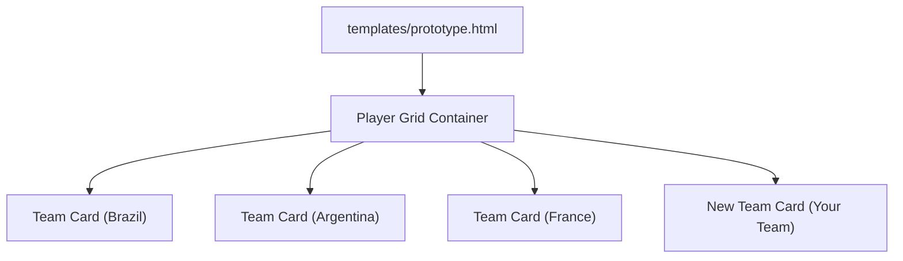
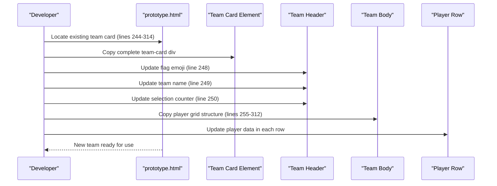
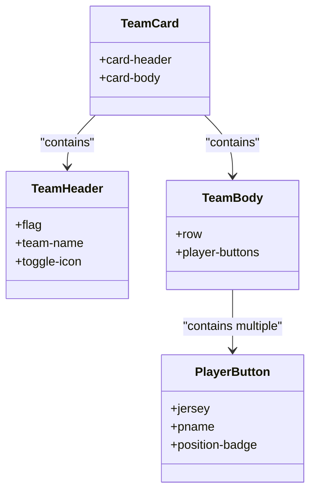
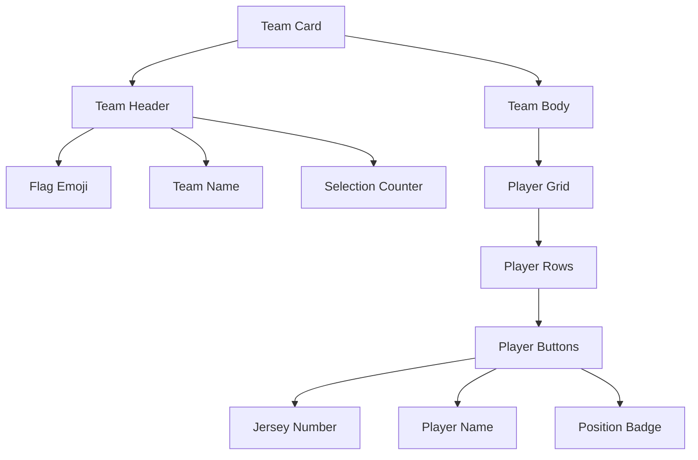

# Adding New National Teams

<cite>
**Referenced Files in This Document**
- [prototype.html](file://templates/prototype.html)
</cite>

## Table of Contents
1. [Introduction](#introduction)
2. [Project Structure](#project-structure)
3. [Core Components](#core-components)
4. [Architecture Overview](#architecture-overview)
5. [Detailed Component Analysis](#detailed-component-analysis)
6. [Dependency Analysis](#dependency-analysis)
7. [Performance Considerations](#performance-considerations)
8. [Troubleshooting Guide](#troubleshooting-guide)
9. [Conclusion](#conclusion)

## Introduction
This document explains how to add new national teams to the WorldCupGame prototype. It focuses on duplicating the existing team card structure and updating the necessary elements to maintain functionality and responsive design.

## Project Structure
The project consists of a single HTML template that defines the UI for displaying national teams, their players, and selection summaries. The relevant structure for adding teams is within the player grid section of the template.

**Diagram sources**
- [prototype.html:243-445](file://templates/prototype.html#L243-L445)

**Section sources**
- [prototype.html:243-445](file://templates/prototype.html#L243-L445)

## Core Components
To add a new national team, you need to duplicate an existing team card and update the following elements:
- Flag emoji in the team header
- Team name in the team header
- Selection counter in the team header
- Player grid rows within the team body
- Player data inside each player button row

Key locations for duplication and updates:
- Team card structure: lines 244-314 (Brazil example)
- Team header elements: lines 246-253
- Player grid rows: lines 255-312
- Player button structure: lines 256-276 (first row example)

**Section sources**
- [prototype.html:244-314](file://templates/prototype.html#L244-L314)
- [prototype.html:255-312](file://templates/prototype.html#L255-L312)

## Architecture Overview
The team addition process follows a straightforward pattern: copy the complete team-card div, update the header elements, and replicate the player grid rows while adjusting player data.

**Diagram sources**
- [prototype.html:244-314](file://templates/prototype.html#L244-L314)
- [prototype.html:255-312](file://templates/prototype.html#L255-L312)

## Detailed Component Analysis

### Team Card Structure
Each team card follows a consistent structure that must be preserved when adding new teams:

**Diagram sources**
- [prototype.html:245-314](file://templates/prototype.html#L245-L314)
- [prototype.html:255-312](file://templates/prototype.html#L255-L312)

### Step-by-Step Team Addition Process

#### Step 1: Duplicate the Team Card
Copy the entire team-card div structure from an existing team (for example, Brazil at lines 244-314) and paste it in the desired location within the player grid container.

#### Step 2: Update Team Header Elements
Modify the three header elements within the card-header div:
- Flag emoji: Update the flag span element (line 248)
- Team name: Change the team name span (line 249)
- Selection counter: Adjust the "(已选 X/Y)" text (line 250)

#### Step 3: Update Player Grid Rows
Copy the player grid structure from the existing team and update each player button row:
- Each player row is a col-4 col-sm-3 col-md-2 col-lg-1 wrapper
- Update the jersey number span (line 257)
- Update the player name span (line 259)
- Update the position badge span (line 260)

#### Step 4: Maintain Responsive Design
Preserve the Bootstrap grid classes for each player row:
- col-4 (mobile)
- col-sm-3 (tablet)
- col-md-2 (desktop)
- col-lg-1 (large desktop)

**Section sources**
- [prototype.html:244-314](file://templates/prototype.html#L244-L314)
- [prototype.html:255-312](file://templates/prototype.html#L255-L312)

### Player Button Structure Details
Each player button contains three data elements that require updating:
- Jersey number: Displayed as a small span with class "jersey"
- Player name: Displayed as a larger span with class "pname"
- Position badge: Displayed as a small badge with class "position-badge"

Example structure reference:
- Jersey span: [prototype.html:257](file://templates/prototype.html#L257)
- Player name span: [prototype.html:259](file://templates/prototype.html#L259)
- Position badge span: [prototype.html:260](file://templates/prototype.html#L260)

**Section sources**
- [prototype.html:257-260](file://templates/prototype.html#L257-L260)

### Responsive Design Guidelines
The player grid maintains consistent responsive behavior through Bootstrap's grid system:
- Mobile: 3 players per row (col-4)
- Tablet: 4 players per row (col-sm-3)
- Desktop: 6 players per row (col-md-2)
- Large Desktop: 12 players per row (col-lg-1)

This ensures optimal display across all device sizes while maintaining visual consistency.

**Section sources**
- [prototype.html:256](file://templates/prototype.html#L256)

## Dependency Analysis
The team addition process relies on several interdependent elements:

**Diagram sources**
- [prototype.html:245-314](file://templates/prototype.html#L245-L314)
- [prototype.html:255-312](file://templates/prototype.html#L255-L312)

**Section sources**
- [prototype.html:245-314](file://templates/prototype.html#L245-L314)
- [prototype.html:255-312](file://templates/prototype.html#L255-L312)

## Performance Considerations
When adding multiple teams:
- Each team card adds minimal DOM overhead
- Bootstrap grid classes are lightweight and efficient
- The toggle functionality operates on individual cards
- Player button click handlers are attached dynamically

## Troubleshooting Guide
Common issues and solutions when adding new teams:

### Issue: Incorrect Column Count
**Problem**: Players don't align properly across screen sizes
**Solution**: Ensure each player row maintains the exact Bootstrap classes: col-4 col-sm-3 col-md-2 col-lg-1

### Issue: Missing Selection Counter
**Problem**: Team header shows incorrect selection statistics
**Solution**: Update the "(已选 X/Y)" text to reflect the actual number of selected players and total squad size

### Issue: Flag Display Problems
**Problem**: Flag emoji appears incorrectly sized or positioned
**Solution**: Verify the flag span element maintains the correct class and font size styling

### Issue: Player Data Not Updating
**Problem**: Player names or positions remain unchanged after copying
**Solution**: Check that each player button's spans are properly updated with new data

**Section sources**
- [prototype.html:248-250](file://templates/prototype.html#L248-L250)
- [prototype.html:256-312](file://templates/prototype.html#L256-L312)

## Conclusion
Adding new national teams to WorldCupGame is a straightforward process involving copying the existing team card structure and updating the necessary elements. By following the documented steps and maintaining the responsive grid classes, you can efficiently add teams while preserving the application's functionality and visual consistency.