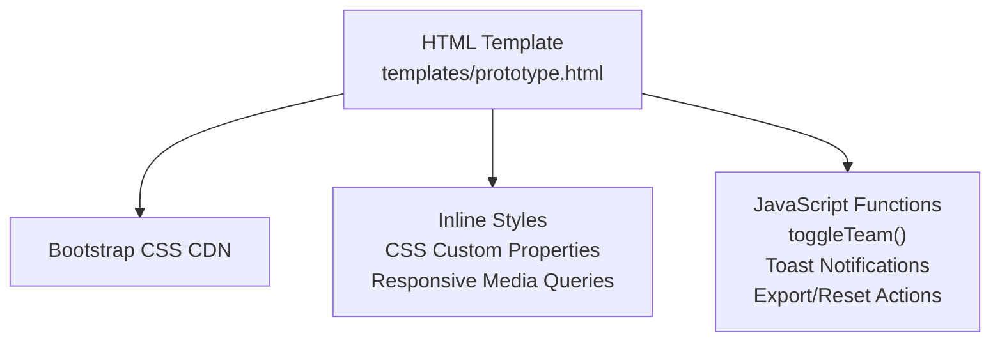
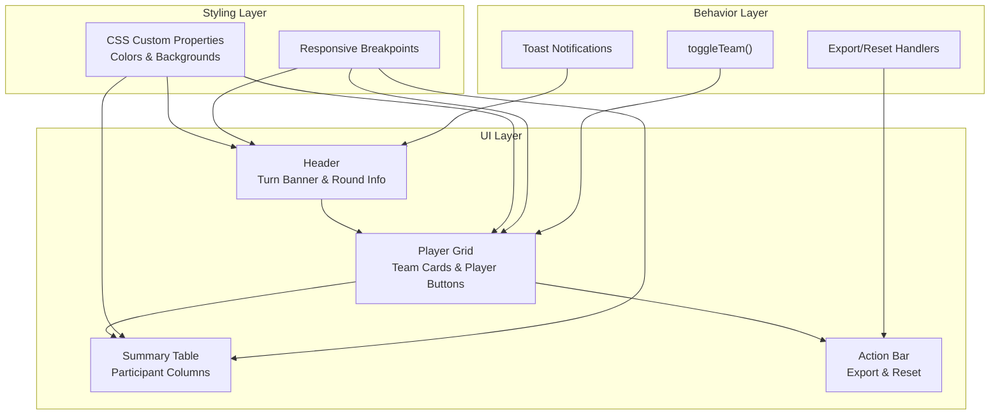
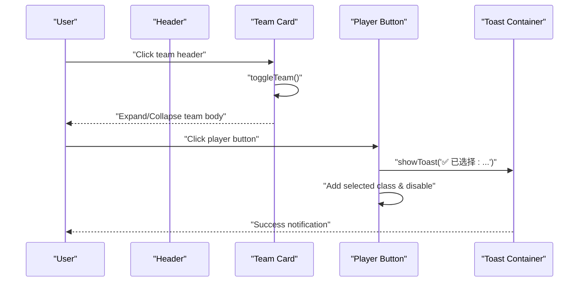
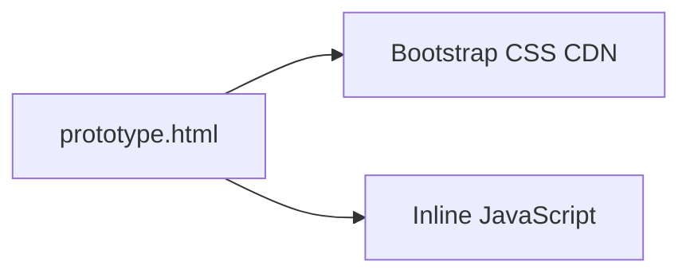

# Customization Guide

<cite>
**Referenced Files in This Document**
- [prototype.html](file://templates/prototype.html)
</cite>

## Table of Contents
1. [Introduction](#introduction)
2. [Project Structure](#project-structure)
3. [Core Components](#core-components)
4. [Architecture Overview](#architecture-overview)
5. [Detailed Component Analysis](#detailed-component-analysis)
6. [Dependency Analysis](#dependency-analysis)
7. [Performance Considerations](#performance-considerations)
8. [Troubleshooting Guide](#troubleshooting-guide)
9. [Conclusion](#conclusion)
10. [Appendices](#appendices)

## Introduction
This guide explains how to customize the WorldCupGame prototype for adding new national teams, modifying player data, adjusting themes, managing participants, and tuning game parameters. It focuses on the HTML template that defines the UI, styles, and interactive behaviors, and provides practical steps grounded in the repository’s structure.

## Project Structure
The project is a single-file HTML prototype that includes:
- A responsive layout built with Bootstrap grid classes
- Inline CSS for theming and responsive breakpoints
- JavaScript for interactive behaviors (team toggling, selection feedback, notifications, and actions)

**Diagram sources**
- [prototype.html:1-561](file://templates/prototype.html#L1-L561)

**Section sources**
- [prototype.html:1-561](file://templates/prototype.html#L1-L561)

## Core Components
This section outlines the primary UI components and how to modify them.

- Team cards
  - Purpose: Group players by national team with expandable/collapsible sections.
  - Structure: Each team card consists of a header (flag emoji, team name, selection counters) and a collapsible body containing player buttons.
  - How to add a new team: Duplicate the team card structure and update the flag emoji, team name, and player rows inside the card body.

- Player buttons
  - Purpose: Individual selectable players with jersey number, name, and position badge.
  - Attributes to modify: The jersey number, player name, and position badge text.
  - Behavior: Clicking a non-selected, non-disabled button triggers a selection effect and a success notification.

- Theme and styling
  - Purpose: Centralized color scheme via CSS custom properties and responsive styles.
  - Customization points: Backgrounds, borders, button states, and responsive breakpoints.

- Participant summary table
  - Purpose: Track selections across rounds and participants.
  - Customization: Add/remove participant columns and adjust column background colors.

- Game header and turn banner
  - Purpose: Display current turn, round info, and game status.
  - Customization: Update the turn holder name, round counters, and total rounds indicator.

**Section sources**
- [prototype.html:250-452](file://templates/prototype.html#L250-L452)
- [prototype.html:8-220](file://templates/prototype.html#L8-L220)
- [prototype.html:460-498](file://templates/prototype.html#L460-L498)
- [prototype.html:224-245](file://templates/prototype.html#L224-L245)

## Architecture Overview
The prototype uses a static HTML page with embedded CSS and JavaScript. The UI is composed of:
- Bootstrap grid classes for responsive layouts
- CSS custom properties for theming
- Inline event handlers and DOM manipulation for interactivity

**Diagram sources**
- [prototype.html:224-245](file://templates/prototype.html#L224-L245)
- [prototype.html:250-452](file://templates/prototype.html#L250-L452)
- [prototype.html:460-498](file://templates/prototype.html#L460-L498)
- [prototype.html:8-220](file://templates/prototype.html#L8-L220)
- [prototype.html:505-557](file://templates/prototype.html#L505-L557)

## Detailed Component Analysis

### Adding New National Teams
Steps:
1. Duplicate an existing team card element.
2. Update the flag emoji in the card header.
3. Change the team name text in the card header.
4. Adjust the selection counter text in the card header.
5. Replace the player rows inside the card body with the new team’s players.

Key locations to edit:
- Team card wrapper and header: [prototype.html:251-260](file://templates/prototype.html#L251-L260)
- Player rows container: [prototype.html:261-321](file://templates/prototype.html#L261-L321)
- Example team cards for Brazil and Argentina: [prototype.html:251-386](file://templates/prototype.html#L251-L386)

Best practices:
- Keep the card-body display state consistent with the intended default (open or closed).
- Ensure each player button contains the jersey number, player name, and position badge.

**Section sources**
- [prototype.html:251-386](file://templates/prototype.html#L251-L386)

### Modifying Player Data
Player buttons are structured with three parts:
- Jersey number
- Player name
- Position badge

To change player data:
- Modify the jersey number text.
- Update the player name text.
- Change the position badge text.

Reference locations:
- Player button structure: [prototype.html:263-321](file://templates/prototype.html#L263-L321)
- Example button elements: [prototype.html:264-318](file://templates/prototype.html#L264-L318)

Selection behavior:
- Clicking a non-selected, non-disabled button adds a selection class and disables the button.
- A success toast notification appears.

Reference locations:
- Selection logic: [prototype.html:520-528](file://templates/prototype.html#L520-L528)
- Toast creation: [prototype.html:531-544](file://templates/prototype.html#L531-L544)

**Section sources**
- [prototype.html:263-318](file://templates/prototype.html#L263-L318)
- [prototype.html:520-528](file://templates/prototype.html#L520-L528)
- [prototype.html:531-544](file://templates/prototype.html#L531-L544)

### Theme Customization with CSS Custom Properties
The theme is centralized in CSS custom properties and applied across components:
- Dark background
- Card background
- Accent gold color
- Grass green accent

How to customize:
- Edit the values of the CSS custom properties in the root block.
- Apply the variables to background colors, borders, and accents.

Reference locations:
- CSS custom properties: [prototype.html:9-14](file://templates/prototype.html#L9-L14)
- Body background: [prototype.html:15-19](file://templates/prototype.html#L15-L19)
- Header gradient and border: [prototype.html:20-27](file://templates/prototype.html#L20-L27)
- Turn banner gradient and text color: [prototype.html:34-43](file://templates/prototype.html#L34-L43)
- Card background: [prototype.html:55-61](file://templates/prototype.html#L55-L61)
- Button hover and selected states: [prototype.html:90-132](file://templates/prototype.html#L90-L132)

Responsive adjustments:
- Reduce font sizes and spacing on small screens.

Reference locations:
- Responsive media query: [prototype.html:214-219](file://templates/prototype.html#L214-L219)

**Section sources**
- [prototype.html:9-14](file://templates/prototype.html#L9-L14)
- [prototype.html:15-19](file://templates/prototype.html#L15-L19)
- [prototype.html:20-27](file://templates/prototype.html#L20-L27)
- [prototype.html:34-43](file://templates/prototype.html#L34-L43)
- [prototype.html:55-61](file://templates/prototype.html#L55-L61)
- [prototype.html:90-132](file://templates/prototype.html#L90-L132)
- [prototype.html:214-219](file://templates/prototype.html#L214-L219)

### Participant Management
The summary table displays participant columns and selection history:
- Add a new participant column by inserting a new header cell with a distinct background color.
- Adjust the row cells under each round to reflect picks for the new participant.
- Use the participant column class for consistent styling.

Reference locations:
- Summary table header: [prototype.html:464-473](file://templates/prototype.html#L464-L473)
- Summary table rows: [prototype.html:475-496](file://templates/prototype.html#L475-L496)
- Column styling class: [prototype.html:169-178](file://templates/prototype.html#L169-L178)

Color schemes:
- Each participant column uses a unique background color for easy identification.

Reference locations:
- Column background colors: [prototype.html:468-472](file://templates/prototype.html#L468-L472)

**Section sources**
- [prototype.html:464-473](file://templates/prototype.html#L464-L473)
- [prototype.html:475-496](file://templates/prototype.html#L475-L496)
- [prototype.html:169-178](file://templates/prototype.html#L169-L178)
- [prototype.html:468-472](file://templates/prototype.html#L468-L472)

### Modifying Game Parameters
The game header shows:
- Current turn holder
- Round information
- Total rounds

To adjust:
- Update the turn holder name text.
- Modify the current round, pick order, and total pick count.
- Change the total rounds indicator.

Reference locations:
- Turn banner and round info: [prototype.html:232-242](file://templates/prototype.html#L232-L242)

**Section sources**
- [prototype.html:232-242](file://templates/prototype.html#L232-L242)

### Interactive Behaviors
- Team toggle: Expand/collapse team cards by clicking the header.
- Player selection: Click a player button to mark it selected and show a toast.
- Export/Reset actions: Trigger notifications and confirm dialogs.

Reference locations:
- Toggle function: [prototype.html:507-517](file://templates/prototype.html#L507-L517)
- Player click handler: [prototype.html:520-528](file://templates/prototype.html#L520-L528)
- Toast notification: [prototype.html:531-544](file://templates/prototype.html#L531-L544)
- Export/Reset handlers: [prototype.html:547-556](file://templates/prototype.html#L547-L556)

**Diagram sources**
- [prototype.html:507-517](file://templates/prototype.html#L507-L517)
- [prototype.html:520-528](file://templates/prototype.html#L520-L528)
- [prototype.html:531-544](file://templates/prototype.html#L531-L544)

**Section sources**
- [prototype.html:507-517](file://templates/prototype.html#L507-L517)
- [prototype.html:520-528](file://templates/prototype.html#L520-L528)
- [prototype.html:531-544](file://templates/prototype.html#L531-L544)
- [prototype.html:547-556](file://templates/prototype.html#L547-L556)

## Dependency Analysis
The prototype depends on:
- Bootstrap CSS CDN for base styles and responsive grid.
- Inline JavaScript for interactive behaviors.

**Diagram sources**
- [prototype.html](file://templates/prototype.html#L7)
- [prototype.html:505-557](file://templates/prototype.html#L505-L557)

**Section sources**
- [prototype.html](file://templates/prototype.html#L7)
- [prototype.html:505-557](file://templates/prototype.html#L505-L557)

## Performance Considerations
- Keep the number of DOM nodes reasonable for smooth toggling and selection updates.
- Prefer CSS custom properties for theming to minimize reflows.
- Use Bootstrap grid classes for efficient responsive layouts.
- Avoid heavy animations in the header and summary areas to maintain scroll performance.

[No sources needed since this section provides general guidance]

## Troubleshooting Guide
Common issues and resolutions:
- Team card does not toggle
  - Ensure the header element has the correct onclick handler and the next sibling is the card body.
  - Reference: [prototype.html:253-260](file://templates/prototype.html#L253-L260), [prototype.html:507-517](file://templates/prototype.html#L507-L517)

- Player button not selecting
  - Verify the button does not have the selected or disabled class initially.
  - Confirm the click listener is attached to non-selected, non-disabled buttons.
  - Reference: [prototype.html:520-528](file://templates/prototype.html#L520-L528)

- Toast not appearing
  - Ensure the toast container exists and the toast creation logic runs.
  - Reference: [prototype.html:531-544](file://templates/prototype.html#L531-L544)

- Summary column alignment
  - Confirm each participant column uses the participant-col class and consistent background styling.
  - Reference: [prototype.html:169-178](file://templates/prototype.html#L169-L178), [prototype.html:468-472](file://templates/prototype.html#L468-L472)

**Section sources**
- [prototype.html:253-260](file://templates/prototype.html#L253-L260)
- [prototype.html:507-517](file://templates/prototype.html#L507-L517)
- [prototype.html:520-528](file://templates/prototype.html#L520-L528)
- [prototype.html:531-544](file://templates/prototype.html#L531-L544)
- [prototype.html:169-178](file://templates/prototype.html#L169-L178)
- [prototype.html:468-472](file://templates/prototype.html#L468-L472)

## Conclusion
By following this guide, you can extend the WorldCupGame prototype with new teams, update player data, customize themes, manage participants, and adjust game parameters while preserving responsive design and Bootstrap compatibility. Use the provided references to locate and modify the relevant sections safely.

[No sources needed since this section summarizes without analyzing specific files]

## Appendices

### Best Practices Checklist
- Maintain Bootstrap grid classes for responsive layouts.
- Use CSS custom properties for consistent theming.
- Keep interactive behaviors minimal and performant.
- Preserve accessibility by retaining focus and keyboard navigation cues.
- Test on multiple screen sizes to ensure responsive behavior.

[No sources needed since this section provides general guidance]