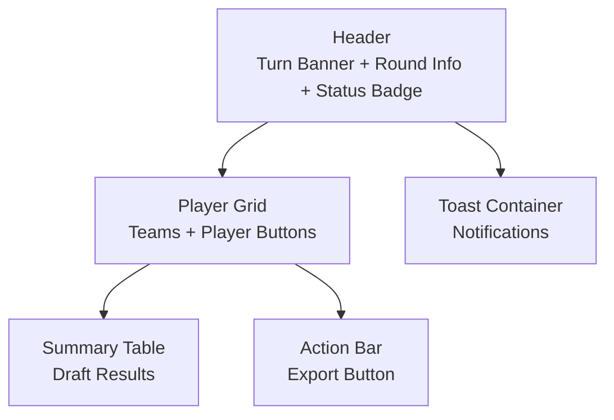
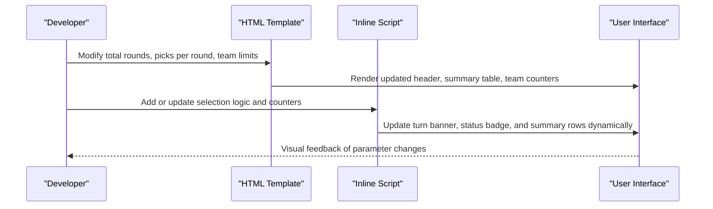
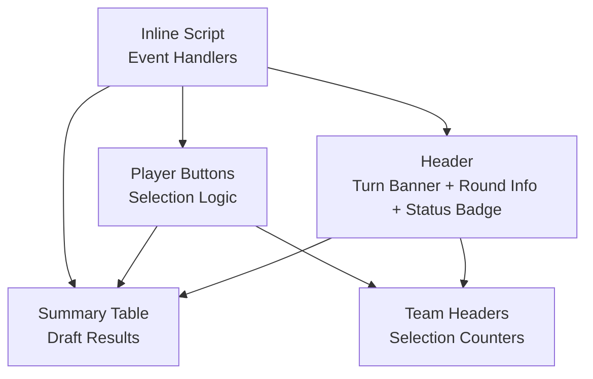

# Game Parameter Modification

<cite>
**Referenced Files in This Document**
- [prototype.html](file://templates/prototype.html)
</cite>

## Table of Contents
1. [Introduction](#introduction)
2. [Project Structure](#project-structure)
3. [Core Components](#core-components)
4. [Architecture Overview](#architecture-overview)
5. [Detailed Component Analysis](#detailed-component-analysis)
6. [Dependency Analysis](#dependency-analysis)
7. [Performance Considerations](#performance-considerations)
8. [Troubleshooting Guide](#troubleshooting-guide)
9. [Conclusion](#conclusion)

## Introduction
This document explains how to modify core game parameters in the World Cup Draft application. It focuses on adjusting:
- Total rounds by updating the round information display and summary table structure
- Picks per round by modifying selection logic and summary table row structure
- Team limits by changing player button states and updating selection counters in team headers
- Game status badges and turn banner display to reflect parameter changes

The guidance is grounded in the existing HTML/CSS/JavaScript implementation and provides practical steps to balance parameters for optimal user experience.

## Project Structure
The project is a single-page HTML prototype with embedded styles and minimal JavaScript. The relevant areas for parameter modification are:
- Header area containing turn banner, round info, and game status badge
- Player grid with teams and player buttons
- Summary table for draft results
- Toast notifications and action bar

**Diagram sources**
- [prototype.html:250-270](file://templates/prototype.html#L250-L270)
- [prototype.html:275-608](file://templates/prototype.html#L275-L608)
- [prototype.html:610-648](file://templates/prototype.html#L610-L648)
- [prototype.html:657-658](file://templates/prototype.html#L657-L658)

**Section sources**
- [prototype.html:250-270](file://templates/prototype.html#L250-L270)
- [prototype.html:275-608](file://templates/prototype.html#L275-L608)
- [prototype.html:610-648](file://templates/prototype.html#L610-L648)
- [prototype.html:657-658](file://templates/prototype.html#L657-L658)

## Core Components
This section identifies the key UI components that hold game parameters and how to modify them.

- Turn banner and round info
  - Located in the header section. Contains the current participant’s turn, round number, pick order, and total pick count.
  - Relevant elements: turn banner text, round info display, and total rounds indicator in the header.
  - See [prototype.html:257-267](file://templates/prototype.html#L257-L267).

- Summary table
  - Displays draft results by round and participant.
  - Structure includes a header row with participant columns and rows for each round.
  - See [prototype.html:614-647](file://templates/prototype.html#L614-L647).

- Player grid and team headers
  - Teams show selection counters indicating selected vs. available slots.
  - Player buttons represent selectable players and become disabled upon selection.
  - See [prototype.html:284-352](file://templates/prototype.html#L284-L352) and [prototype.html:356-417](file://templates/prototype.html#L356-L417).

- Game status badge and total rounds
  - Status badge indicates game state; total rounds label shows the maximum number of rounds.
  - See [prototype.html:265-266](file://templates/prototype.html#L265-L266).

**Section sources**
- [prototype.html:257-267](file://templates/prototype.html#L257-L267)
- [prototype.html:614-647](file://templates/prototype.html#L614-L647)
- [prototype.html:284-352](file://templates/prototype.html#L284-L352)
- [prototype.html:356-417](file://templates/prototype.html#L356-L417)
- [prototype.html:265-266](file://templates/prototype.html#L265-L266)

## Architecture Overview
The game parameter modification workflow involves updating static HTML elements and potentially adding dynamic behavior to reflect new values. The following diagram shows how changes propagate across components.

[No sources needed since this diagram shows conceptual workflow, not actual code structure]

## Detailed Component Analysis

### Adjusting Total Rounds
Total rounds affect:
- The maximum number shown in the header’s total rounds indicator
- The number of rows in the summary table representing rounds
- The round counter in the round info display

Steps:
1. Update the total rounds indicator in the header.
   - Target: the element displaying the total rounds count near the status badge.
   - Reference: [prototype.html](file://templates/prototype.html#L266).

2. Expand or shrink the summary table rows to match the new total rounds.
   - Add or remove rows under the table body to reflect the new round count.
   - Reference: [prototype.html:625-645](file://templates/prototype.html#L625-L645).

3. Update the round info display to reflect the current round progression.
   - Adjust the round number, pick order, and total pick count in the round info area.
   - Reference: [prototype.html:260-262](file://templates/prototype.html#L260-L262).

Impact:
- Increasing rounds increases the summary table height and scrollable area.
- Decreasing rounds reduces the summary table length and simplifies navigation.

**Section sources**
- [prototype.html](file://templates/prototype.html#L266)
- [prototype.html:625-645](file://templates/prototype.html#L625-L645)
- [prototype.html:260-262](file://templates/prototype.html#L260-L262)

### Changing Picks Per Round
Picks per round controls how many participants select in each round. This affects:
- The number of participant columns in the summary table header
- The number of entries per round row in the summary table body
- The selection logic for enabling/disabling player buttons

Steps:
1. Modify the summary table header to add or remove participant columns.
   - Add columns for new participants or remove unused ones.
   - Reference: [prototype.html:616-623](file://templates/prototype.html#L616-L623).

2. Update the summary table body rows to accommodate the new picks per round.
   - Ensure each round row has the correct number of cells for participants.
   - Reference: [prototype.html:625-645](file://templates/prototype.html#L625-L645).

3. Update selection logic to handle the new picks per round.
   - The current click handler selects a single player per click.
   - Extend logic to support multiple selections per round if needed.
   - Reference: [prototype.html:688-696](file://templates/prototype.html#L688-L696).

4. Update team counters to reflect picks per round.
   - Team headers show selected/available counts; ensure they reflect the new limit.
   - Reference: [prototype.html](file://templates/prototype.html#L289) and [prototype.html](file://templates/prototype.html#L361).

Impact:
- More picks per round increases the number of selections per round and table width.
- Fewer picks per round reduces table width and simplifies the UI.

**Section sources**
- [prototype.html:616-623](file://templates/prototype.html#L616-L623)
- [prototype.html:625-645](file://templates/prototype.html#L625-L645)
- [prototype.html:688-696](file://templates/prototype.html#L688-L696)
- [prototype.html](file://templates/prototype.html#L289)
- [prototype.html](file://templates/prototype.html#L361)

### Adjusting Team Limits
Team limits define how many players can be selected from each team. This impacts:
- Player button states (enabled/disabled) based on remaining slots
- Team header counters reflecting selected vs. available slots
- Summary table entries for each participant’s picks

Steps:
1. Update team header counters to reflect the new limit.
   - Change the “selected/limit” text in each team card header.
   - Reference: [prototype.html](file://templates/prototype.html#L289) and [prototype.html](file://templates/prototype.html#L361).

2. Modify player button states to enforce the new limit.
   - Disable buttons when a team’s limit is reached.
   - Reference: [prototype.html:138-145](file://templates/prototype.html#L138-L145) and [prototype.html:688-696](file://templates/prototype.html#L688-L696).

3. Update selection logic to track team selections and enforce limits.
   - Track picks per team and disable buttons accordingly.
   - Reference: [prototype.html:688-696](file://templates/prototype.html#L688-L696).

4. Reflect team selections in the summary table.
   - Ensure each participant’s picks are recorded under the correct team column.
   - Reference: [prototype.html:616-623](file://templates/prototype.html#L616-L623) and [prototype.html:625-645](file://templates/prototype.html#L625-L645).

Impact:
- Lower team limits reduce available choices and increase competition.
- Higher team limits provide more flexibility but may require more rounds.

**Section sources**
- [prototype.html](file://templates/prototype.html#L289)
- [prototype.html](file://templates/prototype.html#L361)
- [prototype.html:138-145](file://templates/prototype.html#L138-L145)
- [prototype.html:688-696](file://templates/prototype.html#L688-L696)
- [prototype.html:616-623](file://templates/prototype.html#L616-L623)
- [prototype.html:625-645](file://templates/prototype.html#L625-L645)

### Updating Game Status Badges
The game status badge indicates the current game state. To update it:
- Modify the badge text and color to reflect the new state.
- Reference: [prototype.html](file://templates/prototype.html#L265).

Considerations:
- Ensure the badge text clearly communicates the state (e.g., “In Progress”, “Completed”).
- Match the badge color scheme with the theme.

**Section sources**
- [prototype.html](file://templates/prototype.html#L265)

### Modifying the Turn Banner Display
The turn banner shows whose turn it is and can be styled responsively. To modify it:
- Update the participant name in the turn banner.
- Reference: [prototype.html:257-259](file://templates/prototype.html#L257-L259).

Responsive adjustments:
- The banner scales down on smaller screens; adjust font sizes and padding if needed.
- Reference: [prototype.html:239-244](file://templates/prototype.html#L239-L244).

**Section sources**
- [prototype.html:257-259](file://templates/prototype.html#L257-L259)
- [prototype.html:239-244](file://templates/prototype.html#L239-L244)

## Dependency Analysis
The following diagram shows how components depend on each other for parameter updates.

**Diagram sources**
- [prototype.html:257-267](file://templates/prototype.html#L257-L267)
- [prototype.html:614-647](file://templates/prototype.html#L614-L647)
- [prototype.html:284-352](file://templates/prototype.html#L284-L352)
- [prototype.html:688-696](file://templates/prototype.html#L688-L696)

**Section sources**
- [prototype.html:257-267](file://templates/prototype.html#L257-L267)
- [prototype.html:614-647](file://templates/prototype.html#L614-L647)
- [prototype.html:284-352](file://templates/prototype.html#L284-L352)
- [prototype.html:688-696](file://templates/prototype.html#L688-L696)

## Performance Considerations
- Minimize DOM updates when changing parameters to avoid layout thrashing.
- Batch updates to the summary table and team headers to reduce reflows.
- Use efficient selectors and event delegation for player button interactions.
- Keep the number of visible rows in the summary table reasonable to maintain smooth scrolling.

[No sources needed since this section provides general guidance]

## Troubleshooting Guide
Common issues and resolutions:
- Summary table misalignment after adding/removing columns
  - Ensure each round row has the correct number of cells matching the participant count.
  - Verify that the header and body columns align.

- Player buttons remain enabled after reaching team limits
  - Confirm that the selection logic disables buttons when a team’s limit is reached.
  - Check that the team counters update in real-time.

- Turn banner or status badge not reflecting changes
  - Verify that the header elements are updated when parameters change.
  - Ensure responsive styles do not override intended values on small screens.

- Excessive scrolling in summary table
  - Reduce the number of rounds or picks per round to improve usability.
  - Consider pagination or filtering if the table becomes too long.

**Section sources**
- [prototype.html:614-647](file://templates/prototype.html#L614-L647)
- [prototype.html:688-696](file://templates/prototype.html#L688-L696)
- [prototype.html:257-267](file://templates/prototype.html#L257-L267)
- [prototype.html:239-244](file://templates/prototype.html#L239-L244)

## Conclusion
Modifying core game parameters in this prototype involves updating static HTML elements and extending the selection logic to enforce new rules. By carefully adjusting the header displays, summary table structure, team limits, and selection counters, you can tailor the game flow to different scenarios while maintaining a responsive and intuitive user interface. Test changes incrementally and validate the UI across screen sizes to ensure a smooth user experience.