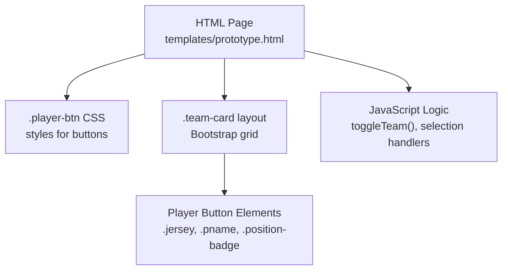
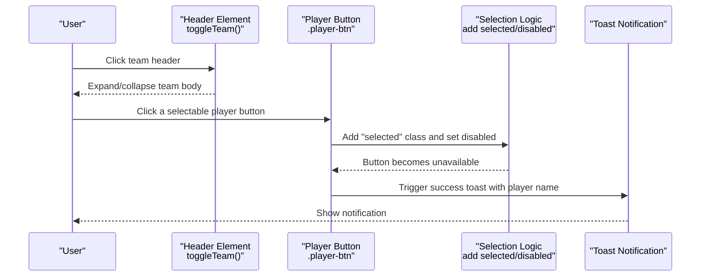
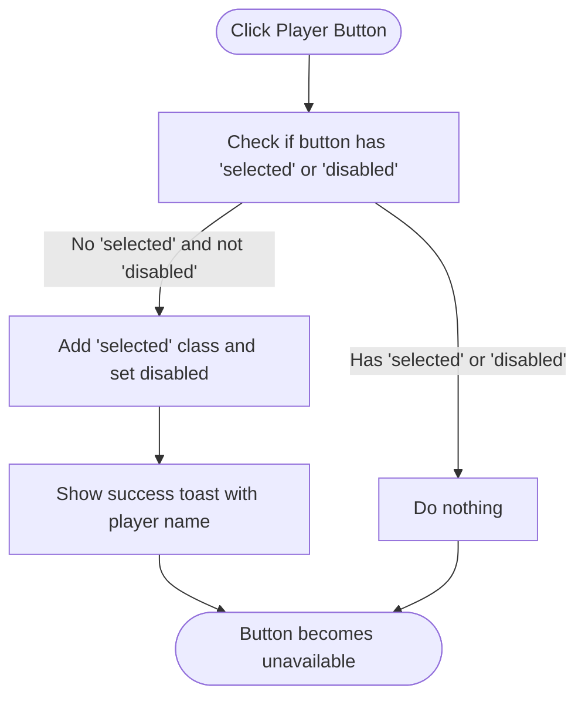
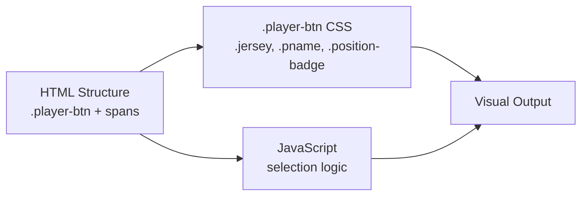

# Modifying Player Data

<cite>
**Referenced Files in This Document**
- [prototype.html](file://templates/prototype.html)
</cite>

## Table of Contents
1. [Introduction](#introduction)
2. [Project Structure](#project-structure)
3. [Core Components](#core-components)
4. [Architecture Overview](#architecture-overview)
5. [Detailed Component Analysis](#detailed-component-analysis)
6. [Dependency Analysis](#dependency-analysis)
7. [Performance Considerations](#performance-considerations)
8. [Troubleshooting Guide](#troubleshooting-guide)
9. [Conclusion](#conclusion)

## Introduction
This document explains how to modify player data within team cards in the World Cup draft interface. It focuses on updating player button attributes such as jersey numbers, player names, and position badges, and how these changes integrate with the JavaScript selection logic. It also covers maintaining visual consistency, changing player positions, adding new players, and managing player availability using selected and disabled states.

## Project Structure
The project is a single-page HTML prototype that renders team cards with player buttons. The relevant structure for player data modification includes:
- Team containers with expandable/collapsible headers
- Player button rows grouped under each team
- Player button elements containing spans for jersey number, player name, and position badge
- Inline styles and Bootstrap classes for layout and appearance
- Embedded JavaScript for toggling team visibility and simulating player selection

**Diagram sources**
- [prototype.html:89-132](file://templates/prototype.html#L89-L132)
- [prototype.html:244-444](file://templates/prototype.html#L244-L444)
- [prototype.html:497-544](file://templates/prototype.html#L497-L544)

**Section sources**
- [prototype.html:89-132](file://templates/prototype.html#L89-L132)
- [prototype.html:244-444](file://templates/prototype.html#L244-L444)
- [prototype.html:497-544](file://templates/prototype.html#L497-L544)

## Core Components
- Player button element: The interactive button representing a player. It uses the class selector ".player-btn" and contains child spans for jersey number, player name, and position badge.
- Jersey span: Contains the player’s jersey number and is styled with ".jersey".
- Player name span: Contains the player’s name and is styled with ".pname".
- Position badge span: Contains the player’s position (e.g., FW, MF) and is styled with ".position-badge".
- Selected/disabled states: The ".selected" class and ":disabled" pseudo-class control availability and visual feedback for picked players.
- Team card: A container with a header that toggles the visibility of the player button grid below.

Key selectors and styles:
- ".player-btn" defines base button appearance and hover behavior.
- ".player-btn:disabled, .player-btn.selected" define the appearance of unavailable/picked players.
- ".player-btn .jersey", ".player-btn .pname", ".player-btn .position-badge" define typography and spacing for each part of the player label.

**Section sources**
- [prototype.html:89-132](file://templates/prototype.html#L89-L132)
- [prototype.html:257-311](file://templates/prototype.html#L257-L311)
- [prototype.html:329-376](file://templates/prototype.html#L329-L376)

## Architecture Overview
The player selection architecture combines static HTML/CSS with embedded JavaScript:
- HTML defines team cards and player buttons with span children for jersey, name, and position.
- CSS controls visual states for enabled, hovered, selected, and disabled buttons.
- JavaScript handles:
  - Toggling team visibility via the header.
  - Simulating player selection by adding the "selected" class and disabling the button.
  - Showing notifications when a player is selected.

**Diagram sources**
- [prototype.html:499-509](file://templates/prototype.html#L499-L509)
- [prototype.html:511-520](file://templates/prototype.html#L511-L520)
- [prototype.html:523-536](file://templates/prototype.html#L523-L536)

## Detailed Component Analysis

### Player Button Structure and Attributes
Each player button is a self-contained unit with three parts:
- Jersey number: rendered inside a span with class ".jersey".
- Player name: rendered inside a span with class ".pname".
- Position badge: rendered inside a span with class ".position-badge".

These spans are direct children of the ".player-btn" element and are styled independently to ensure consistent alignment and readability.

- Lines for jersey number: [prototype.html:257-311](file://templates/prototype.html#L257-L311), [prototype.html:329-376](file://templates/prototype.html#L329-L376)
- Lines for player name: [prototype.html:257-311](file://templates/prototype.html#L257-L311), [prototype.html:329-376](file://templates/prototype.html#L329-L376)
- Lines for position badge: [prototype.html:257-311](file://templates/prototype.html#L257-L311), [prototype.html:329-376](file://templates/prototype.html#L329-L376)

To update a player’s jersey number, modify the text content of the ".jersey" span within the target ".player-btn". To update the player name, modify the ".pname" span. To change the position, update the ".position-badge" span.

Maintaining visual consistency:
- Keep the three spans as direct children of ".player-btn".
- Preserve the ".jersey", ".pname", and ".position-badge" classes.
- Use the existing CSS rules for typography and spacing to keep alignment uniform.

**Section sources**
- [prototype.html:89-132](file://templates/prototype.html#L89-L132)
- [prototype.html:257-311](file://templates/prototype.html#L257-L311)
- [prototype.html:329-376](file://templates/prototype.html#L329-L376)

### Updating Player Positions
Positions are represented by the ".position-badge" span. To change a player’s position:
- Modify the text content of the ".position-badge" span to reflect the new role (e.g., FW, MF, DF, GK).
- Optionally adjust the CSS styling for the ".position-badge" class to differentiate positions visually if desired.

Examples of position values in the template:
- Forward (FW): [prototype.html:257-311](file://templates/prototype.html#L257-L311), [prototype.html:329-376](file://templates/prototype.html#L329-L376)
- Midfielder (MF): [prototype.html:436-442](file://templates/prototype.html#L436-L442)

Position styling is controlled by the ".position-badge" CSS rule. You can customize the background, padding, and color to improve readability or convey additional semantics.

**Section sources**
- [prototype.html:125-132](file://templates/prototype.html#L125-L132)
- [prototype.html:257-311](file://templates/prototype.html#L257-L311)
- [prototype.html:329-376](file://templates/prototype.html#L329-L376)
- [prototype.html:436-442](file://templates/prototype.html#L436-L442)

### Adding New Players
To add a new player while maintaining visual consistency:
- Insert a new column item (".col-*") under the team’s player row.
- Place a ".player-btn" element inside the column.
- Add three child spans:
  - ".jersey" for the jersey number
  - ".pname" for the player name
  - ".position-badge" for the position
- Ensure the ".player-btn" is enabled (no "selected" class or "disabled" attribute) so it remains selectable.

Example insertion points:
- Under Brazil team row: [prototype.html:255-312](file://templates/prototype.html#L255-L312)
- Under Argentina team row: [prototype.html:327-377](file://templates/prototype.html#L327-L377)
- Under France team row: [prototype.html:391-443](file://templates/prototype.html#L391-L443)

When adding new players, follow the exact HTML structure shown in the existing rows to preserve layout and responsiveness.

**Section sources**
- [prototype.html:255-312](file://templates/prototype.html#L255-L312)
- [prototype.html:327-377](file://templates/prototype.html#L327-L377)
- [prototype.html:391-443](file://templates/prototype.html#L391-L443)

### Managing Player Availability (Selected/Disabled States)
Player availability is controlled by:
- The "selected" class on ".player-btn" to mark a player as chosen.
- The "disabled" attribute on the button element to prevent further interaction.

The JavaScript selection logic:
- Selects buttons that are neither ".selected" nor ":disabled".
- On click, retrieves the player name from the ".pname" span.
- Adds the "selected" class and sets "disabled" to true.
- Displays a success toast notification.

Availability states and their effects:
- Enabled: Normal appearance and clickable.
- Selected/disabled: Dimmed appearance, not clickable, and visually marked as unavailable.

**Diagram sources**
- [prototype.html:511-520](file://templates/prototype.html#L511-L520)
- [prototype.html:523-536](file://templates/prototype.html#L523-L536)

**Section sources**
- [prototype.html:106-113](file://templates/prototype.html#L106-L113)
- [prototype.html:511-520](file://templates/prototype.html#L511-L520)

### Relationship Between Player Data and JavaScript Selection Logic
The selection logic relies on:
- DOM traversal to locate the ".pname" span within the clicked ".player-btn".
- Class manipulation to apply "selected" and disable the button.
- Toast notifications to confirm selections.

Implications for data updates:
- Changing the ".pname" span text will update the notification message.
- Changing the ".position-badge" span text does not affect selection logic but impacts visual labeling.
- Removing or altering the ".jersey" span content does not affect selection logic but affects display.

Best practices:
- Always update the ".pname" span when renaming a player to keep notifications accurate.
- Keep the ".jersey" and ".position-badge" spans intact to preserve layout and styling.

**Section sources**
- [prototype.html:511-520](file://templates/prototype.html#L511-L520)
- [prototype.html:113-132](file://templates/prototype.html#L113-L132)

## Dependency Analysis
The player data system depends on:
- HTML structure: ".player-btn" and its child spans define the data model.
- CSS: ".player-btn" and ".position-badge" classes define appearance and layout.
- JavaScript: selection logic reads ".pname" and manipulates "selected" and "disabled" states.

**Diagram sources**
- [prototype.html:89-132](file://templates/prototype.html#L89-L132)
- [prototype.html:511-520](file://templates/prototype.html#L511-L520)

**Section sources**
- [prototype.html:89-132](file://templates/prototype.html#L89-L132)
- [prototype.html:511-520](file://templates/prototype.html#L511-L520)

## Performance Considerations
- Minimize DOM queries: The selection logic targets buttons that are not yet selected and not disabled, reducing unnecessary work.
- Keep updates localized: Modifying individual spans avoids re-rendering entire rows.
- Maintain responsive breakpoints: The existing grid classes ensure consistent layout across devices.

## Troubleshooting Guide
Common issues and resolutions:
- Button not selectable after selection:
  - Cause: "selected" class and "disabled" attribute are applied.
  - Resolution: Remove "selected" class and "disabled" attribute to restore interactivity.
  - Reference: [prototype.html:106-113](file://templates/prototype.html#L106-L113), [prototype.html:517-518](file://templates/prototype.html#L517-L518)

- Incorrect player name in notifications:
  - Cause: ".pname" span content mismatch.
  - Resolution: Update the ".pname" span text to match the intended player name.
  - Reference: [prototype.html:514](file://templates/prototype.html#L514)

- Position badge not visible or styled incorrectly:
  - Cause: Missing or altered ".position-badge" class.
  - Resolution: Ensure the span has the ".position-badge" class and review CSS rules.
  - Reference: [prototype.html:125-132](file://templates/prototype.html#L125-L132)

- Adding a new player breaks layout:
  - Cause: Missing ".player-btn" wrapper or incorrect column structure.
  - Resolution: Follow the exact HTML pattern used in existing rows.
  - Reference: [prototype.html:255-312](file://templates/prototype.html#L255-L312), [prototype.html:327-377](file://templates/prototype.html#L327-L377)

**Section sources**
- [prototype.html:106-113](file://templates/prototype.html#L106-L113)
- [prototype.html:514](file://templates/prototype.html#L514)
- [prototype.html:125-132](file://templates/prototype.html#L125-L132)
- [prototype.html:255-312](file://templates/prototype.html#L255-L312)
- [prototype.html:327-377](file://templates/prototype.html#L327-L377)

## Conclusion
Modifying player data within team cards involves updating the three spans inside each ".player-btn": the jersey number, player name, and position badge. These changes integrate seamlessly with the existing CSS and JavaScript logic. To maintain visual consistency, follow the established HTML structure and CSS classes. Use the "selected" class and "disabled" attribute to manage player availability, and rely on the selection logic to handle notifications and state transitions.