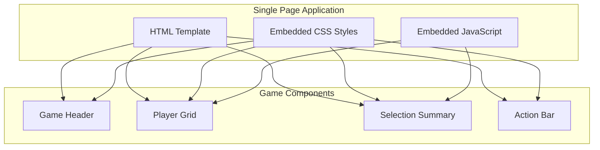
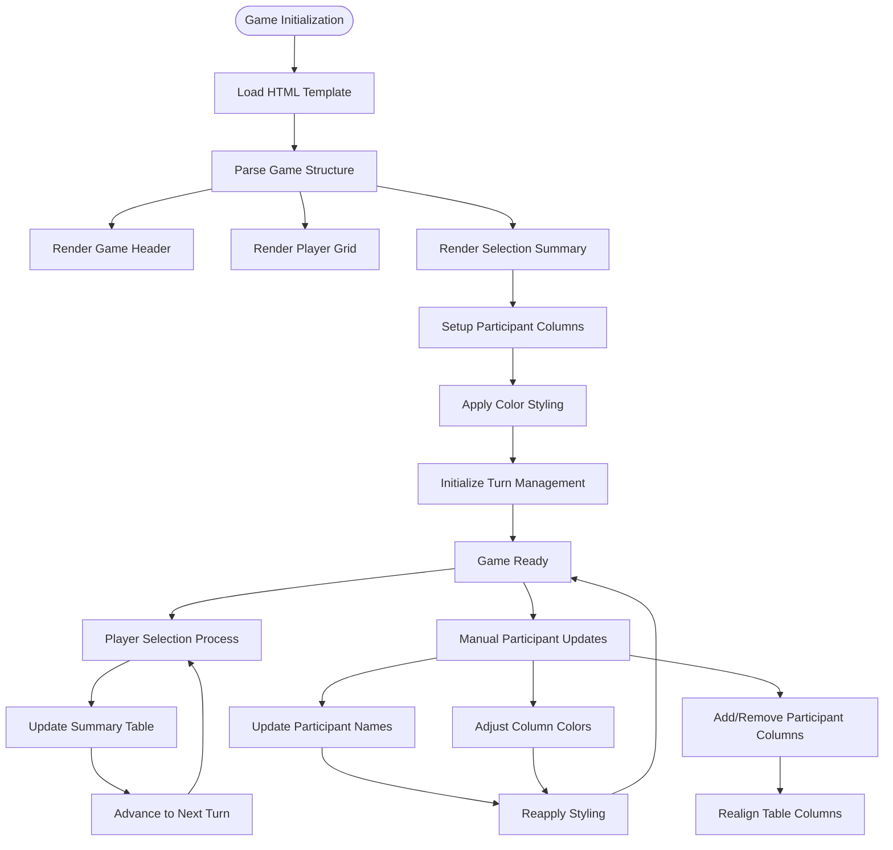
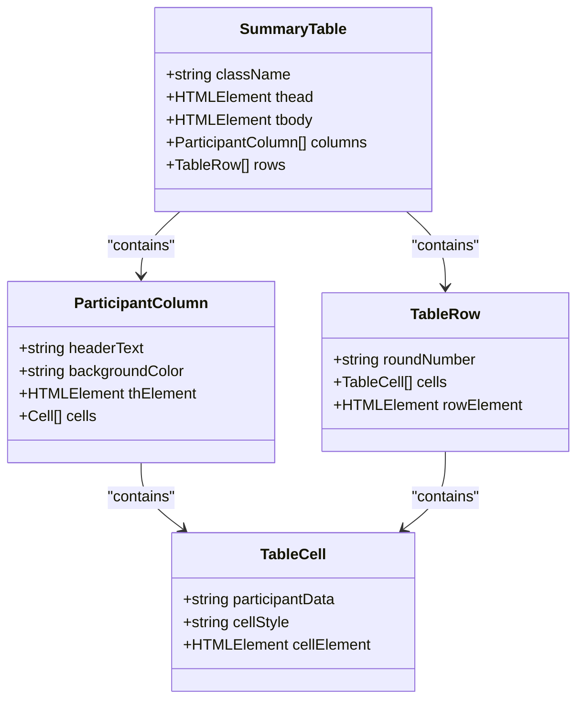
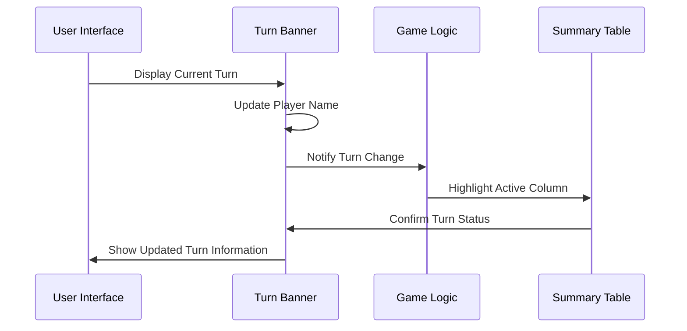
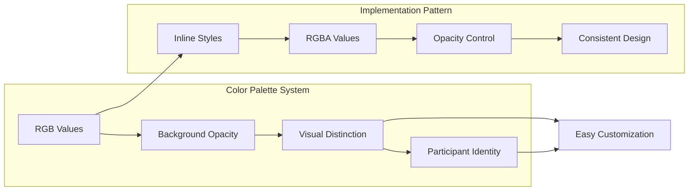
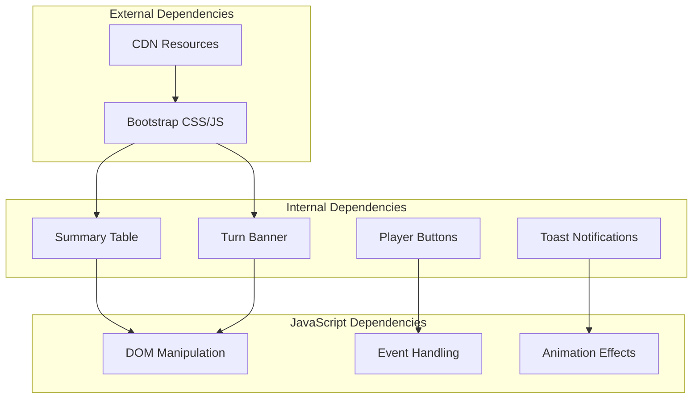

# Participant Management

<cite>
**Referenced Files in This Document**
- [prototype.html](file://templates/prototype.html)
</cite>

## Table of Contents
1. [Introduction](#introduction)
2. [Project Structure](#project-structure)
3. [Core Components](#core-components)
4. [Architecture Overview](#architecture-overview)
5. [Detailed Component Analysis](#detailed-component-analysis)
6. [Dependency Analysis](#dependency-analysis)
7. [Performance Considerations](#performance-considerations)
8. [Troubleshooting Guide](#troubleshooting-guide)
9. [Conclusion](#conclusion)

## Introduction

This document provides comprehensive guidance for managing participants in the multiplayer selection game system. The game features a draft-style selection mechanism where multiple participants compete to select players from various teams. The participant management system centers around the selection summary table, which displays each participant's picks across different rounds of the selection process.

The system currently operates as a static HTML template with embedded CSS and JavaScript, designed for manual participant management through direct HTML modifications. This approach allows for straightforward customization while maintaining simplicity in the user interface.

## Project Structure

The project follows a single-file architecture pattern with all functionality contained within a single HTML template:

**Diagram sources**
- [prototype.html:1-548](file://templates/prototype.html#L1-L548)

**Section sources**
- [prototype.html:1-548](file://templates/prototype.html#L1-L548)

## Core Components

The participant management system consists of several interconnected components that work together to display and track participant selections:

### Selection Summary Table
The central component for participant management is the selection summary table located in the summary section. This table serves as the primary interface for tracking participant picks across all selection rounds.

### Turn Banner
The turn banner displays whose turn it currently is to make a selection, providing real-time feedback to participants during the game.

### Participant Columns
Each participant is represented by a dedicated column in the summary table, complete with color-coded styling and participant-specific styling.

**Section sources**
- [prototype.html:447-485](file://templates/prototype.html#L447-L485)
- [prototype.html:34-48](file://templates/prototype.html#L34-L48)

## Architecture Overview

The participant management architecture follows a client-side rendering approach with embedded styling and minimal JavaScript logic:

**Diagram sources**
- [prototype.html:447-485](file://templates/prototype.html#L447-L485)
- [prototype.html:34-48](file://templates/prototype.html#L34-L48)

## Detailed Component Analysis

### Selection Summary Table Structure

The selection summary table is built with a clear hierarchical structure that facilitates participant management:

**Diagram sources**
- [prototype.html:451-483](file://templates/prototype.html#L451-L483)

#### Column Header Management
The participant column headers are defined in the table head section. Each header represents a participant and includes both the participant name and visual styling:

**Section sources**
- [prototype.html:452-460](file://templates/prototype.html#L452-L460)

#### Data Cell Management
The table body contains rows representing different selection rounds, with each row containing cells for each participant's pick:

**Section sources**
- [prototype.html:462-482](file://templates/prototype.html#L462-L482)

### Turn Banner System

The turn banner dynamically displays whose turn it currently is to make a selection:

**Diagram sources**
- [prototype.html:224-230](file://templates/prototype.html#L224-L230)

**Section sources**
- [prototype.html:224-230](file://templates/prototype.html#L224-L230)

### Color Styling System

The participant management system uses a sophisticated color styling approach to visually distinguish participants:

**Diagram sources**
- [prototype.html:454-459](file://templates/prototype.html#L454-L459)

**Section sources**
- [prototype.html:454-459](file://templates/prototype.html#L454-L459)

## Dependency Analysis

The participant management system has minimal external dependencies and relies primarily on Bootstrap for responsive design:

**Diagram sources**
- [prototype.html:497-548](file://templates/prototype.html#L497-L548)

**Section sources**
- [prototype.html:497-548](file://templates/prototype.html#L497-L548)

## Performance Considerations

The current implementation prioritizes simplicity and immediate visual feedback over complex performance optimizations. The static nature of the HTML template ensures fast loading times and minimal computational overhead.

Key performance characteristics:
- Single-page application reduces server requests
- Embedded CSS eliminates additional stylesheet loading
- Minimal JavaScript reduces memory footprint
- Responsive design adapts to various screen sizes efficiently

## Troubleshooting Guide

### Common Issues and Solutions

#### Issue: Participant Names Not Updating
**Problem**: Changes to participant names in the summary table header don't reflect in the turn banner
**Solution**: Update both locations simultaneously - the header text in the table head and the player name in the turn banner element

#### Issue: Column Alignment Problems
**Problem**: Adding or removing participants causes misalignment in the summary table
**Solution**: Ensure that each row contains the same number of cells as there are participant columns

#### Issue: Color Style Conflicts
**Problem**: New participant colors clash with existing styling
**Solution**: Use the established RGBA pattern with appropriate opacity values for consistent visual hierarchy

#### Issue: Turn Indicator Mismatch
**Problem**: The turn banner shows incorrect participant information
**Solution**: Verify that the turn banner text matches the intended participant's name in the summary table

**Section sources**
- [prototype.html:224-230](file://templates/prototype.html#L224-L230)
- [prototype.html:452-460](file://templates/prototype.html#L452-L460)

## Conclusion

The participant management system provides a straightforward yet effective solution for multiplayer selection games. Its static HTML foundation ensures reliability and ease of maintenance, while the color-coded column system provides clear visual distinction between participants.

The system's strength lies in its simplicity and directness - manual updates are explicit and predictable, making it easy to understand and modify. The embedded styling approach ensures consistent visual presentation without external dependencies.

For future enhancements, consider implementing dynamic participant management through JavaScript manipulation of the existing HTML structure, which would maintain the current visual design while adding programmatic control over participant updates.