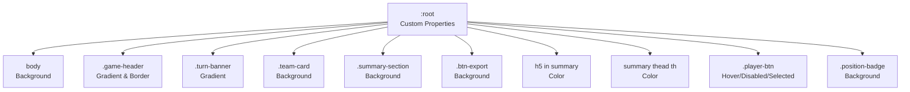
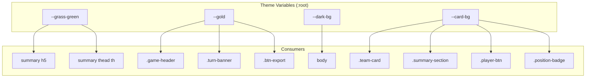
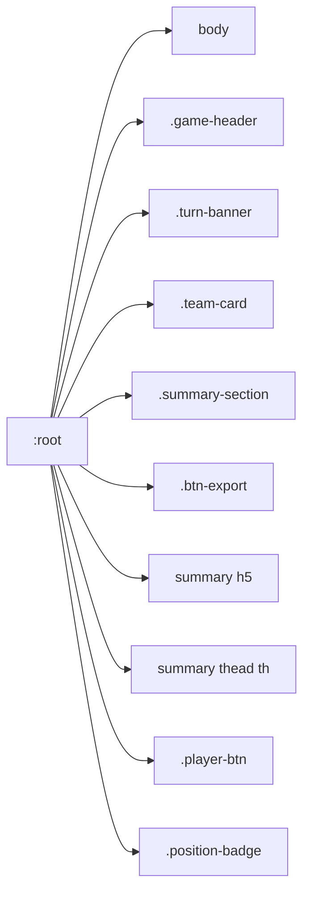

# Theme Customization

<cite>
**Referenced Files in This Document**
- [prototype.html](file://templates/prototype.html)
</cite>

## Table of Contents
1. [Introduction](#introduction)
2. [Project Structure](#project-structure)
3. [Core Components](#core-components)
4. [Architecture Overview](#architecture-overview)
5. [Detailed Component Analysis](#detailed-component-analysis)
6. [Dependency Analysis](#dependency-analysis)
7. [Performance Considerations](#performance-considerations)
8. [Troubleshooting Guide](#troubleshooting-guide)
9. [Conclusion](#conclusion)

## Introduction
This document explains how to customize the theme of the application using CSS custom properties defined in the :root section. It focuses on the four primary theme variables and how they propagate across the UI to achieve a cohesive color scheme. You will learn how to change the overall palette by editing the custom properties, how different CSS selectors target specific UI components (headers, cards, buttons, badges), and how to maintain visual consistency when making theme changes.

## Project Structure
The entire theme system is contained within a single HTML template file. The styling is embedded in a style element inside the head section, and the JavaScript logic is included at the bottom of the body. There are no external CSS or JS files in this project.

**Diagram sources**
- [prototype.html:9-14](file://templates/prototype.html#L9-L14)
- [prototype.html:15-213](file://templates/prototype.html#L15-L213)

**Section sources**
- [prototype.html:1-213](file://templates/prototype.html#L1-L213)

## Core Components
The theme customization hinges on four CSS custom properties defined in the :root section:
- --grass-green: Used primarily for accents and highlights.
- --gold: Used for key highlights, borders, and gradients.
- --dark-bg: Applied as the page background.
- --card-bg: Applied as backgrounds for cards and summary sections.

These variables are consumed throughout the stylesheet to keep the color scheme unified. Updating them changes the entire look-and-feel consistently.

Key selectors and their relationships:
- body applies --dark-bg as background.
- .game-header applies a gradient using base dark colors and uses --gold for the bottom border.
- .turn-banner applies a gradient using --gold and another accent color.
- .team-card and .summary-section apply --card-bg for their backgrounds.
- .btn-export uses --gold for its background.
- Summary headers and table headers use --gold for text color.
- .player-btn hover and disabled/selected states use carefully chosen colors to remain readable against the card backgrounds.
- .position-badge uses a semi-transparent background to remain subtle while still legible.

Practical customization steps:
- To change the overall color palette, edit the four variables in the :root section.
- To adjust gradients, update the gradient values in .game-header and .turn-banner.
- To refine button styles, adjust the player-btn hover/disabled/selected colors to maintain contrast against --card-bg.
- To tweak badges, adjust the background and color of .position-badge to ensure readability.

Maintaining visual consistency:
- Keep --gold as a bright, contrasting accent against --card-bg and --dark-bg.
- Ensure hover and disabled states of interactive elements remain readable against --card-bg.
- Verify that text colors (e.g., summary headers) remain legible against backgrounds using --gold.

**Section sources**
- [prototype.html:9-14](file://templates/prototype.html#L9-L14)
- [prototype.html:15-213](file://templates/prototype.html#L15-L213)

## Architecture Overview
The theme architecture is a centralized property-driven system. The :root defines the palette, and individual components consume these properties. This minimizes duplication and ensures consistent updates.

**Diagram sources**
- [prototype.html:9-14](file://templates/prototype.html#L9-L14)
- [prototype.html:15-213](file://templates/prototype.html#L15-L213)

## Detailed Component Analysis

### Custom Properties and Their Consumers
- :root defines the palette. Consumers include:
  - body background via --dark-bg.
  - .game-header gradient and border via --gold.
  - .turn-banner gradient via --gold.
  - .team-card and .summary-section backgrounds via --card-bg.
  - .btn-export background via --gold.
  - Summary headers and table headers text color via --gold.
  - .player-btn hover/disabled/selected states for contrast against --card-bg.
  - .position-badge background for subtlety against --card-bg.

How to modify:
- Change --dark-bg to alter the page background.
- Change --card-bg to unify card and summary backgrounds.
- Change --gold to adjust highlights, borders, and gradients.
- Change --grass-green for additional accent color usage.

**Section sources**
- [prototype.html:9-14](file://templates/prototype.html#L9-L14)
- [prototype.html:15-213](file://templates/prototype.html#L15-L213)

### Background Colors
- Page background: body uses --dark-bg.
- Cards and summaries: .team-card and .summary-section use --card-bg.
- Recommendations:
  - Choose a --card-bg that provides sufficient contrast for text and interactive elements.
  - Ensure --card-bg remains distinct from --dark-bg to avoid visual blending.

**Section sources**
- [prototype.html:15-213](file://templates/prototype.html#L15-L213)

### Button Styles
- Base button: .player-btn uses fixed colors for background/border/text.
- Hover state: Adjusts to a darker shade with elevation and shadow.
- Disabled/Selected: Uses muted colors and a strikethrough to indicate state.
- Recommendations:
  - If you change --card-bg, adjust .player-btn hover/disabled/selected colors to preserve readability and contrast.
  - Keep the selected state visually distinct from disabled state.

**Section sources**
- [prototype.html:89-132](file://templates/prototype.html#L89-L132)

### Gradient Effects
- .game-header uses a gradient with base dark colors and --gold for the border.
- .turn-banner uses a gradient with --gold and another accent.
- Recommendations:
  - Keep gradient stops aligned with the base palette.
  - Ensure the border color (--gold) remains visible against the gradient.

**Section sources**
- [prototype.html:20-43](file://templates/prototype.html#L20-L43)

### Typography and Text Colors
- Summary headers and table headers use --gold for text color.
- Recommendations:
  - Maintain sufficient contrast between text and backgrounds.
  - Test readability across devices and screen sizes.

**Section sources**
- [prototype.html:142-159](file://templates/prototype.html#L142-L159)

### Badges and Indicators
- .position-badge uses a semi-transparent background and muted text color.
- Recommendations:
  - Ensure the badge background remains subtle but still legible against --card-bg.
  - Keep text color consistent with the overall palette.

**Section sources**
- [prototype.html:125-132](file://templates/prototype.html#L125-L132)

### Export Button
- .btn-export uses --gold for background and a hover effect that lightens the color.
- Recommendations:
  - Keep hover color within the same hue family as --gold for consistency.
  - Ensure text color remains readable against the button background.

**Section sources**
- [prototype.html:187-198](file://templates/prototype.html#L187-L198)

## Dependency Analysis
The theme system exhibits a unidirectional dependency from :root to consumers. There are no circular dependencies because custom properties are read-only and consumed by selectors.

**Diagram sources**
- [prototype.html:9-14](file://templates/prototype.html#L9-L14)
- [prototype.html:15-213](file://templates/prototype.html#L15-L213)

**Section sources**
- [prototype.html:9-14](file://templates/prototype.html#L9-L14)
- [prototype.html:15-213](file://templates/prototype.html#L15-L213)

## Performance Considerations
- CSS custom properties are evaluated at render time and are efficient for theming.
- Limit the number of places where custom properties are used to reduce reflows.
- Prefer using custom properties for colors and spacing to minimize cascade complexity.

## Troubleshooting Guide
Common issues and resolutions:
- Low contrast: If text becomes hard to read after changing --card-bg, adjust .player-btn hover/disabled/selected colors and .position-badge background to improve contrast.
- Mismatched accents: If --gold looks out of place against new backgrounds, adjust gradients in .game-header and .turn-banner to maintain visual harmony.
- Readability problems: Ensure summary headers and table headers retain sufficient contrast against their backgrounds.

**Section sources**
- [prototype.html:15-213](file://templates/prototype.html#L15-L213)

## Conclusion
By centralizing the palette in :root and consuming the variables throughout the stylesheet, the application achieves a consistent and maintainable theme system. Updating the four custom properties allows you to quickly change the entire color scheme while preserving visual coherence. Focus on contrast, readability, and consistent hue families to maintain a polished look across headers, cards, buttons, and badges.