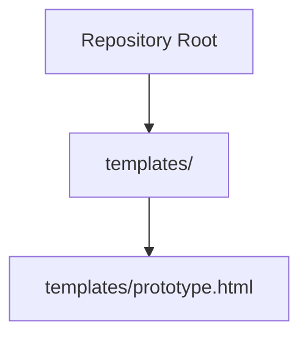
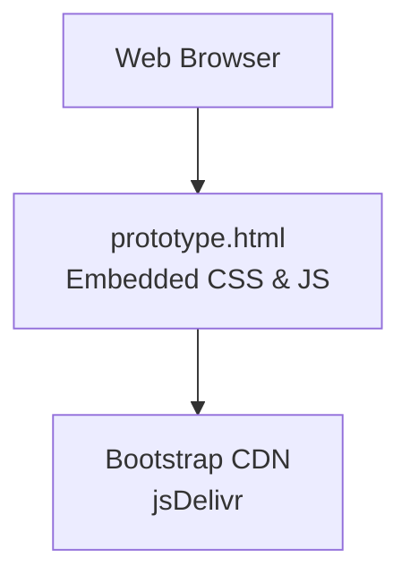
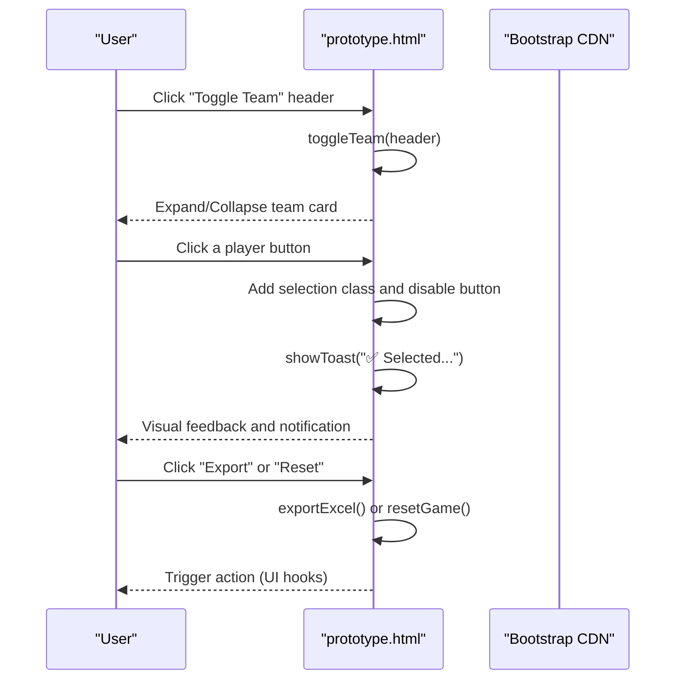
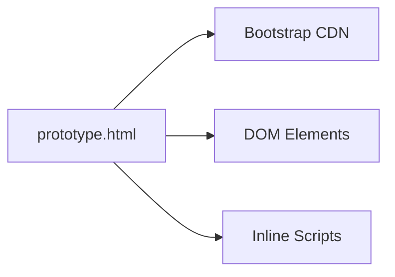

# Deployment and Distribution

<cite>
**Referenced Files in This Document**
- [prototype.html](file://templates/prototype.html)
</cite>

## Table of Contents
1. [Introduction](#introduction)
2. [Project Structure](#project-structure)
3. [Core Components](#core-components)
4. [Architecture Overview](#architecture-overview)
5. [Detailed Component Analysis](#detailed-component-analysis)
6. [Dependency Analysis](#dependency-analysis)
7. [Performance Considerations](#performance-considerations)
8. [Troubleshooting Guide](#troubleshooting-guide)
9. [Conclusion](#conclusion)
10. [Appendices](#appendices)

## Introduction
This document provides deployment and distribution guidance for WorldCupGame, focusing on how to deliver the application as a standalone, client-side web page. The application is designed as a single-file HTML page with embedded styles and minimal script logic, intended for local execution without server infrastructure. It relies on a CDN-hosted Bootstrap library for UI components and interactivity. The guide covers distribution methods, offline alternatives, hosting options, browser compatibility, performance optimization, and security considerations for client-side sharing.

## Project Structure
The repository contains a single HTML file that defines the entire application surface. It includes:
- Embedded CSS for theming and responsive layout
- Inline JavaScript for interactive behaviors (team toggling, selection feedback, notifications, export/reset actions)
- Bootstrap CSS and JS loaded from a CDN
- Static assets referenced via Unicode flags and icons

**Diagram sources**
- [prototype.html](file://templates/prototype.html)

**Section sources**
- [prototype.html](file://templates/prototype.html)

## Core Components
- Single-file HTML application with embedded CSS and inline JavaScript
- Bootstrap 5.3.3 loaded from a CDN for UI components and JavaScript plugins
- Responsive grid layout for player cards and summary table
- Interactive elements:
  - Team card headers with expand/collapse behavior
  - Player buttons with selection state and disabled visuals
  - Toast notifications for user feedback
  - Export and Reset actions (UI hooks for future implementation)

Key implementation references:
- Bootstrap CSS and JS CDN links
- Inline script blocks for DOM manipulation and event handling
- Responsive breakpoints and media queries

**Section sources**
- [prototype.html](file://templates/prototype.html)

## Architecture Overview
The application follows a pure client-side architecture:
- No server-side rendering or backend endpoints
- All assets are static (HTML, CSS, JS)
- Bootstrap is fetched from a public CDN
- Local storage is not used; state is ephemeral per session

**Diagram sources**
- [prototype.html](file://templates/prototype.html)

## Detailed Component Analysis

### Bootstrap CDN Dependencies
The application depends on Bootstrap for:
- Grid system and responsive utilities
- Button styles and interactive components
- JavaScript bundle for Bootstrap plugins

CDN references:
- Bootstrap CSS: loaded via a CDN link
- Bootstrap JS bundle: loaded via a CDN script tag

Offline alternatives:
- Download Bootstrap CSS and JS locally and host alongside the HTML
- Replace CDN URLs with local paths after copying assets into the same directory

Security and integrity considerations:
- When self-hosting, pin specific versions and consider Subresource Integrity (SRI) attributes
- Prefer HTTPS delivery for both CDN and local assets

**Section sources**
- [prototype.html](file://templates/prototype.html)

### Responsive Layout and Interactions
The page uses:
- CSS custom properties for theming
- Media queries for mobile responsiveness
- Inline JavaScript for:
  - Toggling team card visibility
  - Handling player selection events
  - Showing toast notifications
  - Export and reset action hooks

**Diagram sources**
- [prototype.html](file://templates/prototype.html)

**Section sources**
- [prototype.html](file://templates/prototype.html)

### Hosting Options
Static web hosting platforms:
- Serve the HTML file directly from any static host
- Ensure proper MIME type for .html (text/html)
- Enable compression (gzip/brotli) for improved load times

GitHub Pages:
- Publish the HTML file to a gh-pages branch or docs folder
- Configure base URL if hosted under a subpath
- GitHub Pages serves static assets over HTTPS

Local file serving:
- Open the HTML file directly in a browser (file://)
- Some browser policies may restrict certain features (e.g., clipboard API) depending on the protocol
- For development, use a local HTTP server to avoid file:// limitations

**Section sources**
- [prototype.html](file://templates/prototype.html)

## Dependency Analysis
External runtime dependencies:
- Bootstrap CSS and JS from jsDelivr
- No third-party analytics, trackers, or external fonts in the current file

Internal dependencies:
- Inline CSS and JS are tightly coupled to the HTML structure
- JavaScript relies on DOM elements defined in the HTML

Potential circular dependencies:
- None; the page is a leaf module with no imports

**Diagram sources**
- [prototype.html](file://templates/prototype.html)

**Section sources**
- [prototype.html](file://templates/prototype.html)

## Performance Considerations
Optimization strategies for fast delivery and smooth interactions:
- Minimize payload:
  - Keep the HTML file self-contained; avoid unnecessary comments or whitespace
  - Prefer compact CSS and inline scripts
- Leverage caching:
  - Set long cache headers for static assets (Bootstrap CSS/JS)
  - Use immutable cache keys for versioned assets
- Compression:
  - Enable gzip or brotli on the server for HTML, CSS, and JS
- Critical rendering path:
  - Keep essential CSS inline and defer non-critical CSS
  - Defer non-critical JavaScript until after initial render
- Image optimization:
  - Flags and icons are Unicode; no raster images are present
- Network reliability:
  - Self-host Bootstrap to reduce reliance on CDN availability
  - Consider adding a service worker for offline fallback (advanced)

[No sources needed since this section provides general guidance]

## Troubleshooting Guide
Common issues and resolutions:
- Bootstrap not loading:
  - Verify network connectivity to the CDN
  - Switch to self-hosted Bootstrap if CDN is blocked
- Styling not applied:
  - Confirm the HTML is served over HTTP/HTTPS (not file://)
  - Check browser console for CSP or mixed-content errors
- Interactions not working:
  - Ensure JavaScript is enabled
  - Confirm no ad blockers or extensions interfere with inline scripts
- Export/Reset actions:
  - These are UI hooks; implement actual logic in the application code
- Mobile responsiveness:
  - Test on various screen sizes; adjust breakpoints if needed

**Section sources**
- [prototype.html](file://templates/prototype.html)

## Conclusion
WorldCupGame is a lightweight, single-file client-side application suitable for direct distribution and local execution. Its reliance on a Bootstrap CDN simplifies deployment but introduces external dependency concerns. By self-hosting assets, choosing appropriate hosting platforms, and applying performance optimizations, you can reliably share the application across browsers and devices while maintaining a seamless user experience.

## Appendices

### Browser Compatibility and Testing Checklist
- Desktop browsers: Chrome, Firefox, Safari, Edge
- Mobile browsers: Chrome for Android, Safari for iOS
- Minimum supported Bootstrap features:
  - CSS grid utilities
  - Button styles and hover states
  - JavaScript components (if used)
- Testing tasks:
  - Verify responsive layout on small/large screens
  - Test team toggle and player selection interactions
  - Validate toast notifications and action buttons
  - Confirm export/reset UI hooks are reachable

[No sources needed since this section provides general guidance]