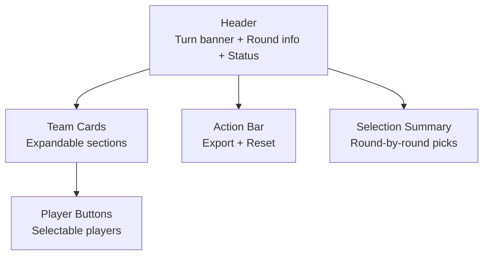

# Getting Started

<cite>
**Referenced Files in This Document**
- [prototype.html](file://templates/prototype.html)
</cite>

## Table of Contents
1. [Introduction](#introduction)
2. [Prerequisites](#prerequisites)
3. [Quick Start](#quick-start)
4. [Interface Overview](#interface-overview)
5. [Step-by-Step First-Time User Guide](#step-by-step-first-time-user-guide)
6. [Common Beginner Questions](#common-beginner-questions)
7. [Troubleshooting](#troubleshooting)
8. [Accessibility and Screen Size Considerations](#accessibility-and-screen-size-considerations)
9. [Conclusion](#conclusion)

## Introduction
WorldCupGame is a turn-based draft interface designed to simulate selecting players for a fantasy World Cup squad. It presents teams and their available players in an interactive grid. Players take turns selecting players, with visual indicators showing whose turn it is and the current round progression. The interface includes a summary table that tracks picks across multiple participants and rounds.

## Prerequisites
To run the application, you need:
- A modern web browser (Chrome, Firefox, Safari, Edge, or equivalent)
- An active internet connection (required for Bootstrap CDN resources)
- Basic familiarity with navigating web pages and clicking buttons

No special development tools or installations are required. The application is self-contained in a single HTML file and runs directly in the browser.

## Quick Start
The simplest way to run the application:
1. Open the file templates/prototype.html directly in your browser
2. The page will load immediately with all necessary resources fetched from the CDN
3. You can start interacting with the interface right away

Note: Some browsers may block external resources if the file is opened locally via file:// protocol. If you encounter issues, use a local server or open the file through a browser extension that allows mixed content.

## Interface Overview
The interface consists of several key areas:

- Header section: Displays the game title, current player's turn, round information, and game status
- Team cards: Expandable sections for each participating team, showing available players
- Player buttons: Interactive buttons representing selectable players
- Action bar: Export and Reset controls
- Selection summary: Table showing picks across all participants and rounds

**Diagram sources**
- [prototype.html:225-245](file://templates/prototype.html#L225-L245)
- [prototype.html:250-452](file://templates/prototype.html#L250-L452)
- [prototype.html:454-498](file://templates/prototype.html#L454-L498)

## Step-by-Step First-Time User Guide
Follow these steps to complete your first selection:

1. **Loading the Page**
   - Open templates/prototype.html in your browser
   - Wait for the page to fully render (Bootstrap resources will load automatically)
   - Verify the header shows the current turn indicator and round information

2. **Understanding Turn Indicators**
   - Look at the turn banner in the header to see whose turn it is
   - Check the round information below the turn banner
   - Confirm the game status badge shows "进行中" (in progress)

3. **Navigating Team Cards**
   - Click on any team card header to expand/collapse that team's player list
   - Team cards show the number of players already selected from that team
   - Expanded cards reveal all available players for selection

4. **Making Your Selection**
   - Browse available players in the expanded team cards
   - Click on any player button that is not already selected
   - The button will visually change to indicate selection
   - A confirmation notification will appear at the top-right corner

5. **Viewing Results**
   - Check the selection summary table to see your pick
   - The table shows picks across all participants and rounds
   - Your selection will appear in the appropriate round and column

6. **Using Actions**
   - Export button: Generates a download notification (simulated)
   - Reset button: Prompts to clear all selections and restart the game

**Section sources**
- [prototype.html:225-245](file://templates/prototype.html#L225-L245)
- [prototype.html:250-452](file://templates/prototype.html#L250-L452)
- [prototype.html:454-498](file://templates/prototype.html#L454-L498)

## Common Beginner Questions

### How do I know whose turn it is?
The header displays a prominent turn banner showing whose turn it currently is. Below this, you can see the current round, position, and total picks made so far.

### What does the selection status mean?
Selected players are shown as disabled buttons with a different appearance. The team cards also display how many players from each team have been selected.

### How do I expand/collapse team cards?
Click on any team card header area to toggle between expanded and collapsed views. The arrow icon indicates the current state.

### What happens when I select a player?
- The player button becomes visually marked as selected
- The button becomes disabled to prevent re-selection
- A confirmation notification appears at the top-right corner
- Your selection appears in the summary table

### How do I see all my selections?
Check the selection summary table at the bottom of the page. Each row represents a round, and your picks appear in your colored column.

### Can I undo a selection?
No, selections are simulated and cannot be undone. Use the Reset action to clear all selections if needed.

**Section sources**
- [prototype.html:232-237](file://templates/prototype.html#L232-L237)
- [prototype.html:252-260](file://templates/prototype.html#L252-L260)
- [prototype.html:507-517](file://templates/prototype.html#L507-L517)
- [prototype.html:520-528](file://templates/prototype.html#L520-L528)
- [prototype.html:461-498](file://templates/prototype.html#L461-L498)

## Troubleshooting

### Browser Compatibility Issues
- **Older browsers**: The interface requires modern browser support for CSS Grid, Flexbox, and JavaScript features
- **Internet Explorer**: Not supported; use Chrome, Firefox, Safari, or Edge instead
- **Mobile browsers**: Generally work well, but some older mobile browsers may have limited support

### Content Loading Problems
- **CDN resources blocked**: Some browsers block external resources when opening files locally
- **Solution**: Use a local web server or enable mixed content in your browser for testing
- **Alternative**: Save the page locally and open it through a browser extension that allows external resources

### Performance Issues
- **Slow rendering**: Large screens or low-powered devices may experience delays
- **Large images**: The interface uses minimal images; performance depends mainly on device capabilities
- **Network latency**: Initial load depends on CDN response times

### Visual Display Issues
- **Layout problems**: Ensure your browser window is wide enough for optimal layout
- **Text scaling**: Adjust your browser's zoom level if text appears too small or large
- **Color contrast**: The dark theme works best with modern browsers

**Section sources**
- [prototype.html:505-557](file://templates/prototype.html#L505-L557)

## Accessibility and Screen Size Considerations

### Responsive Design Features
The interface includes responsive breakpoints for different screen sizes:
- Mobile phones (up to 576px): Reduced font sizes and adjusted spacing
- Tablets and larger devices: Full desktop layout with optimal spacing
- Wide screens: Maximum content width with comfortable reading margins

### Visual Accessibility
- Dark theme reduces eye strain in low-light environments
- High contrast between text and backgrounds
- Color-coded participant columns aid identification
- Clear visual feedback for interactive elements

### Interaction Accessibility
- Keyboard navigation: Tab order follows logical reading flow
- Focus indicators: Visible focus rings for interactive elements
- Touch targets: Sufficiently sized buttons for mobile use
- Hover states: Enhanced visibility for mouse users

### Screen Reader Support
- Semantic HTML structure with proper headings
- Descriptive alt text for flag emojis
- Logical tab order for keyboard navigation
- ARIA roles and attributes where appropriate

### Device-Specific Considerations
- **Desktop**: Full feature set with mouse hover effects
- **Tablet**: Optimized touch targets and reduced animations
- **Mobile**: Collapsible sections and simplified layouts
- **High DPI**: Proper scaling for Retina displays

**Section sources**
- [prototype.html:214-219](file://templates/prototype.html#L214-L219)
- [prototype.html:15-220](file://templates/prototype.html#L15-L220)

## Conclusion
WorldCupGame provides a straightforward, turn-based selection experience that requires no setup or installation. The interface is designed for immediate usability with clear visual indicators and responsive behavior across devices. New users can quickly understand the turn-based mechanics, navigate team cards, and make selections through intuitive button interactions. The built-in summary table provides clear visibility into the draft progress, while the responsive design ensures accessibility across various screen sizes and devices.