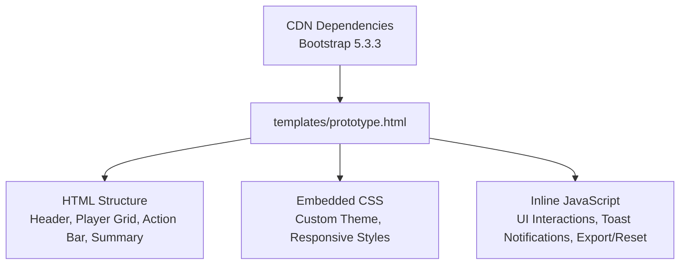
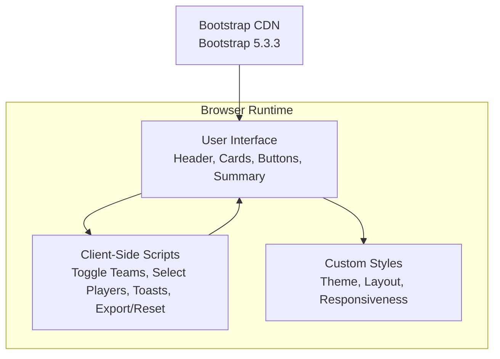
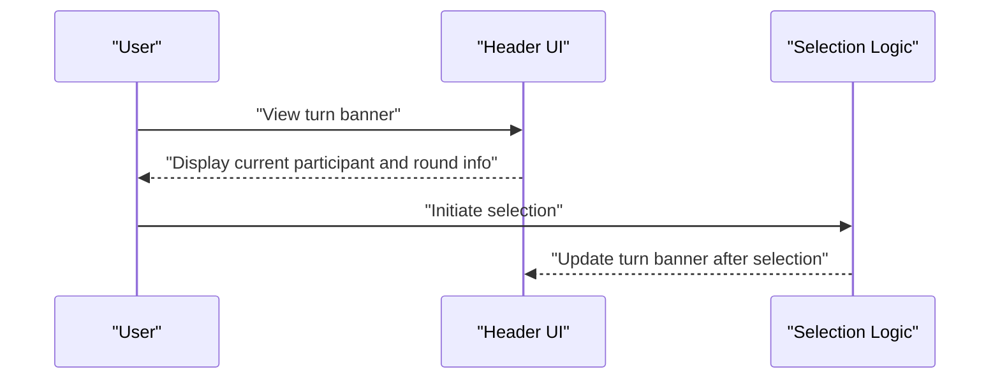
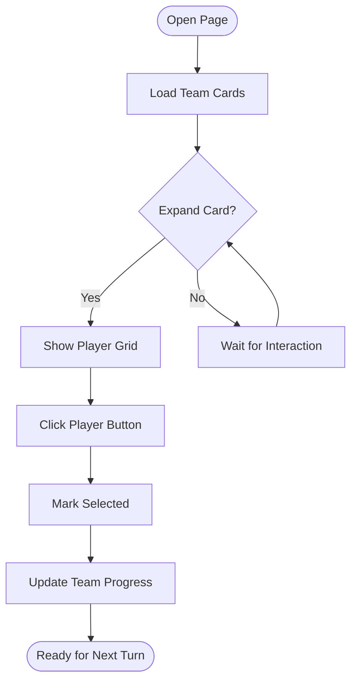
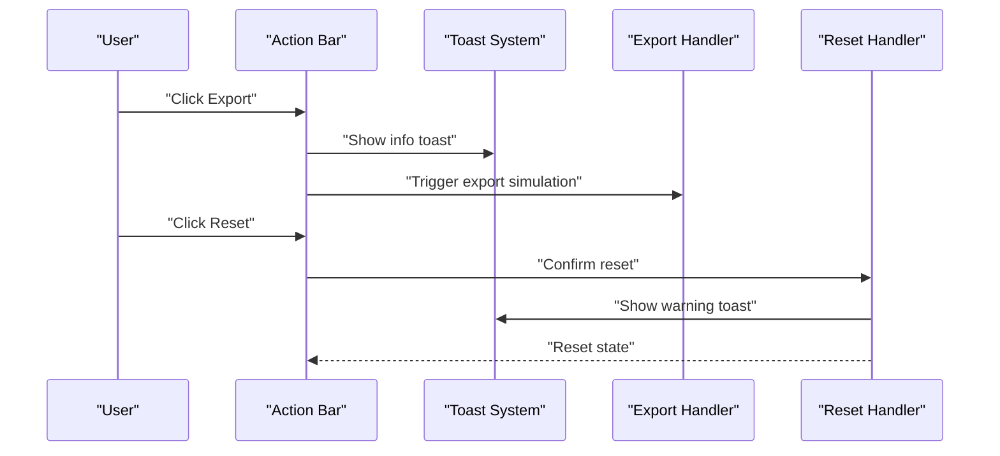
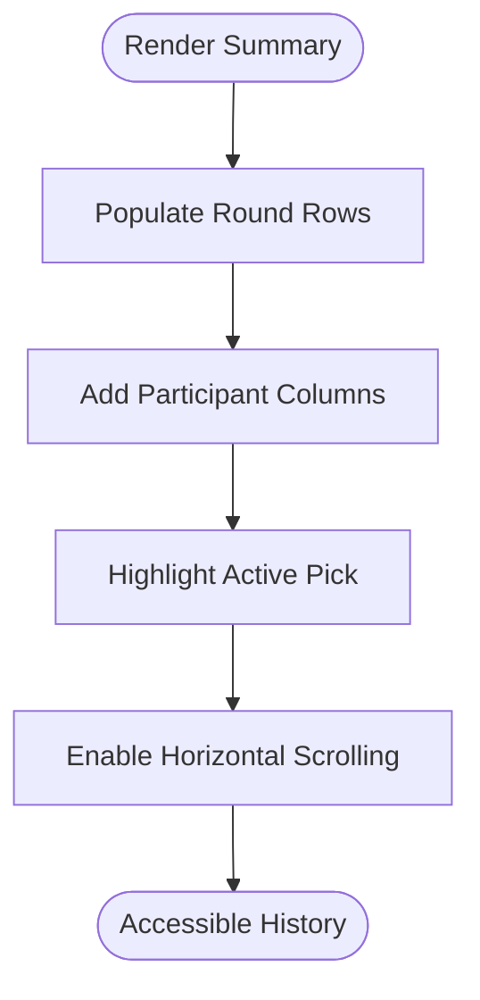
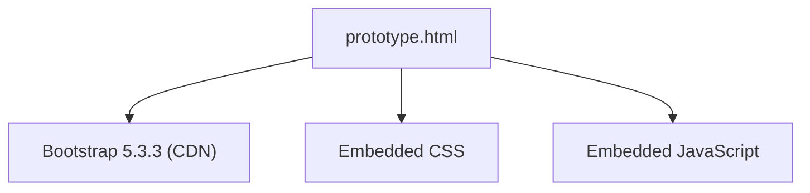

# Project Overview

<cite>
**Referenced Files in This Document**
- [prototype.html](file://templates/prototype.html)
</cite>

## Table of Contents
1. [Introduction](#introduction)
2. [Project Structure](#project-structure)
3. [Core Components](#core-components)
4. [Architecture Overview](#architecture-overview)
5. [Detailed Component Analysis](#detailed-component-analysis)
6. [Dependency Analysis](#dependency-analysis)
7. [Performance Considerations](#performance-considerations)
8. [Troubleshooting Guide](#troubleshooting-guide)
9. [Conclusion](#conclusion)

## Introduction
WorldCupGame is an interactive web application designed to simulate the 2026 FIFA World Cup player selection process. The project presents a fantasy-style draft mechanism where multiple participants take turns selecting players from national squads, recreating the excitement of building a dream team around the world’s biggest sporting event. As a single-file frontend application, it runs entirely in the browser without requiring server-side processing, making it lightweight, portable, and easy to deploy.

Key value propositions:
- Interactive player selection: Participants can browse national teams, review player profiles, and pick players in real-time.
- Multi-participant support: The interface displays turn-based selection with participant indicators, enabling collaborative play among friends or online groups.
- Export capabilities: Built-in export functionality allows saving selection results for sharing or archival.
- Standalone nature: No external dependencies beyond a CDN-hosted Bootstrap library, ensuring simplicity and reliability.

Target audience:
- Sports enthusiasts who enjoy fantasy-style competitions and want to engage with the upcoming World Cup.
- Fantasy sports participants who seek a quick, browser-based tool to draft and track their favorite players.

## Project Structure
The entire application is contained within a single HTML file, which includes embedded styles and scripts. This monolithic approach ensures zero-server deployment and minimal setup overhead.

**Diagram sources**
- [prototype.html:1-561](file://templates/prototype.html#L1-L561)

**Section sources**
- [prototype.html:1-561](file://templates/prototype.html#L1-L561)

## Core Components
- Game header: Displays the tournament theme, current participant’s turn, round information, and game status.
- Team cards: Group players by national squad with expandable/collapsible sections for improved navigation.
- Player buttons: Individual clickable entries representing available players, with visual feedback upon selection.
- Action bar: Provides export and reset controls for managing the session.
- Selection summary: Tabular view of picks across rounds and participants, highlighting the active selection.

These components combine to deliver a streamlined, turn-based drafting experience tailored to the 2026 FIFA World Cup narrative.

**Section sources**
- [prototype.html:224-245](file://templates/prototype.html#L224-L245)
- [prototype.html:250-452](file://templates/prototype.html#L250-L452)
- [prototype.html:454-498](file://templates/prototype.html#L454-L498)

## Architecture Overview
The application follows a client-side architecture with a single HTML page serving as both template and runtime engine. It leverages Bootstrap for responsive layout and UI components, while custom CSS and JavaScript handle interactivity and state updates.

**Diagram sources**
- [prototype.html:505-558](file://templates/prototype.html#L505-L558)
- [prototype.html:7](file://templates/prototype.html#L7)

**Section sources**
- [prototype.html:505-558](file://templates/prototype.html#L505-L558)
- [prototype.html:7](file://templates/prototype.html#L7)

## Detailed Component Analysis

### Header and Turn Management
The header communicates the current participant’s turn, round progression, and overall game status. This creates immediate context for participants and helps coordinate multi-user sessions.

**Diagram sources**
- [prototype.html:225-245](file://templates/prototype.html#L225-L245)

**Section sources**
- [prototype.html:225-245](file://templates/prototype.html#L225-L245)

### Team Cards and Player Grid
Players are grouped by national team within collapsible cards. Each card shows the team flag, name, and selection progress. The grid layout adapts across screen sizes for optimal usability.

**Diagram sources**
- [prototype.html:250-452](file://templates/prototype.html#L250-L452)

**Section sources**
- [prototype.html:250-452](file://templates/prototype.html#L250-L452)

### Action Bar and Export/Reset
The action bar provides essential controls for session management. Export initiates a download simulation, while reset clears selections with confirmation.

**Diagram sources**
- [prototype.html:454-458](file://templates/prototype.html#L454-L458)
- [prototype.html:546-556](file://templates/prototype.html#L546-L556)
- [prototype.html:530-544](file://templates/prototype.html#L530-L544)

**Section sources**
- [prototype.html:454-458](file://templates/prototype.html#L454-L458)
- [prototype.html:546-556](file://templates/prototype.html#L546-L556)
- [prototype.html:530-544](file://templates/prototype.html#L530-L544)

### Selection Summary
The summary table tracks picks across rounds and participants, visually highlighting the active selection and providing a historical record of choices.

**Diagram sources**
- [prototype.html:460-498](file://templates/prototype.html#L460-L498)

**Section sources**
- [prototype.html:460-498](file://templates/prototype.html#L460-L498)

## Dependency Analysis
The application relies on a single external dependency hosted via CDN: Bootstrap 5.3.3. All other assets (styles and scripts) are embedded directly in the HTML file, ensuring portability and offline readiness.

**Diagram sources**
- [prototype.html:7](file://templates/prototype.html#L7)
- [prototype.html:505-558](file://templates/prototype.html#L505-L558)

**Section sources**
- [prototype.html:7](file://templates/prototype.html#L7)
- [prototype.html:505-558](file://templates/prototype.html#L505-L558)

## Performance Considerations
- Single-file delivery minimizes HTTP requests and reduces latency.
- Embedded CSS and JavaScript eliminate network overhead for local execution.
- Responsive design ensures efficient rendering across devices without heavy frameworks.
- Lightweight DOM manipulation keeps interactions smooth during multi-round drafting.

## Troubleshooting Guide
- If the page does not render correctly, verify that the CDN link for Bootstrap is accessible.
- If player buttons do not respond, confirm that the inline script executed without errors.
- If toasts do not appear, check the toast container element and console for errors.
- For export/reset actions, ensure browser pop-up permissions are enabled if prompted.

**Section sources**
- [prototype.html:530-556](file://templates/prototype.html#L530-L556)
- [prototype.html:7](file://templates/prototype.html#L7)

## Conclusion
WorldCupGame delivers a focused, engaging simulation of the 2026 FIFA World Cup player selection process. Its single-file, client-side architecture makes it easy to share and run anywhere, while the intuitive UI and multi-participant support enhance collaboration. With embedded styling and minimal external dependencies, it offers a reliable, portable solution for sports fans and fantasy enthusiasts alike.