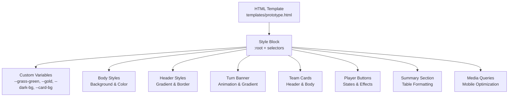
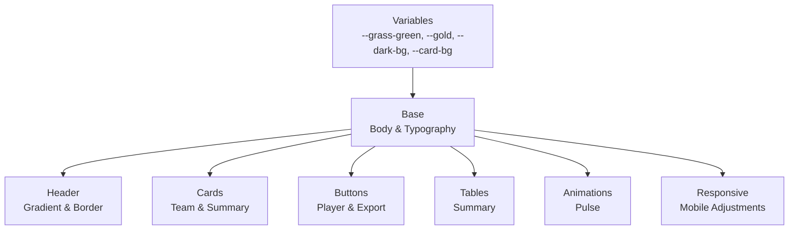
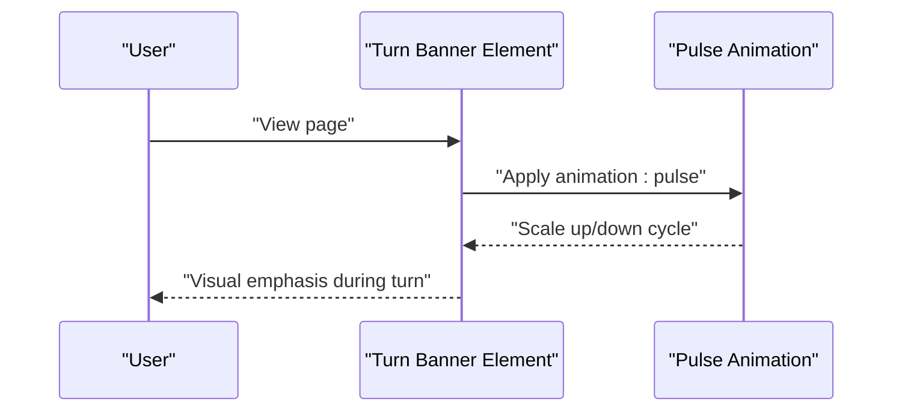
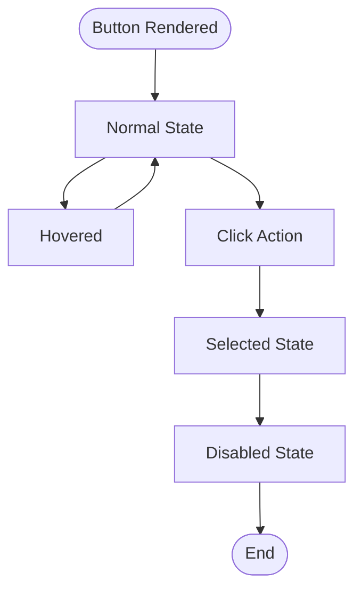
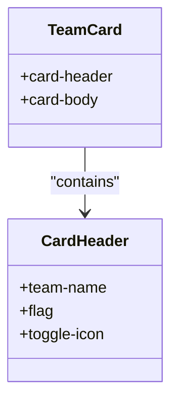
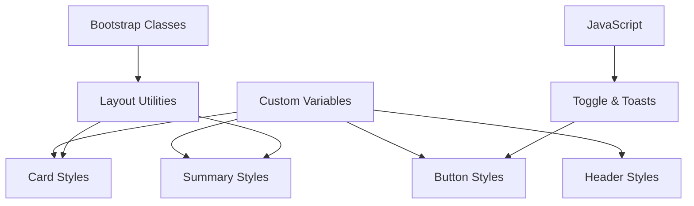

# CSS Styling and Theming

<cite>
**Referenced Files in This Document**
- [prototype.html](file://templates/prototype.html)
</cite>

## Table of Contents
1. [Introduction](#introduction)
2. [Project Structure](#project-structure)
3. [Core Components](#core-components)
4. [Architecture Overview](#architecture-overview)
5. [Detailed Component Analysis](#detailed-component-analysis)
6. [Dependency Analysis](#dependency-analysis)
7. [Performance Considerations](#performance-considerations)
8. [Troubleshooting Guide](#troubleshooting-guide)
9. [Conclusion](#conclusion)

## Introduction
This document explains the CSS architecture and theming system used in the World Cup Game interface. It focuses on custom CSS variables for consistent theming, the dark theme implementation with gradient backgrounds and card styling, responsive design using media queries, the animation system for turn banners, player button styling with hover and disabled states, Bootstrap integration patterns, and examples of card headers, team names, flag icons, and summary table formatting. The goal is to help developers customize themes easily while maintaining visual consistency across components.

## Project Structure
The styling is embedded directly inside the HTML template under a style element. The CSS follows a modular approach:
- Global variables define the color palette
- Base layout and typography
- Theme-specific gradients and backgrounds
- Component-level styles for cards, buttons, and tables
- Responsive adjustments for mobile devices

**Diagram sources**
- [prototype.html:8-213](file://templates/prototype.html#L8-L213)

**Section sources**
- [prototype.html:1-548](file://templates/prototype.html#L1-L548)

## Core Components
This section documents the central theming constructs and how they are applied across the interface.

- Custom CSS variables
  - Purpose: Centralized color definitions enabling easy theme customization
  - Variables: --grass-green, --gold, --dark-bg, --card-bg
  - Usage: Applied via var(--variable-name) to ensure consistency across components

- Dark theme foundation
  - Background: Uses --dark-bg for the body
  - Card backgrounds: Uses --card-bg for team cards and summary sections
  - Accent colors: --gold for highlights and interactive elements

- Gradient backgrounds
  - Header: Linear gradient from dark to blue tones
  - Turn banner: Gold-to-orange gradient with strong contrast text
  - Export button: Gold background with hover enhancement

- Typography and spacing
  - Font family: Modern sans-serif stack for readability
  - Spacing: Consistent padding/margins for cards and tables

**Section sources**
- [prototype.html:9-14](file://templates/prototype.html#L9-L14)
- [prototype.html:15-19](file://templates/prototype.html#L15-L19)
- [prototype.html:20-27](file://templates/prototype.html#L20-L27)
- [prototype.html:34-48](file://templates/prototype.html#L34-L48)
- [prototype.html:187-198](file://templates/prototype.html#L187-L198)

## Architecture Overview
The CSS architecture centers around a small set of custom variables and layered styles:
- Variables define the palette
- Base styles apply global colors and fonts
- Component styles build on base styles with minimal overrides
- Media queries adapt layouts for smaller screens

**Diagram sources**
- [prototype.html:9-14](file://templates/prototype.html#L9-L14)
- [prototype.html:15-19](file://templates/prototype.html#L15-L19)
- [prototype.html:20-27](file://templates/prototype.html#L20-L27)
- [prototype.html:55-61](file://templates/prototype.html#L55-L61)
- [prototype.html:89-113](file://templates/prototype.html#L89-L113)
- [prototype.html:149-168](file://templates/prototype.html#L149-L168)
- [prototype.html:44-48](file://templates/prototype.html#L44-L48)
- [prototype.html:207-212](file://templates/prototype.html#L207-L212)

## Detailed Component Analysis

### Custom CSS Variables and Theming
- Variables are declared in :root to be globally available
- They unify color usage across gradients, backgrounds, borders, and text accents
- Changing a variable updates the entire theme consistently

Implementation references:
- Variable declarations: [prototype.html:9-14](file://templates/prototype.html#L9-L14)
- Usage in body background: [prototype.html:16](file://templates/prototype.html#L16)
- Usage in card backgrounds: [prototype.html:56](file://templates/prototype.html#L56), [prototype.html:136](file://templates/prototype.html#L136)
- Usage in header border: [prototype.html:22](file://templates/prototype.html#L22)
- Usage in turn banner gradient: [prototype.html:35](file://templates/prototype.html#L35)
- Usage in export button: [prototype.html:188](file://templates/prototype.html#L188)

**Section sources**
- [prototype.html:9-14](file://templates/prototype.html#L9-L14)
- [prototype.html:16](file://templates/prototype.html#L16)
- [prototype.html:56](file://templates/prototype.html#L56)
- [prototype.html:136](file://templates/prototype.html#L136)
- [prototype.html:22](file://templates/prototype.html#L22)
- [prototype.html:35](file://templates/prototype.html#L35)
- [prototype.html:188](file://templates/prototype.html#L188)

### Dark Theme Implementation
- Background: Dark base color for reduced eye strain and strong contrast
- Gradients: Subtle header gradient and vibrant turn banner gradient
- Borders and cards: Soft borders and elevated card backgrounds for depth
- Text: High contrast text color against dark backgrounds

Implementation references:
- Body background: [prototype.html:16](file://templates/prototype.html#L16)
- Header gradient and border: [prototype.html:21](file://templates/prototype.html#L21), [prototype.html:22](file://templates/prototype.html#L22)
- Card backgrounds: [prototype.html:56](file://templates/prototype.html#L56), [prototype.html:136](file://templates/prototype.html#L136)
- Border colors: [prototype.html:57](file://templates/prototype.html#L57), [prototype.html:137](file://templates/prototype.html#L137)

**Section sources**
- [prototype.html:16](file://templates/prototype.html#L16)
- [prototype.html:21](file://templates/prototype.html#L21)
- [prototype.html:22](file://templates/prototype.html#L22)
- [prototype.html:56](file://templates/prototype.html#L56)
- [prototype.html:136](file://templates/prototype.html#L136)
- [prototype.html:57](file://templates/prototype.html#L57)
- [prototype.html:137](file://templates/prototype.html#L137)

### Responsive Design with Media Queries
- Mobile-first approach with targeted adjustments for small screens
- Font sizes and paddings reduce for compact displays
- Grid column counts remain flexible to fit available space

Implementation references:
- Media query block: [prototype.html:207-212](file://templates/prototype.html#L207-L212)
- Adjustments for header title: [prototype.html:208](file://templates/prototype.html#L208)
- Adjustments for turn banner: [prototype.html:209](file://templates/prototype.html#L209)
- Adjustments for player buttons: [prototype.html:210](file://templates/prototype.html#L210)
- Adjustments for summary table: [prototype.html:211](file://templates/prototype.html#L211)

**Section sources**
- [prototype.html:207-212](file://templates/prototype.html#L207-L212)
- [prototype.html:208](file://templates/prototype.html#L208)
- [prototype.html:209](file://templates/prototype.html#L209)
- [prototype.html:210](file://templates/prototype.html#L210)
- [prototype.html:211](file://templates/prototype.html#L211)

### Animation System: Pulse for Turn Banners
- Turn banner uses a subtle scaling animation to draw attention
- Smooth easing via transform scale creates a gentle pulsing effect
- Animation runs continuously to signal active selection phase

Implementation references:
- Banner element: [prototype.html:225-227](file://templates/prototype.html#L225-L227)
- Animation property: [prototype.html:42](file://templates/prototype.html#L42)
- Keyframes definition: [prototype.html:44-48](file://templates/prototype.html#L44-L48)

**Diagram sources**
- [prototype.html:42](file://templates/prototype.html#L42)
- [prototype.html:44-48](file://templates/prototype.html#L44-L48)
- [prototype.html:225-227](file://templates/prototype.html#L225-L227)

**Section sources**
- [prototype.html:42](file://templates/prototype.html#L42)
- [prototype.html:44-48](file://templates/prototype.html#L44-L48)
- [prototype.html:225-227](file://templates/prototype.html#L225-L227)

### Player Button Styling: States and Effects
- Base appearance: Dark blue background with light text and subtle border
- Hover state: Lift effect, slight elevation, and enhanced shadow for feedback
- Disabled state: Reduced opacity and muted colors with line-through decoration
- Selected state: Visual indication of selection with disabled behavior
- Typography: Jersey number, player name, and position badge styled for clarity

Implementation references:
- Base button: [prototype.html:89-113](file://templates/prototype.html#L89-L113)
- Hover effect: [prototype.html:101-105](file://templates/prototype.html#L101-L105)
- Disabled/selected: [prototype.html:106-113](file://templates/prototype.html#L106-L113)
- Typography within button: [prototype.html:114-132](file://templates/prototype.html#L114-L132)

**Diagram sources**
- [prototype.html:89-113](file://templates/prototype.html#L89-L113)
- [prototype.html:101-105](file://templates/prototype.html#L101-L105)
- [prototype.html:106-113](file://templates/prototype.html#L106-L113)

**Section sources**
- [prototype.html:89-113](file://templates/prototype.html#L89-L113)
- [prototype.html:101-105](file://templates/prototype.html#L101-L105)
- [prototype.html:106-113](file://templates/prototype.html#L106-L113)
- [prototype.html:114-132](file://templates/prototype.html#L114-L132)

### Bootstrap Integration Patterns
- Bootstrap CSS is included via CDN for grid and utility classes
- Custom styles override Bootstrap defaults for cards, buttons, and tables
- Utility classes (e.g., container, row, col-* classes) are used alongside custom CSS
- Toast notifications leverage Bootstrap’s toast utilities

Integration references:
- Bootstrap CSS import: [prototype.html:7](file://templates/prototype.html#L7)
- Container and grid usage: [prototype.html:240](file://templates/prototype.html#L240), [prototype.html:254](file://templates/prototype.html#L254)
- Toast utilities: [prototype.html:526](file://templates/prototype.html#L526), [prototype.html:531](file://templates/prototype.html#L531)
- Bootstrap JS bundle: [prototype.html:545](file://templates/prototype.html#L545)

**Section sources**
- [prototype.html:7](file://templates/prototype.html#L7)
- [prototype.html:240](file://templates/prototype.html#L240)
- [prototype.html:254](file://templates/prototype.html#L254)
- [prototype.html:526](file://templates/prototype.html#L526)
- [prototype.html:531](file://templates/prototype.html#L531)
- [prototype.html:545](file://templates/prototype.html#L545)

### Card Header Styling, Team Names, and Flag Icons
- Card header: Semi-transparent background, bottom border, and flex layout
- Team name: Bold and prominent with muted metadata
- Flag icons: Large emoji flags aligned with team name
- Toggle icon: Rotates on collapse to indicate state

Implementation references:
- Card header: [prototype.html:62-88](file://templates/prototype.html#L62-L88)
- Team name: [prototype.html:74-77](file://templates/prototype.html#L74-L77)
- Flag icon: [prototype.html:78-81](file://templates/prototype.html#L78-L81)
- Toggle icon rotation: [prototype.html:86-88](file://templates/prototype.html#L86-L88)

**Diagram sources**
- [prototype.html:62-88](file://templates/prototype.html#L62-L88)
- [prototype.html:74-77](file://templates/prototype.html#L74-L77)
- [prototype.html:78-81](file://templates/prototype.html#L78-L81)
- [prototype.html:86-88](file://templates/prototype.html#L86-L88)

**Section sources**
- [prototype.html:62-88](file://templates/prototype.html#L62-L88)
- [prototype.html:74-77](file://templates/prototype.html#L74-L77)
- [prototype.html:78-81](file://templates/prototype.html#L78-L81)
- [prototype.html:86-88](file://templates/prototype.html#L86-L88)

### Summary Table Formatting
- Table header: Dark accent background, gold text, and bold weight
- Rows: Hover effect for interactivity, alternating borders for readability
- Participant columns: Left-border separation with distinct background per participant
- Empty picks: Muted color and centered placeholder text

Implementation references:
- Summary section: [prototype.html:135-148](file://templates/prototype.html#L135-L148)
- Table header: [prototype.html:153-160](file://templates/prototype.html#L153-L160)
- Table rows: [prototype.html:166-168](file://templates/prototype.html#L166-L168)
- Participant columns: [prototype.html:169-178](file://templates/prototype.html#L169-L178)

**Section sources**
- [prototype.html:135-148](file://templates/prototype.html#L135-L148)
- [prototype.html:153-160](file://templates/prototype.html#L153-L160)
- [prototype.html:166-168](file://templates/prototype.html#L166-L168)
- [prototype.html:169-178](file://templates/prototype.html#L169-L178)

## Dependency Analysis
The CSS depends on:
- Custom variables for color consistency
- Bootstrap classes for layout and utilities
- Inline JavaScript for interactive behaviors (toggle, toasts)

**Diagram sources**
- [prototype.html:9-14](file://templates/prototype.html#L9-L14)
- [prototype.html:20-27](file://templates/prototype.html#L20-L27)
- [prototype.html:55-61](file://templates/prototype.html#L55-L61)
- [prototype.html:89-113](file://templates/prototype.html#L89-L113)
- [prototype.html:149-168](file://templates/prototype.html#L149-L168)
- [prototype.html:7](file://templates/prototype.html#L7)
- [prototype.html:497-544](file://templates/prototype.html#L497-L544)

**Section sources**
- [prototype.html:9-14](file://templates/prototype.html#L9-L14)
- [prototype.html:20-27](file://templates/prototype.html#L20-L27)
- [prototype.html:55-61](file://templates/prototype.html#L55-L61)
- [prototype.html:89-113](file://templates/prototype.html#L89-L113)
- [prototype.html:149-168](file://templates/prototype.html#L149-L168)
- [prototype.html:7](file://templates/prototype.html#L7)
- [prototype.html:497-544](file://templates/prototype.html#L497-L544)

## Performance Considerations
- CSS variables minimize repeated color definitions and improve maintainability
- Gradients and shadows are used sparingly to keep rendering lightweight
- Media queries adjust only essential properties for mobile to reduce reflows
- Bootstrap utilities are leveraged to avoid heavy custom layout logic

## Troubleshooting Guide
- If colors appear inconsistent, verify variable usage across components
  - References: [prototype.html:9-14](file://templates/prototype.html#L9-L14)
- If buttons do not reflect hover/disabled states, check pseudo-class precedence
  - References: [prototype.html:101-113](file://templates/prototype.html#L101-L113)
- If the turn banner does not animate, confirm animation property and keyframes
  - References: [prototype.html:42](file://templates/prototype.html#L42), [prototype.html:44-48](file://templates/prototype.html#L44-L48)
- If summary table looks off on small screens, review media query adjustments
  - References: [prototype.html:207-212](file://templates/prototype.html#L207-L212)

**Section sources**
- [prototype.html:9-14](file://templates/prototype.html#L9-L14)
- [prototype.html:101-113](file://templates/prototype.html#L101-L113)
- [prototype.html:42](file://templates/prototype.html#L42)
- [prototype.html:44-48](file://templates/prototype.html#L44-L48)
- [prototype.html:207-212](file://templates/prototype.html#L207-L212)

## Conclusion
The CSS architecture employs a clean, modular approach with custom variables at its core. The dark theme, gradient accents, and responsive adjustments create a cohesive and accessible interface. Player buttons and summary tables are styled for clarity and interactivity, while Bootstrap integration ensures robust layout utilities. By centralizing colors in variables, theme customization becomes straightforward and consistent across all components.