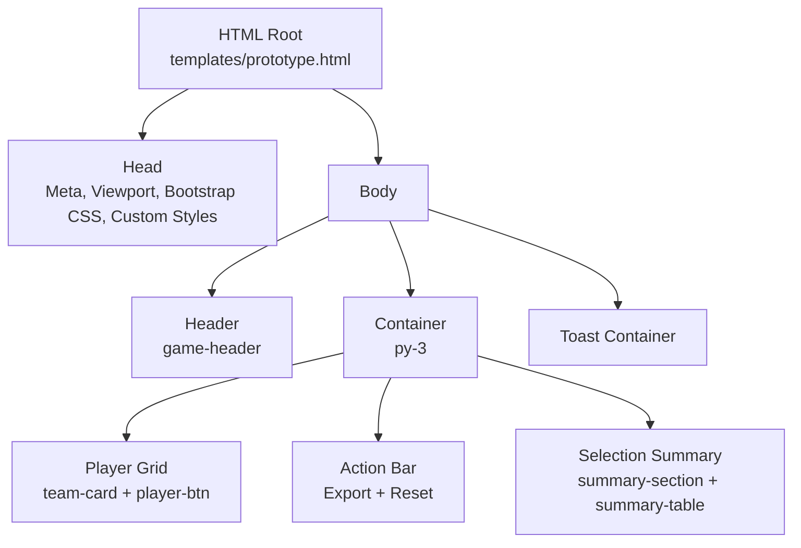
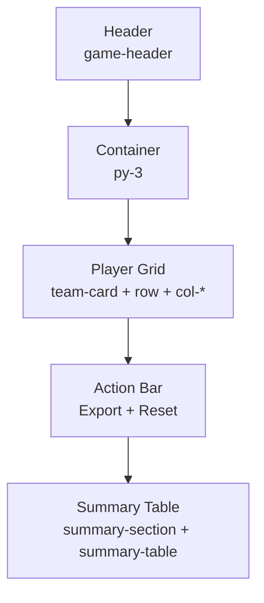
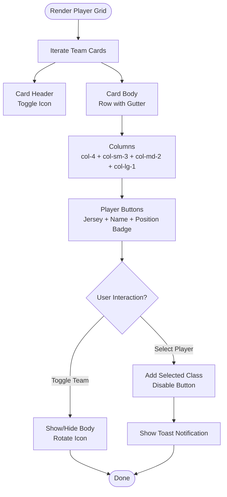
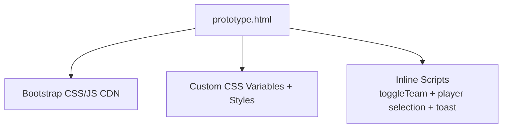

# HTML Structure

<cite>
**Referenced Files in This Document**
- [prototype.html](file://templates/prototype.html)
</cite>

## Table of Contents
1. [Introduction](#introduction)
2. [Project Structure](#project-structure)
3. [Core Components](#core-components)
4. [Architecture Overview](#architecture-overview)
5. [Detailed Component Analysis](#detailed-component-analysis)
6. [Dependency Analysis](#dependency-analysis)
7. [Performance Considerations](#performance-considerations)
8. [Troubleshooting Guide](#troubleshooting-guide)
9. [Conclusion](#conclusion)

## Introduction
This document explains the HTML structure of the WorldCupGame prototype, focusing on semantic markup, Bootstrap grid system usage, responsive design patterns, and the overall page hierarchy. It covers the header section (game title, turn banner, round information), the player grid system (team cards, player buttons, responsive columns), the action bar (export and reset buttons), and the selection summary table (participant columns and color-coding). It also documents how Bootstrap grid classes (col-*, col-sm-*, col-md-*, col-lg-*) create responsive layouts across screen sizes.

## Project Structure
The project consists of a single HTML template that defines the complete page structure and styling. The template integrates Bootstrap 5.3.3 via CDN and applies custom CSS variables and styles to achieve a dark theme with gold accents and interactive elements.

**Diagram sources**
- [prototype.html:1-561](file://templates/prototype.html#L1-L561)

**Section sources**
- [prototype.html:1-561](file://templates/prototype.html#L1-L561)

## Core Components
This section outlines the primary structural components and their roles within the page hierarchy.

- Game Header: Displays the game title, turn banner, round information, and status badge. Uses a responsive row with three columns aligned for centering on small screens and left/right alignment on medium+ screens.
- Player Grid: Contains multiple team cards, each with a collapsible body showing player buttons arranged in a responsive grid.
- Action Bar: Provides export and reset actions with prominent styling and spacing.
- Selection Summary: Presents a tabular view of picks across participants with color-coded columns and hover effects.

**Section sources**
- [prototype.html:224-245](file://templates/prototype.html#L224-L245)
- [prototype.html:247-500](file://templates/prototype.html#L247-L500)
- [prototype.html:454-458](file://templates/prototype.html#L454-L458)
- [prototype.html:460-498](file://templates/prototype.html#L460-L498)

## Architecture Overview
The page follows a top-to-bottom layout:
- Header section establishes branding and turn/round context.
- Main content area centers around a container with vertical spacing.
- Player grid organizes teams and players in a flexible grid.
- Action bar sits below the grid for quick actions.
- Summary table appears after the action bar to track selections.

**Diagram sources**
- [prototype.html:224-245](file://templates/prototype.html#L224-L245)
- [prototype.html:247-500](file://templates/prototype.html#L247-L500)

## Detailed Component Analysis

### Header Section
The header uses a containerized row with three responsive columns:
- Left column: Game title centered on small screens, left-aligned on medium+.
- Center column: Turn banner and round information stacked vertically, centered on small screens, stacked on medium+.
- Right column: Status badge and total rounds count, right-aligned on small+.

Responsive behavior:
- On extra-small screens, columns stack vertically and center content.
- On medium and larger screens, columns align horizontally with specified text alignments.

Accessibility and semantics:
- The header is marked up as a semantic header element.
- The title is an h1 for prominence.
- Round information is structured with strong emphasis for key numbers.

**Section sources**
- [prototype.html:224-245](file://templates/prototype.html#L224-L245)

### Player Grid System
The player grid is composed of:
- Team cards: Each team card encapsulates a header and a collapsible body containing player buttons.
- Player buttons: Each button displays a jersey number, player name, and position badge, styled with hover and selection states.
- Responsive columns: Each player cell uses a combination of Bootstrap grid classes to adapt the number of items per row across breakpoints.

Responsive column layout:
- Extra-small breakpoint: col-4 (three players per row).
- Small breakpoint: col-sm-3 (four players per row).
- Medium breakpoint: col-md-2 (six players per row).
- Large breakpoint: col-lg-1 (twelve players per row).
- Additional gutters are controlled by the row’s gap class.

Interactivity:
- Team cards can be toggled open/closed via a click handler.
- Player buttons can be selected (with visual feedback and disabling), triggering a toast notification.

**Diagram sources**
- [prototype.html:250-452](file://templates/prototype.html#L250-L452)
- [prototype.html:505-557](file://templates/prototype.html#L505-L557)

**Section sources**
- [prototype.html:250-452](file://templates/prototype.html#L250-L452)
- [prototype.html:505-557](file://templates/prototype.html#L505-L557)

### Action Bar
The action bar is a horizontal flex container with centered alignment and wrapping support for smaller screens. It contains:
- Export button: Prominent gold-styled button with rounded corners.
- Reset button: Destructive red-styled button with rounded corners.

Behavior:
- Buttons trigger JavaScript handlers for exporting and resetting the game.
- The container ensures consistent spacing and responsiveness.

**Section sources**
- [prototype.html:454-458](file://templates/prototype.html#L454-L458)
- [prototype.html:505-557](file://templates/prototype.html#L505-L557)

### Selection Summary Table
The summary table presents picks across multiple participants:
- Header row lists the round number and participant columns with distinct background colors.
- Body rows show picks per round; special “选人中” indicator highlights the current selection.
- Empty pick placeholders indicate future rounds.
- Hover effects and borders improve readability.

Column styling:
- Participant columns are separated by a left border.
- Each participant column has a unique background color for visual grouping.

**Section sources**
- [prototype.html:460-498](file://templates/prototype.html#L460-L498)

### Responsive Design Patterns
Bootstrap grid classes drive responsive behavior:
- col-4: Three items per row on extra-small screens.
- col-sm-3: Four items per row on small screens.
- col-md-2: Six items per row on medium screens.
- col-lg-1: Twelve items per row on large screens.
- Row gutters (g-2) ensure consistent spacing between items.

Media queries:
- A small breakpoint adjusts typography and font sizes for mobile readability.

**Section sources**
- [prototype.html:262-298](file://templates/prototype.html#L262-L298)
- [prototype.html:334-384](file://templates/prototype.html#L334-L384)
- [prototype.html:414-449](file://templates/prototype.html#L414-L449)
- [prototype.html:214-219](file://templates/prototype.html#L214-L219)

### Semantic Markup and Accessibility Notes
- The header is semantically marked up as a header element.
- The main content area is wrapped in a container for consistent margins and padding.
- Player buttons are native buttons with disabled states for accessibility.
- The summary table uses thead/tbody for improved screen reader navigation.

[No sources needed since this section provides general guidance]

## Dependency Analysis
External dependencies and integrations:
- Bootstrap 5.3.3 CSS and JS are loaded from a CDN for grid system and component utilities.
- Custom CSS variables define theme colors and global styles.
- Inline scripts handle interactivity for team toggling, player selection, and notifications.

**Diagram sources**
- [prototype.html:7](file://templates/prototype.html#L7)
- [prototype.html:558](file://templates/prototype.html#L558)
- [prototype.html:8-220](file://templates/prototype.html#L8-L220)
- [prototype.html:505-557](file://templates/prototype.html#L505-L557)

**Section sources**
- [prototype.html:7](file://templates/prototype.html#L7)
- [prototype.html:558](file://templates/prototype.html#L558)
- [prototype.html:8-220](file://templates/prototype.html#L8-L220)
- [prototype.html:505-557](file://templates/prototype.html#L505-L557)

## Performance Considerations
- Minimizing DOM updates: The player selection logic adds a class and disables the button, avoiding heavy reflows.
- Efficient grid rendering: Using Bootstrap’s grid classes reduces custom CSS complexity and improves rendering performance.
- Toast notifications: Lightweight DOM insertion/removal with a short timeout prevents long-lived nodes.

[No sources needed since this section provides general guidance]

## Troubleshooting Guide
Common issues and resolutions:
- Team card not toggling: Ensure the header element has the correct toggle handler attached and that the next sibling is the card body.
- Player button not selectable: Verify the button does not have the selected or disabled state classes; event listeners target only eligible buttons.
- Toast not appearing: Confirm the toast container exists and the script appends the toast element before removing it.
- Export/Reset actions: Ensure the corresponding functions are bound to the buttons and that confirm dialogs are acceptable to users.

**Section sources**
- [prototype.html:505-557](file://templates/prototype.html#L505-L557)

## Conclusion
The WorldCupGame prototype demonstrates a clean, responsive HTML structure built on Bootstrap’s grid system and enhanced with custom styling and interactivity. The header communicates game state, the player grid organizes teams and players with adaptive columns, the action bar provides essential controls, and the summary table offers a clear view of selections. The responsive design ensures usability across devices, while the semantic markup and accessibility considerations support inclusive usage.