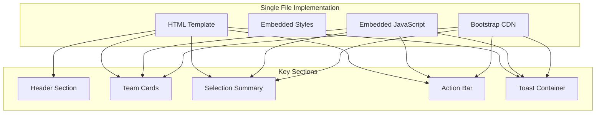
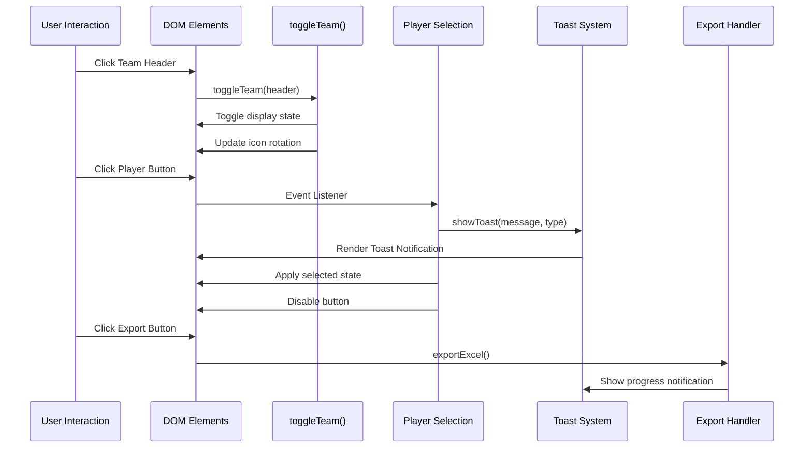
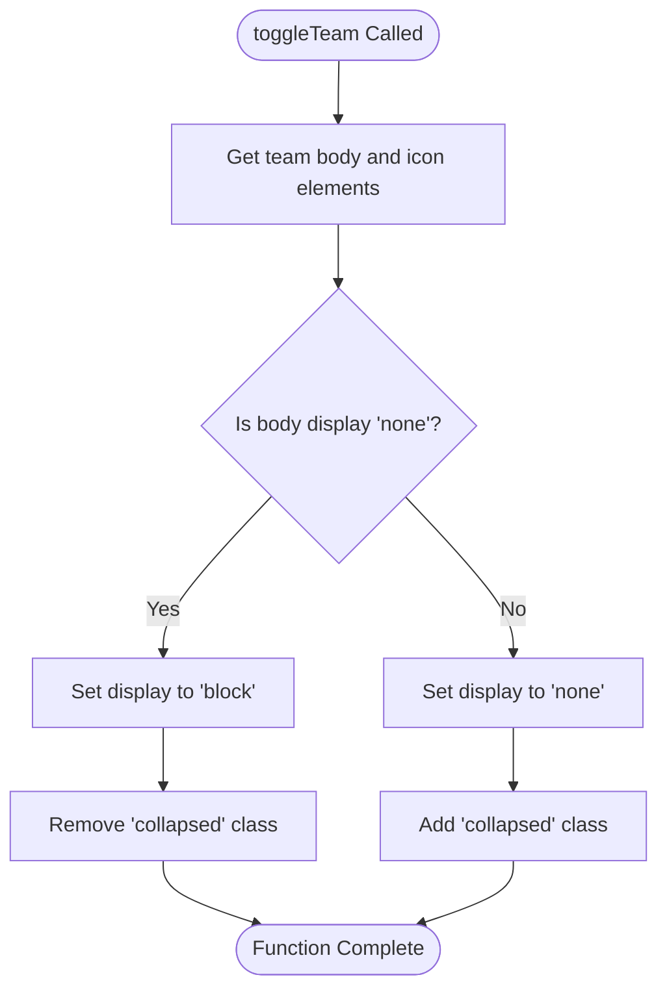
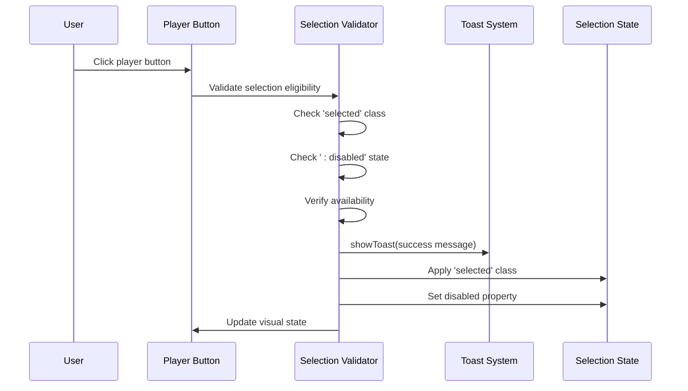
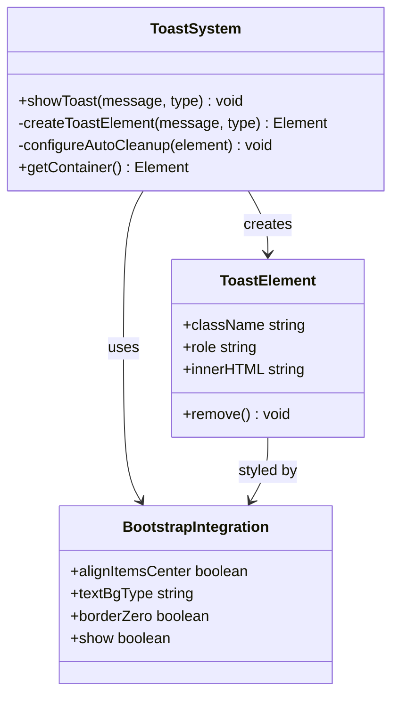
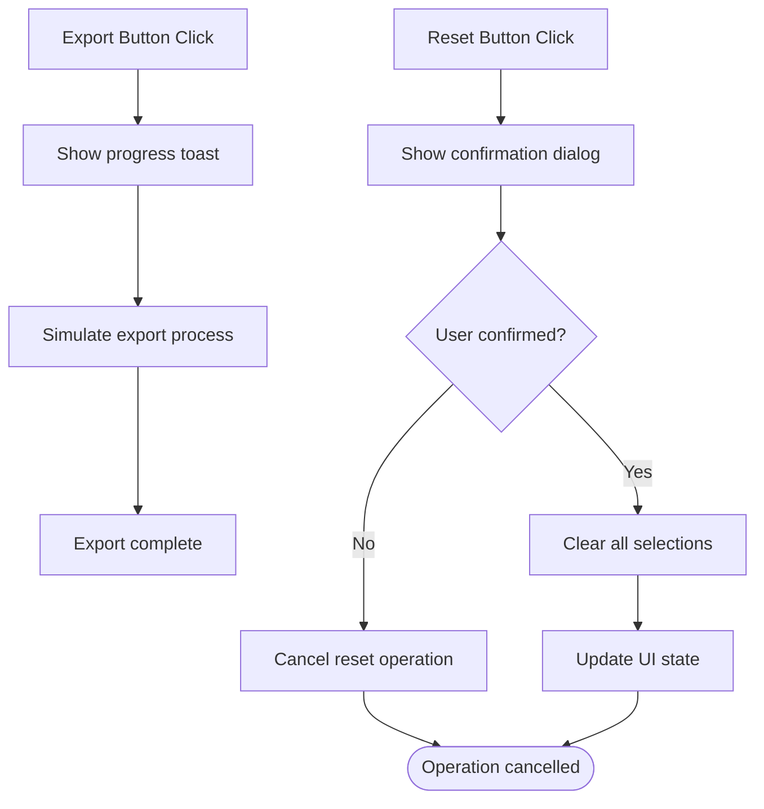
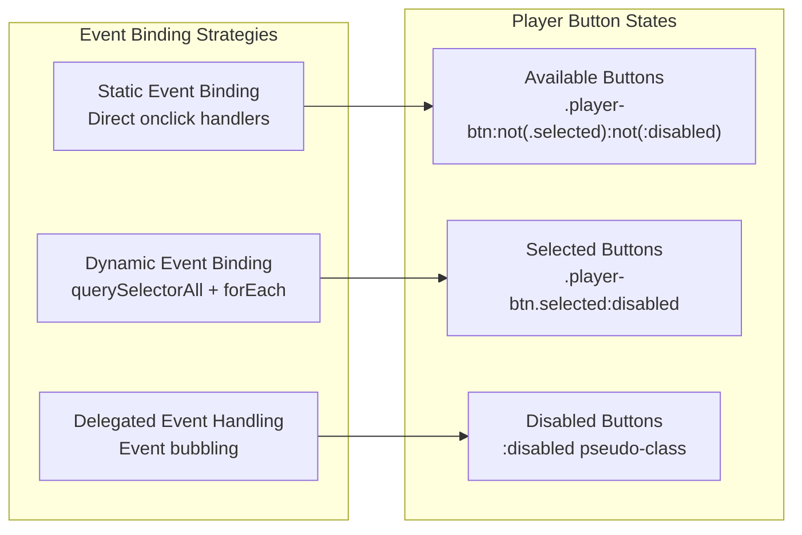
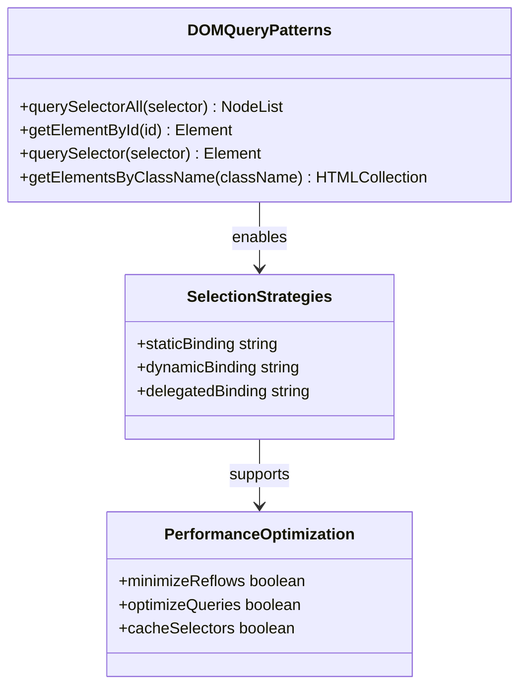
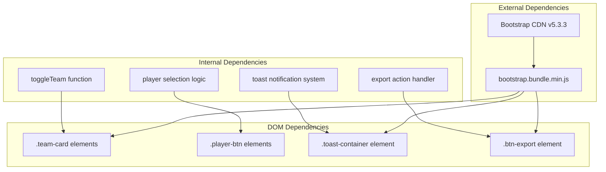

# JavaScript Functionality

<cite>
**Referenced Files in This Document**
- [prototype.html](file://templates/prototype.html)
</cite>

## Table of Contents
1. [Introduction](#introduction)
2. [Project Structure](#project-structure)
3. [Core Components](#core-components)
4. [Architecture Overview](#architecture-overview)
5. [Detailed Component Analysis](#detailed-component-analysis)
6. [Dependency Analysis](#dependency-analysis)
7. [Performance Considerations](#performance-considerations)
8. [Troubleshooting Guide](#troubleshooting-guide)
9. [Conclusion](#conclusion)

## Introduction
This document provides comprehensive technical documentation for the JavaScript implementation in the World Cup Player Selection game. The system consists of interactive team cards with expandable/collapsible sections, player selection functionality with visual feedback, toast notifications, and action handlers for exporting results. Despite being implemented as a single HTML file with embedded JavaScript, the code demonstrates modular patterns and follows modern web development practices.

## Project Structure
The project follows a minimalistic structure with all functionality contained within a single HTML template file. The structure emphasizes separation of concerns through distinct sections for styling, markup, and scripting.

**Diagram sources**
- [prototype.html:1-548](file://templates/prototype.html#L1-L548)

**Section sources**
- [prototype.html:1-548](file://templates/prototype.html#L1-L548)

## Core Components
The JavaScript implementation consists of four primary functional areas that work together to create the interactive player selection experience.

### Team Management System
The team management system handles the expansion and collapse of team sections through the `toggleTeam()` function. This component manages the visual state of team cards and provides intuitive user interaction for browsing available players.

### Player Selection Engine
The player selection engine processes user interactions with individual player buttons. It implements sophisticated state management, visual feedback mechanisms, and selection validation logic to ensure proper game flow.

### Notification Infrastructure
The toast notification system provides contextual feedback for user actions. It integrates seamlessly with Bootstrap's toast components while maintaining custom styling and behavior patterns.

### Action Handler Framework
The action handler framework manages global application actions including export functionality and game reset operations with appropriate user confirmation and feedback mechanisms.

**Section sources**
- [prototype.html:497-544](file://templates/prototype.html#L497-L544)

## Architecture Overview
The JavaScript architecture employs a hybrid approach combining direct DOM manipulation with event-driven programming patterns. The system maintains loose coupling between components while ensuring responsive user interactions.

**Diagram sources**
- [prototype.html:499-541](file://templates/prototype.html#L499-L541)

## Detailed Component Analysis

### Team Toggle Functionality
The `toggleTeam()` function serves as the cornerstone of the expandable team card system. It implements a clean, efficient mechanism for managing team section visibility.

**Diagram sources**
- [prototype.html:499-509](file://templates/prototype.html#L499-L509)

The implementation utilizes direct DOM manipulation for optimal performance, avoiding unnecessary reflows and repaints. The function operates on the immediate siblings of the clicked header element, ensuring precise targeting of associated team content.

**Section sources**
- [prototype.html:499-509](file://templates/prototype.html#L499-L509)

### Player Selection Logic
The player selection system implements sophisticated state management with multiple validation layers and visual feedback mechanisms.

**Diagram sources**
- [prototype.html:511-520](file://templates/prototype.html#L511-L520)

The selection logic employs a two-phase approach: initial validation using `querySelectorAll()` to target eligible buttons, followed by dynamic event binding for runtime interactions. This pattern ensures efficient memory usage while maintaining responsive user feedback.

**Section sources**
- [prototype.html:511-520](file://templates/prototype.html#L511-L520)

### Toast Notification System
The toast notification system provides contextual feedback for user actions with automatic cleanup and Bootstrap integration.

**Diagram sources**
- [prototype.html:522-536](file://templates/prototype.html#L522-L536)

The system implements automatic cleanup through a 3-second timeout mechanism, ensuring toast notifications don't persist beyond their intended usefulness. The integration with Bootstrap's toast components maintains visual consistency while allowing for custom styling and behavior.

**Section sources**
- [prototype.html:522-536](file://templates/prototype.html#L522-L536)

### Action Handlers
The action handler system manages global application actions with appropriate user confirmation and feedback mechanisms.

**Diagram sources**
- [prototype.html:539-541](file://templates/prototype.html#L539-L541)

The export handler demonstrates a pattern for simulating long-running operations while providing immediate user feedback. The reset handler showcases proper user confirmation patterns with clear success/failure paths.

**Section sources**
- [prototype.html:539-541](file://templates/prototype.html#L539-L541)

### Event Delegation Patterns
The implementation demonstrates sophisticated event delegation patterns for handling dynamically added player buttons and managing event listener lifecycle.

**Diagram sources**
- [prototype.html:511-520](file://templates/prototype.html#L511-L520)

The event delegation pattern ensures that newly added player buttons automatically inherit click handling capabilities without requiring explicit event binding. This approach optimizes memory usage and maintains consistent behavior across the application lifecycle.

**Section sources**
- [prototype.html:511-520](file://templates/prototype.html#L511-L520)

### DOM Query Patterns
The implementation employs strategic DOM query patterns to balance performance with functionality, utilizing both static and dynamic selection strategies.

**Diagram sources**
- [prototype.html:511-520](file://templates/prototype.html#L511-L520)

The selection strategy prioritizes efficiency through targeted queries that minimize DOM traversal overhead while maintaining flexibility for dynamic content updates.

**Section sources**
- [prototype.html:511-520](file://templates/prototype.html#L511-L520)

## Dependency Analysis
The JavaScript implementation maintains minimal external dependencies while leveraging Bootstrap's comprehensive component library for consistent user interface behavior.

**Diagram sources**
- [prototype.html:497-544](file://templates/prototype.html#L497-L544)

The dependency graph reveals a clean separation between internal logic and external framework integration, enabling easy maintenance and potential refactoring opportunities.

**Section sources**
- [prototype.html:497-544](file://templates/prototype.html#L497-L544)

## Performance Considerations
The implementation demonstrates several performance optimization strategies that contribute to smooth user interactions and efficient resource utilization.

### Memory Management
- Event listeners are bound only to eligible player buttons using `:not(.selected):not(:disabled)` selectors
- Automatic cleanup of toast notifications prevents memory leaks
- Efficient DOM traversal minimizes layout thrashing

### Rendering Optimization
- Direct style manipulation bypasses CSS transitions during initial load
- Icon rotation uses CSS transforms for GPU-accelerated animations
- Conditional rendering prevents unnecessary DOM updates

### Network Efficiency
- Single CDN endpoint for Bootstrap reduces HTTP requests
- Embedded JavaScript eliminates additional script loading overhead
- Minimal external resources reduce page weight

## Troubleshooting Guide

### Common Issues and Solutions

**Team Toggle Not Working**
- Verify that the `toggleTeam()` function is properly defined
- Check that team header elements have the correct `onclick` attribute
- Ensure sibling elements exist for proper DOM traversal

**Player Selection Not Applying**
- Confirm that player buttons lack the `selected` class initially
- Verify that buttons are not marked as `disabled`
- Check that the `querySelectorAll()` selector targets the correct elements

**Toast Notifications Not Appearing**
- Ensure the `.toast-container` element exists in the DOM
- Verify Bootstrap CSS and JavaScript are properly loaded
- Check that toast elements are being removed after timeout

**Event Listeners Not Triggering**
- Confirm that event listeners are attached after DOMContentLoaded
- Verify that delegated events bubble properly through the DOM tree
- Check for JavaScript errors in the browser console

**Section sources**
- [prototype.html:499-541](file://templates/prototype.html#L499-L541)

## Conclusion
The JavaScript implementation demonstrates a well-structured, modular approach to building interactive web applications within a single HTML file constraint. The code effectively balances functionality with performance through strategic use of DOM manipulation, event delegation, and Bootstrap integration. The system provides a solid foundation for extension and enhancement while maintaining clean separation of concerns and responsive user interactions.

The implementation serves as an excellent example of modern web development practices, showcasing how complex functionality can be delivered through thoughtful architecture and careful attention to user experience. The modular structure, despite the single-file constraint, enables future enhancements and maintains code readability and maintainability.