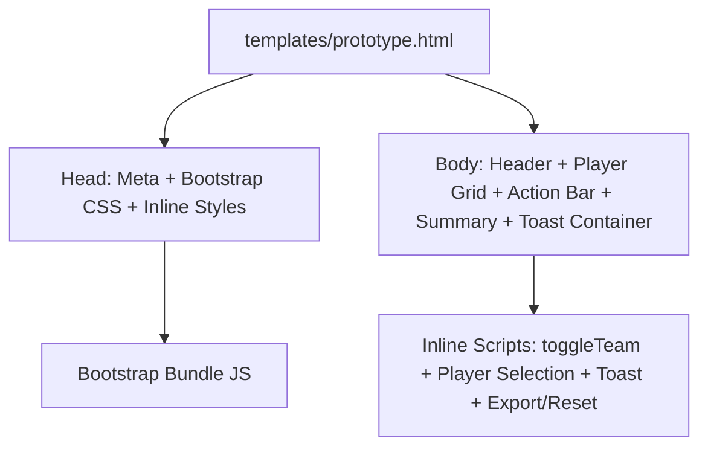
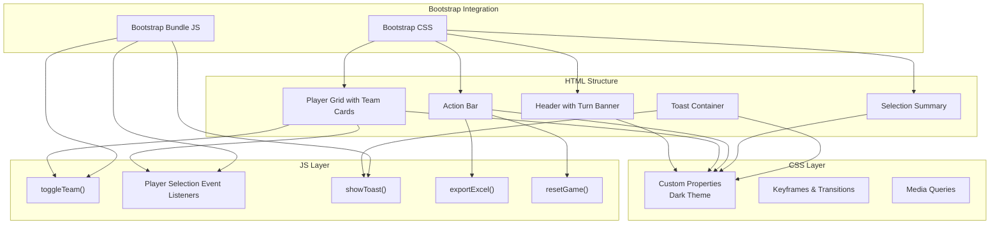
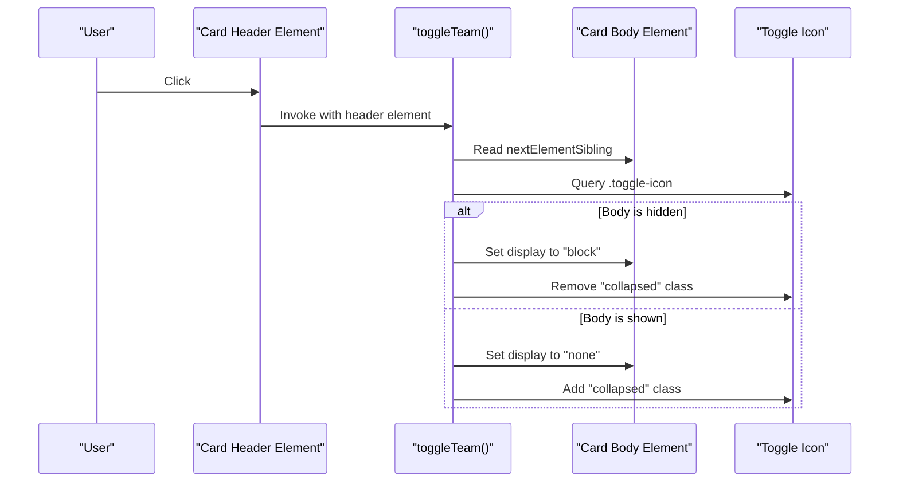
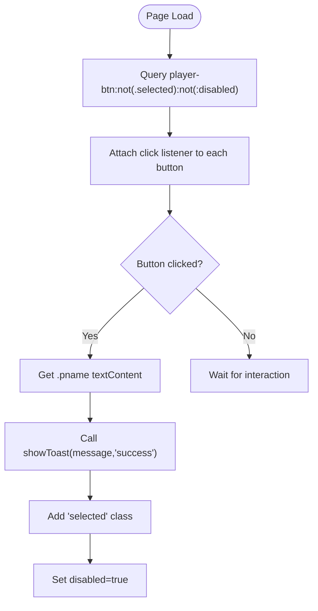
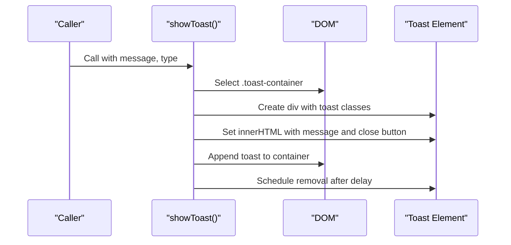
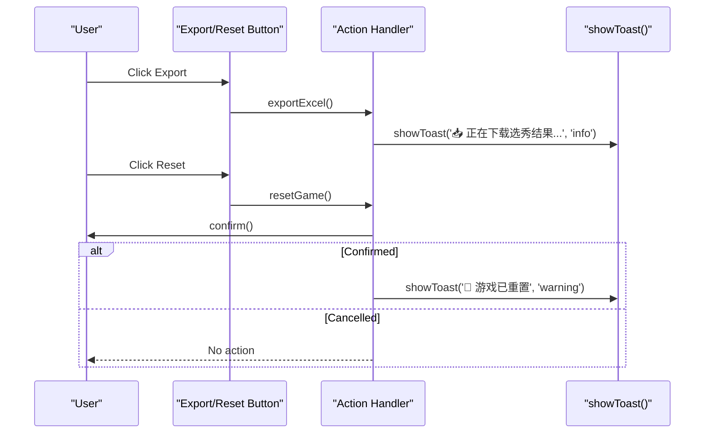
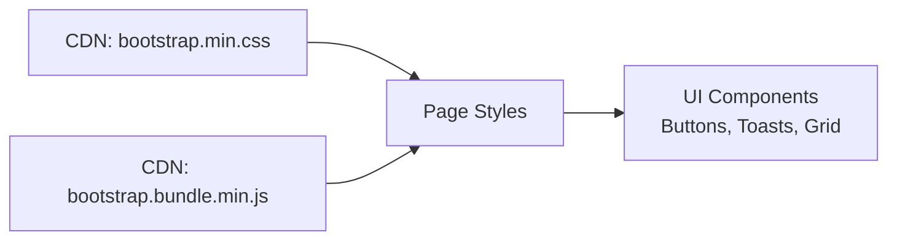
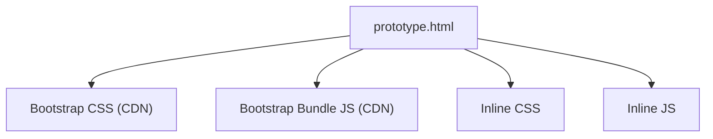

# Technical Implementation

<cite>
**Referenced Files in This Document**
- [prototype.html](file://templates/prototype.html)
</cite>

## Table of Contents
1. [Introduction](#introduction)
2. [Project Structure](#project-structure)
3. [Core Components](#core-components)
4. [Architecture Overview](#architecture-overview)
5. [Detailed Component Analysis](#detailed-component-analysis)
6. [Dependency Analysis](#dependency-analysis)
7. [Performance Considerations](#performance-considerations)
8. [Troubleshooting Guide](#troubleshooting-guide)
9. [Conclusion](#conclusion)
10. [Appendices](#appendices)

## Introduction
This document explains the technical implementation of WorldCupGame’s core functionality as implemented in a single HTML file. It covers the HTML structure with semantic markup and Bootstrap grid usage, the CSS architecture including custom properties, animations, and responsive media queries, and the JavaScript functionality for DOM manipulation, event handling, team expansion logic, player selection mechanics, and the notification system. It also documents Bootstrap integration patterns and CDN dependencies, and provides guidance for extending the functionality while maintaining code organization.

## Project Structure
The project is a single-file static web application built around a single HTML template. It integrates Bootstrap via CDN for layout and UI components, and includes custom CSS and JavaScript inline for theming, animations, and interactivity.

**Diagram sources**
- [prototype.html:1-561](file://templates/prototype.html#L1-L561)

**Section sources**
- [prototype.html:1-561](file://templates/prototype.html#L1-L561)

## Core Components
- Theme and Layout
  - Custom CSS variables define a dark theme palette and branding colors.
  - Sticky header with turn banner and round information.
  - Responsive container and Bootstrap grid system for player cards.
- Team Cards
  - Collapsible team sections with flag, team name, and selection progress.
  - Toggle icon rotation indicates expanded/collapsed state.
- Player Buttons
  - Grid of player buttons with jersey number, name, and position badge.
  - Visual states for hover, selected, and disabled.
- Selection Summary
  - Tabular summary of picks across participants and rounds.
- Action Bar
  - Export and Reset actions with Bootstrap-styled buttons.
- Notification System
  - Toast container for transient notifications with auto-dismiss.

**Section sources**
- [prototype.html:8-220](file://templates/prototype.html#L8-L220)
- [prototype.html:224-503](file://templates/prototype.html#L224-L503)

## Architecture Overview
The application follows a client-side single-page architecture. The HTML defines the structure, CSS provides styling and responsive behavior, and JavaScript handles interactive behaviors and notifications.

**Diagram sources**
- [prototype.html:6-7](file://templates/prototype.html#L6-L7)
- [prototype.html:505-558](file://templates/prototype.html#L505-L558)
- [prototype.html:8-220](file://templates/prototype.html#L8-L220)

## Detailed Component Analysis

### HTML Structure and Semantic Markup
- Semantic use of header, sectioning elements, and tables for content organization.
- Bootstrap grid classes (container, row, col-*) for responsive layout.
- Accessibility attributes: role="alert" on toast elements.
- Inline styles for dynamic toggling of visibility and temporary styling.

Key structural elements:
- Header with turn banner and round info.
- Player grid containing multiple team cards with collapsible bodies.
- Action bar with export and reset buttons.
- Summary table with participant columns.
- Toast container for notifications.

**Section sources**
- [prototype.html:224-503](file://templates/prototype.html#L224-L503)

### CSS Architecture and Theming
- Custom properties define a cohesive dark theme with brand accents.
- Component-specific styles for team cards, player buttons, summary table, and action bar.
- Animations include a subtle pulse effect for the turn banner.
- Media queries adapt typography and spacing for small screens.

Implementation highlights:
- Dark background and card backgrounds using custom properties.
- Hover and selected states for player buttons with transitions.
- Summary table with participant column highlighting and hover effects.
- Toast container positioned fixed for non-blocking notifications.

**Section sources**
- [prototype.html:8-220](file://templates/prototype.html#L8-L220)

### JavaScript Functionality

#### Team Expansion Logic
- The toggle function reads the next sibling element and toggles its display property.
- The toggle icon rotates to indicate expanded/collapsed state.
- Uses DOM traversal to access the associated card body and icon element.

**Diagram sources**
- [prototype.html:507-517](file://templates/prototype.html#L507-L517)

**Section sources**
- [prototype.html:507-517](file://templates/prototype.html#L507-L517)

#### Player Selection Mechanics
- Event listeners are attached to all player buttons that are neither selected nor disabled.
- On click, a success toast is shown with the player’s name.
- The button is marked as selected and disabled to prevent re-selection.

**Diagram sources**
- [prototype.html:519-528](file://templates/prototype.html#L519-L528)
- [prototype.html:531-544](file://templates/prototype.html#L531-L544)

**Section sources**
- [prototype.html:519-528](file://templates/prototype.html#L519-L528)
- [prototype.html:531-544](file://templates/prototype.html#L531-L544)

#### Notification System (Toasts)
- Toasts are dynamically created and appended to the toast container.
- Bootstrap toast classes are applied for styling and behavior.
- Auto-remove after a timeout to keep the UI clean.

**Diagram sources**
- [prototype.html:531-544](file://templates/prototype.html#L531-L544)

**Section sources**
- [prototype.html:531-544](file://templates/prototype.html#L531-L544)

#### Export and Reset Actions
- Export action triggers a toast indicating download initiation.
- Reset action prompts confirmation and triggers a warning toast upon confirmation.

**Diagram sources**
- [prototype.html:546-556](file://templates/prototype.html#L546-L556)
- [prototype.html:531-544](file://templates/prototype.html#L531-L544)

**Section sources**
- [prototype.html:546-556](file://templates/prototype.html#L546-L556)
- [prototype.html:531-544](file://templates/prototype.html#L531-L544)

### Bootstrap Integration Patterns and CDN Dependencies
- Bootstrap CSS is included via CDN for base styles and utilities.
- Bootstrap bundle JS is included for JavaScript components and utilities.
- Inline styles and classes leverage Bootstrap utility classes (e.g., container, row, col-*).
- Toasts reuse Bootstrap toast classes for styling and behavior.

**Diagram sources**
- [prototype.html:6-7](file://templates/prototype.html#L6-L7)
- [prototype.html:558](file://templates/prototype.html#L558)

**Section sources**
- [prototype.html:6-7](file://templates/prototype.html#L6-L7)
- [prototype.html:558](file://templates/prototype.html#L558)

### Responsive Design Patterns
- Bootstrap grid classes (col-*, col-sm-*, col-md-*, col-lg-*) provide responsive column layouts for player buttons.
- Media queries adjust typography and spacing for smaller screens.
- Flexbox and grid utilities support alignment and spacing across breakpoints.

**Section sources**
- [prototype.html:262-319](file://templates/prototype.html#L262-L319)
- [prototype.html:334-384](file://templates/prototype.html#L334-L384)
- [prototype.html:214-219](file://templates/prototype.html#L214-L219)

## Dependency Analysis
The application has minimal runtime dependencies:
- Bootstrap CSS and JS via CDN for layout and UI components.
- Inline CSS and JavaScript for theming, animations, and interactivity.

**Diagram sources**
- [prototype.html:6-7](file://templates/prototype.html#L6-L7)
- [prototype.html:558](file://templates/prototype.html#L558)
- [prototype.html:8-220](file://templates/prototype.html#L8-L220)
- [prototype.html:505-558](file://templates/prototype.html#L505-L558)

**Section sources**
- [prototype.html:6-7](file://templates/prototype.html#L6-L7)
- [prototype.html:558](file://templates/prototype.html#L558)
- [prototype.html:8-220](file://templates/prototype.html#L8-L220)
- [prototype.html:505-558](file://templates/prototype.html#L505-L558)

## Performance Considerations
- Single-file delivery reduces HTTP requests and simplifies caching.
- Inline CSS avoids an extra stylesheet request; consider extracting for larger projects.
- Event delegation could reduce listener overhead if the number of player buttons grows substantially.
- Toast creation/removal is lightweight; ensure no accumulation of stale toasts.
- Bootstrap bundle includes utilities; consider custom builds if minimizing bundle size is critical.

## Troubleshooting Guide
Common issues and resolutions:
- Team toggle not working
  - Verify the header element has a next sibling card body and a child toggle icon.
  - Ensure the toggle function runs after DOM load.
  - Confirm no conflicting inline styles override display properties.
- Player selection not registering
  - Check that buttons are not pre-marked as selected or disabled.
  - Confirm event listeners attach after DOMContentLoaded.
- Toasts not appearing
  - Ensure the toast container exists and is appended to the DOM.
  - Verify Bootstrap bundle is loaded before invoking toast classes.
- Export/Reset actions not triggering
  - Confirm handler functions are defined and bound to button click events.
  - Check browser console for errors preventing script execution.

**Section sources**
- [prototype.html:507-517](file://templates/prototype.html#L507-L517)
- [prototype.html:519-528](file://templates/prototype.html#L519-L528)
- [prototype.html:531-544](file://templates/prototype.html#L531-L544)
- [prototype.html:546-556](file://templates/prototype.html#L546-L556)

## Conclusion
WorldCupGame demonstrates a compact yet functional implementation combining semantic HTML, Bootstrap utilities, and custom CSS/JS. The modular structure within a single file enables quick iteration while maintaining clarity. Extending functionality should preserve the separation of concerns: keep DOM manipulation in dedicated functions, centralize styling in custom properties and media queries, and encapsulate interactions behind clear function boundaries.

## Appendices

### Key Implementation Patterns
- Team expansion: toggle visibility and icon rotation.
- Player selection: event-driven updates with visual feedback.
- Notifications: dynamic DOM creation with automatic cleanup.
- Responsive grid: Bootstrap classes combined with media queries.

**Section sources**
- [prototype.html:507-517](file://templates/prototype.html#L507-L517)
- [prototype.html:519-528](file://templates/prototype.html#L519-L528)
- [prototype.html:531-544](file://templates/prototype.html#L531-L544)
- [prototype.html:262-319](file://templates/prototype.html#L262-L319)
- [prototype.html:214-219](file://templates/prototype.html#L214-L219)