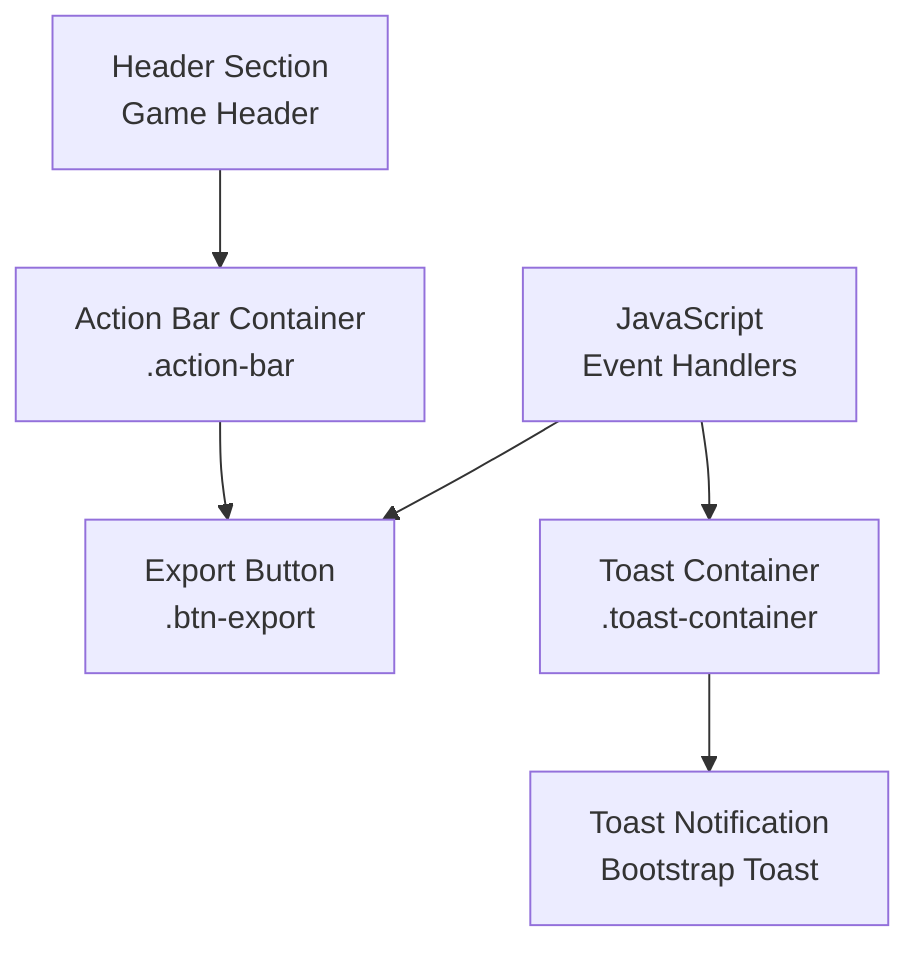
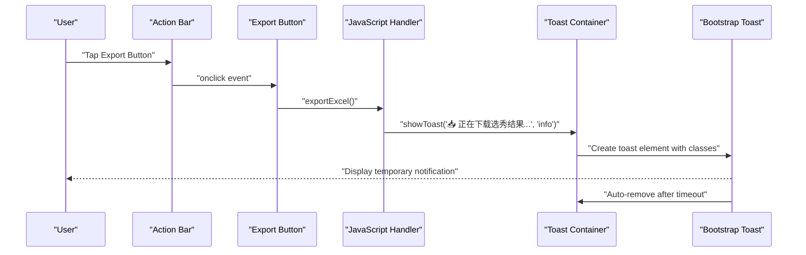
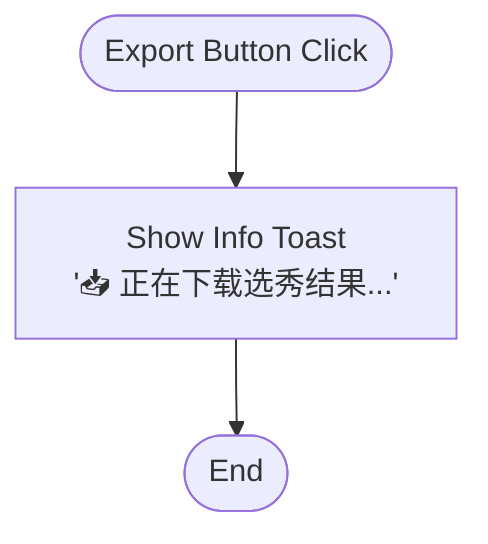
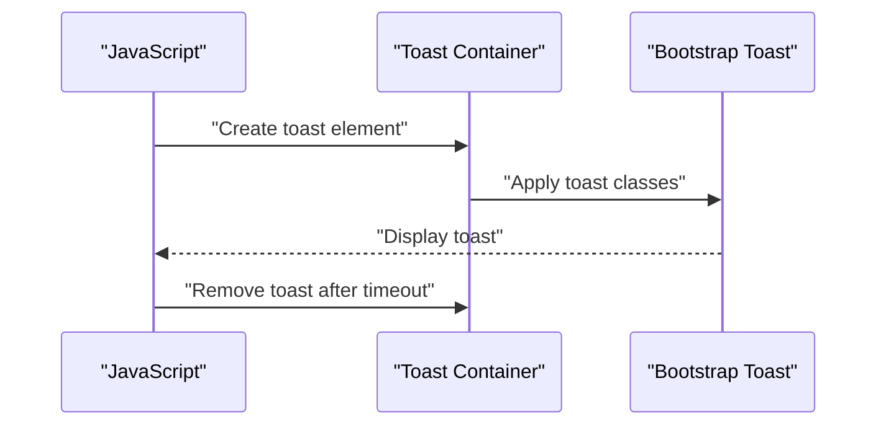
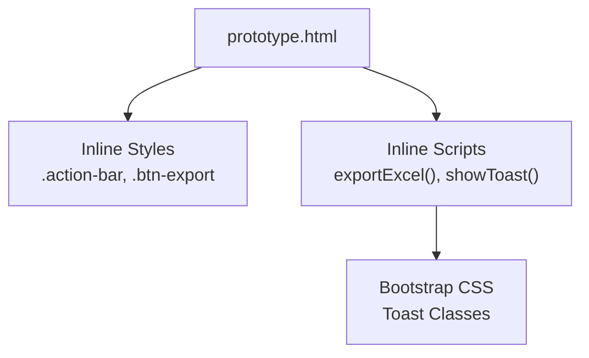

# Action Bar Controls

<cite>
**Referenced Files in This Document**
- [prototype.html](file://templates/prototype.html)
</cite>

## Table of Contents
1. [Introduction](#introduction)
2. [Project Structure](#project-structure)
3. [Core Components](#core-components)
4. [Architecture Overview](#architecture-overview)
5. [Detailed Component Analysis](#detailed-component-analysis)
6. [Dependency Analysis](#dependency-analysis)
7. [Performance Considerations](#performance-considerations)
8. [Troubleshooting Guide](#troubleshooting-guide)
9. [Conclusion](#conclusion)

## Introduction
This document provides comprehensive documentation for the action bar controls in the prototype interface, focusing on the export functionality and the reset button concept. It explains the export button behavior, the toast notification system, responsive layout using flexbox, button styling with gradient-like effects and rounded corners, and the JavaScript event handlers. It also covers mobile responsiveness and touch-friendly sizing.

## Project Structure
The action bar controls are implemented within a single HTML template file. The relevant sections include:
- Action bar container with export button
- Toast notification container
- Supporting styles for layout, spacing, and button appearance
- JavaScript event handlers for export and toast notifications

**Diagram sources**
- [prototype.html:487-495](file://templates/prototype.html#L487-L495)
- [prototype.html:180-205](file://templates/prototype.html#L180-L205)
- [prototype.html:497-544](file://templates/prototype.html#L497-L544)

**Section sources**
- [prototype.html:487-495](file://templates/prototype.html#L487-L495)
- [prototype.html:180-205](file://templates/prototype.html#L180-L205)
- [prototype.html:497-544](file://templates/prototype.html#L497-L544)

## Core Components
- Action bar container: A flexbox-based container that centers buttons and applies spacing and wrapping for responsive layouts.
- Export button: A styled button with a download icon and label, designed for Excel export simulation.
- Toast notification system: A lightweight notification system integrated with Bootstrap toast components for user feedback.

Key implementation references:
- Action bar container and button styles: [prototype.html:180-198](file://templates/prototype.html#L180-L198)
- Export button element and click handler: [prototype.html:488-490](file://templates/prototype.html#L488-L490)
- Toast container and toast creation: [prototype.html:200-205](file://templates/prototype.html#L200-L205), [prototype.html:522-536](file://templates/prototype.html#L522-L536)
- Export simulation handler: [prototype.html:538-541](file://templates/prototype.html#L538-L541)

**Section sources**
- [prototype.html:180-198](file://templates/prototype.html#L180-L198)
- [prototype.html:488-490](file://templates/prototype.html#L488-L490)
- [prototype.html:200-205](file://templates/prototype.html#L200-L205)
- [prototype.html:522-536](file://templates/prototype.html#L522-L536)
- [prototype.html:538-541](file://templates/prototype.html#L538-L541)

## Architecture Overview
The action bar architecture integrates UI markup, CSS styling, and JavaScript event handling. The export button triggers a toast notification indicating the start of the export process. The toast system leverages Bootstrap’s toast component classes and DOM manipulation.

**Diagram sources**
- [prototype.html:488-490](file://templates/prototype.html#L488-L490)
- [prototype.html:538-541](file://templates/prototype.html#L538-L541)
- [prototype.html:522-536](file://templates/prototype.html#L522-L536)

## Detailed Component Analysis

### Export Button
The export button is implemented as a centered, rounded button with a gold background and dark text. It includes a download icon and label, and triggers the export simulation when clicked.

Behavior and styling:
- Centered horizontally within the action bar container using flexbox.
- Rounded corners using a large border radius.
- Hover effect that brightens the background and maintains text contrast.
- Responsive padding ensures adequate touch target size on small screens.

Event handling:
- Click event invokes the export simulation handler, which displays an informational toast.

Accessibility and UX:
- Clear visual affordance with hover and focus states.
- Sufficient touch target size for mobile devices.

References:
- Button element and click handler: [prototype.html:488-490](file://templates/prototype.html#L488-L490)
- Button styles: [prototype.html:187-198](file://templates/prototype.html#L187-L198)
- Export simulation handler: [prototype.html:538-541](file://templates/prototype.html#L538-L541)

**Diagram sources**
- [prototype.html:538-541](file://templates/prototype.html#L538-L541)
- [prototype.html:522-536](file://templates/prototype.html#L522-L536)

**Section sources**
- [prototype.html:488-490](file://templates/prototype.html#L488-L490)
- [prototype.html:187-198](file://templates/prototype.html#L187-L198)
- [prototype.html:538-541](file://templates/prototype.html#L538-L541)
- [prototype.html:522-536](file://templates/prototype.html#L522-L536)

### Reset Button Concept
The prototype currently implements only the export button. The reset button concept is not present in the current codebase. If implemented, it would follow similar patterns:
- A secondary button placed alongside the export button in the action bar.
- Confirmation dialog using a browser prompt or a custom modal.
- Warning notification via the toast system.
- Event handler to reset selections and update UI state.

References for potential implementation:
- Action bar container for placement: [prototype.html:487-490](file://templates/prototype.html#L487-L490)
- Toast system for notifications: [prototype.html:200-205](file://templates/prototype.html#L200-L205), [prototype.html:522-536](file://templates/prototype.html#L522-L536)

**Section sources**
- [prototype.html:487-490](file://templates/prototype.html#L487-L490)
- [prototype.html:200-205](file://templates/prototype.html#L200-L205)
- [prototype.html:522-536](file://templates/prototype.html#L522-L536)

### Toast Notification System
The toast system provides contextual feedback for user actions. It dynamically creates toast elements with Bootstrap classes and removes them after a timeout.

Key features:
- Dynamic toast creation with message and type.
- Bootstrap toast classes for styling and behavior.
- Auto-removal after a set duration.
- Dismiss button support.

References:
- Toast container: [prototype.html:200-205](file://templates/prototype.html#L200-L205)
- Toast creation and removal: [prototype.html:522-536](file://templates/prototype.html#L522-L536)

**Diagram sources**
- [prototype.html:200-205](file://templates/prototype.html#L200-L205)
- [prototype.html:522-536](file://templates/prototype.html#L522-L536)

**Section sources**
- [prototype.html:200-205](file://templates/prototype.html#L200-L205)
- [prototype.html:522-536](file://templates/prototype.html#L522-L536)

### Responsive Layout and Touch-Friendly Design
The action bar uses flexbox to center buttons and apply consistent spacing. It wraps on smaller screens to accommodate multiple buttons. The export button has sufficient padding to serve as a touch-friendly target.

Responsive considerations:
- Flexbox centering and gap spacing: [prototype.html:180-186](file://templates/prototype.html#L180-L186)
- Rounded button with adequate padding: [prototype.html:187-198](file://templates/prototype.html#L187-L198)
- Media query adjustments for smaller screens: [prototype.html:207-212](file://templates/prototype.html#L207-L212)

**Section sources**
- [prototype.html:180-186](file://templates/prototype.html#L180-L186)
- [prototype.html:187-198](file://templates/prototype.html#L187-L198)
- [prototype.html:207-212](file://templates/prototype.html#L207-L212)

## Dependency Analysis
The action bar controls depend on:
- Bootstrap CSS for toast styling and behavior.
- Inline JavaScript for event handling and toast creation.
- Internal CSS for layout and button styling.

**Diagram sources**
- [prototype.html:7](file://templates/prototype.html#L7)
- [prototype.html:497-544](file://templates/prototype.html#L497-L544)

**Section sources**
- [prototype.html:7](file://templates/prototype.html#L7)
- [prototype.html:497-544](file://templates/prototype.html#L497-L544)

## Performance Considerations
- Toast creation and removal are lightweight DOM operations with minimal overhead.
- Flexbox layout is efficient for centering and wrapping.
- No heavy computations are performed during export simulation; the handler focuses on user feedback.

## Troubleshooting Guide
Common issues and resolutions:
- Toast does not appear:
  - Verify the toast container exists and is positioned correctly.
  - Ensure Bootstrap CSS is loaded.
  - Confirm the toast creation function is invoked.
  - References: [prototype.html:200-205](file://templates/prototype.html#L200-L205), [prototype.html:522-536](file://templates/prototype.html#L522-L536)
- Export button click has no effect:
  - Confirm the onclick handler is attached to the button.
  - Verify the export simulation function is defined.
  - References: [prototype.html:488-490](file://templates/prototype.html#L488-L490), [prototype.html:538-541](file://templates/prototype.html#L538-L541)
- Mobile touch targets feel too small:
  - Increase button padding or adjust media query values.
  - References: [prototype.html:187-198](file://templates/prototype.html#L187-L198), [prototype.html:207-212](file://templates/prototype.html#L207-L212)

**Section sources**
- [prototype.html:200-205](file://templates/prototype.html#L200-L205)
- [prototype.html:522-536](file://templates/prototype.html#L522-L536)
- [prototype.html:488-490](file://templates/prototype.html#L488-L490)
- [prototype.html:538-541](file://templates/prototype.html#L538-L541)
- [prototype.html:187-198](file://templates/prototype.html#L187-L198)
- [prototype.html:207-212](file://templates/prototype.html#L207-L212)

## Conclusion
The action bar controls provide a clean, responsive interface for exporting selection results. The export button is styled for visibility and usability, while the toast notification system delivers immediate feedback. The current implementation focuses on export functionality, with reset functionality available as a future enhancement following similar patterns.