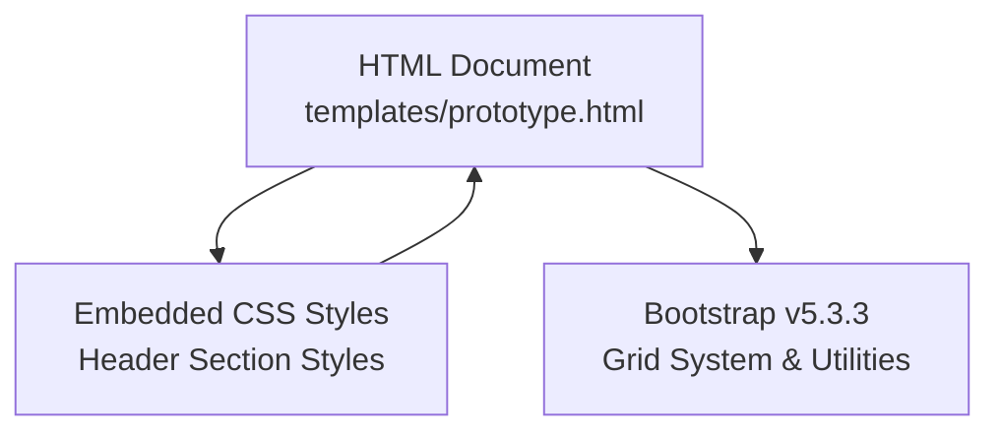
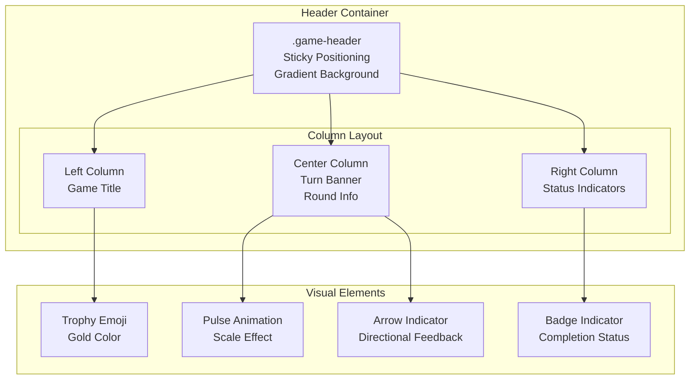
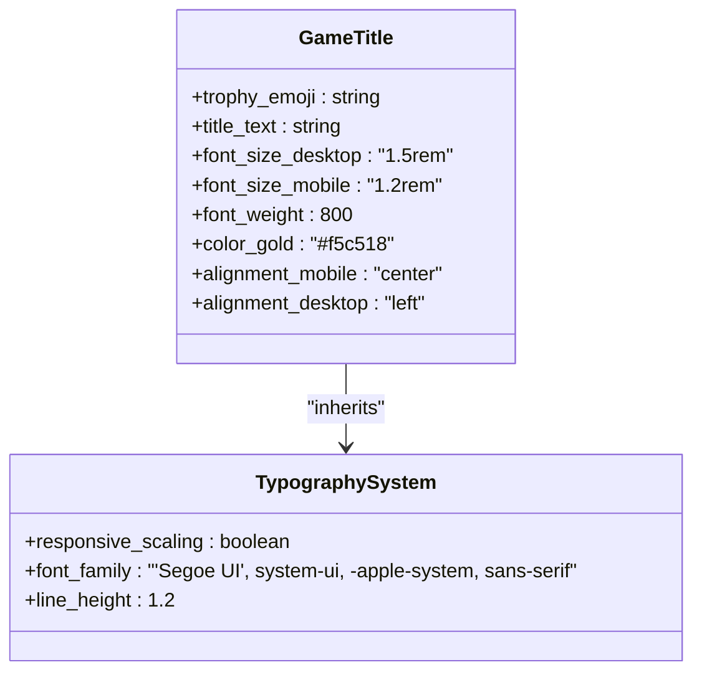
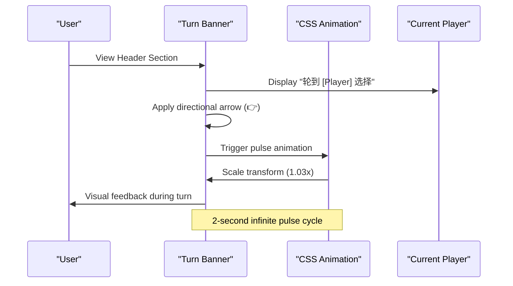
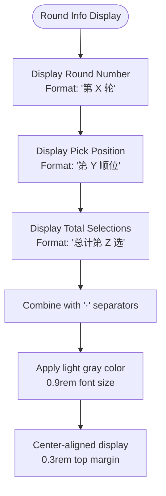
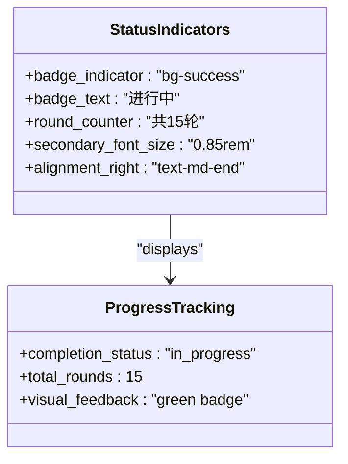
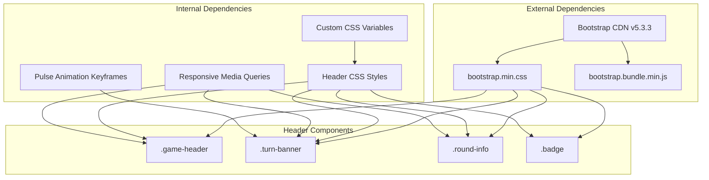

# Header Section

<cite>
**Referenced Files in This Document**
- [prototype.html](file://templates/prototype.html)
</cite>

## Table of Contents
1. [Introduction](#introduction)
2. [Project Structure](#project-structure)
3. [Core Components](#core-components)
4. [Architecture Overview](#architecture-overview)
5. [Detailed Component Analysis](#detailed-component-analysis)
6. [Dependency Analysis](#dependency-analysis)
7. [Performance Considerations](#performance-considerations)
8. [Troubleshooting Guide](#troubleshooting-guide)
9. [Conclusion](#conclusion)

## Introduction
This document provides comprehensive documentation for the WorldCupGame header section component. The header displays the game title with trophy emoji styling, presents the turn banner with animated pulse effects and directional arrow indicators, shows round information including round number, pick position, and total selections counter, and includes game status indicators with badge styling and completion tracking. It also covers responsive behavior across different screen sizes and explains the sticky positioning for mobile scrolling, along with the gradient background styling and gold accent color scheme used throughout the header.

## Project Structure
The header section is implemented within a single HTML file that includes embedded CSS styles and Bootstrap integration. The header is structured as a Bootstrap grid layout with three columns: left-aligned game title, centered turn banner and round information, and right-aligned game status indicators.

**Diagram sources**
- [prototype.html:1-561](file://templates/prototype.html#L1-L561)

**Section sources**
- [prototype.html:1-561](file://templates/prototype.html#L1-L561)

## Core Components
The header section consists of four primary components:

1. **Game Title Display**: Trophy emoji styled title with responsive typography
2. **Turn Banner**: Animated pulse effect with directional arrow indicator
3. **Round Information**: Round number, pick position, and total selections counter
4. **Game Status Indicators**: Badge styling with completion tracking

Each component is designed with responsive behavior and accessibility in mind, utilizing Bootstrap's grid system and custom CSS animations.

**Section sources**
- [prototype.html:217-238](file://templates/prototype.html#L217-L238)

## Architecture Overview
The header section follows a three-column layout pattern with Bootstrap's responsive grid system. The architecture emphasizes:
- Sticky positioning for mobile scrolling
- Gradient background styling with gold accents
- Responsive typography scaling
- Animated visual feedback for turn indicators

**Diagram sources**
- [prototype.html:217-238](file://templates/prototype.html#L217-L238)
- [prototype.html:20-48](file://templates/prototype.html#L20-L48)

## Detailed Component Analysis

### Game Title Display
The game title component features a trophy emoji integrated with the title text, styled with gold color and responsive typography.

Key characteristics:
- **Emoji Integration**: Trophy emoji (🏆) positioned before the title text
- **Color Scheme**: Gold color (#f5c518) using CSS custom property
- **Typography**: Responsive font sizing with base 1.5rem on desktop, reduced to 1.2rem on mobile
- **Font Weight**: Extra-bold (800) for emphasis
- **Alignment**: Centered on mobile, left-aligned on medium screens and larger

**Diagram sources**
- [prototype.html:28-33](file://templates/prototype.html#L28-L33)
- [prototype.html:214-216](file://templates/prototype.html#L214-L216)

**Section sources**
- [prototype.html:28-33](file://templates/prototype.html#L28-L33)
- [prototype.html:214-216](file://templates/prototype.html#L214-L216)

### Turn Banner Functionality
The turn banner displays the current player's turn with animated pulse effects and directional arrow indicators.

Core features:
- **Animated Pulse**: Continuous scale animation (2-second cycle) using CSS keyframes
- **Gradient Background**: Gold-to-orange gradient using CSS custom properties
- **Directional Arrow**: Right-pointing arrow (👉) indicating selection direction
- **Text Styling**: Bold font weight (800) with centered alignment
- **Border Radius**: 50px pill-shaped design
- **Padding**: 0.8rem 1.5rem for optimal touch targets

**Diagram sources**
- [prototype.html:225-234](file://templates/prototype.html#L225-L234)
- [prototype.html:34-48](file://templates/prototype.html#L34-L48)

**Section sources**
- [prototype.html:225-234](file://templates/prototype.html#L225-L234)
- [prototype.html:34-48](file://templates/prototype.html#L34-L48)

### Round Information Display
The round information component provides three key metrics in a single line:

- **Round Number**: Current round indicator (e.g., "第 3 轮")
- **Pick Position**: Selection order within the round (e.g., "第 2 顺位")  
- **Total Selections**: Cumulative selection count (e.g., "总计第 12 选")

Implementation details:
- **Font Sizing**: Reduced to 0.9rem for secondary information
- **Color Scheme**: Light gray (#aaa) for subtle presentation
- **Alignment**: Centered within the column layout
- **Spacing**: Top margin (0.3rem) for visual separation from turn banner

**Diagram sources**
- [prototype.html:228-230](file://templates/prototype.html#L228-L230)
- [prototype.html:49-54](file://templates/prototype.html#L49-L54)

**Section sources**
- [prototype.html:228-230](file://templates/prototype.html#L228-L230)
- [prototype.html:49-54](file://templates/prototype.html#L49-L54)

### Game Status Indicators
The right-side status indicators provide completion tracking and game progress information.

Components:
- **Badge Indicator**: Green success badge with "进行中" (in progress) text
- **Round Counter**: Light text showing total rounds (e.g., "共15轮")
- **Styling**: Font size reduction (0.85rem) for secondary information

Design characteristics:
- **Badge Styling**: Bootstrap badge with green background and gold text
- **Progress Tracking**: Visual indication of game completion status
- **Responsive Text**: Secondary information sized appropriately for small screens

**Diagram sources**
- [prototype.html:232-235](file://templates/prototype.html#L232-L235)

**Section sources**
- [prototype.html:232-235](file://templates/prototype.html#L232-L235)

## Dependency Analysis
The header section relies on several external and internal dependencies:

**Diagram sources**
- [prototype.html:7](file://templates/prototype.html#L7)
- [prototype.html:20-48](file://templates/prototype.html#L20-L48)
- [prototype.html:214-213](file://templates/prototype.html#L214-L213)

**Section sources**
- [prototype.html:7](file://templates/prototype.html#L7)
- [prototype.html:20-48](file://templates/prototype.html#L20-L48)
- [prototype.html:214-213](file://templates/prototype.html#L214-L213)

## Performance Considerations
The header section is optimized for performance through several mechanisms:

- **CSS Animations**: Hardware-accelerated transforms for smooth pulse effects
- **Minimal JavaScript**: Pure CSS animations eliminate JavaScript overhead
- **Efficient Grid System**: Bootstrap's flexbox-based grid minimizes reflows
- **Optimized Color Properties**: CSS custom properties reduce style recalculation
- **Responsive Design**: Media queries applied only at breakpoints prevent unnecessary calculations

## Troubleshooting Guide
Common issues and solutions for the header section:

**Sticky Positioning Issues**:
- Verify `position: sticky` and `top: 0` properties are intact
- Ensure sufficient z-index (1000) for proper stacking context
- Check parent container height constraints

**Animation Problems**:
- Confirm CSS keyframes are properly defined
- Verify animation-duration and timing-function values
- Check browser compatibility for transform scale properties

**Responsive Behavior**:
- Validate media query breakpoints at 576px
- Ensure Bootstrap column classes are correctly applied
- Test font-size scaling across device widths

**Color Scheme Issues**:
- Verify CSS custom properties are defined in :root
- Check color contrast ratios for accessibility compliance
- Ensure gold accent color (#f5c518) is properly referenced

**Section sources**
- [prototype.html:24-26](file://templates/prototype.html#L24-L26)
- [prototype.html:44-48](file://templates/prototype.html#L44-L48)
- [prototype.html:214-213](file://templates/prototype.html#L214-L213)

## Conclusion
The WorldCupGame header section component demonstrates a well-architected, responsive design that effectively communicates game state while maintaining visual appeal. The combination of gradient backgrounds, gold accents, and animated elements creates an engaging user experience, while the sticky positioning ensures accessibility across all device sizes. The modular structure allows for easy maintenance and potential enhancements, making it a solid foundation for the overall application interface.