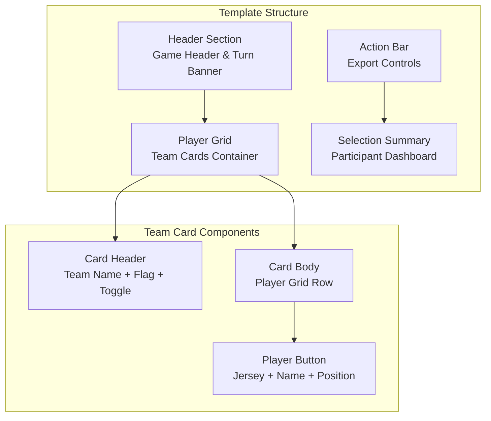
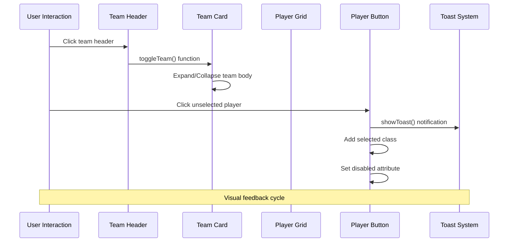
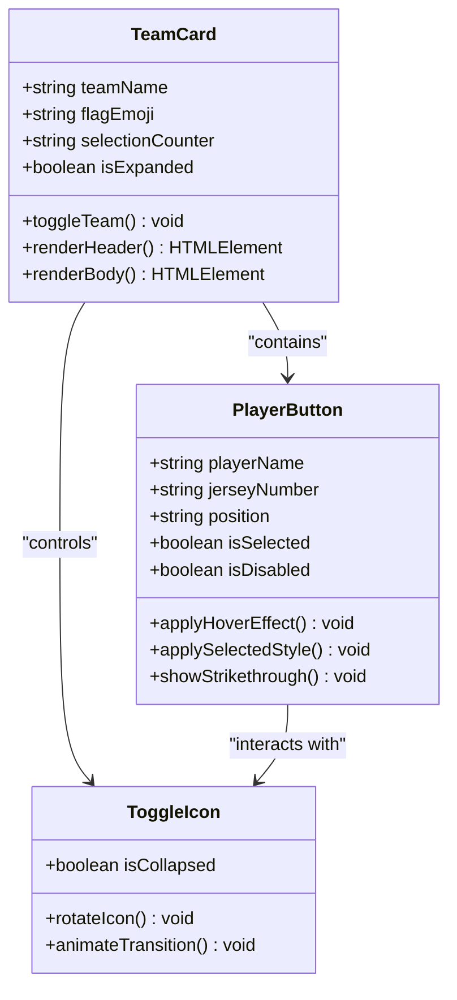
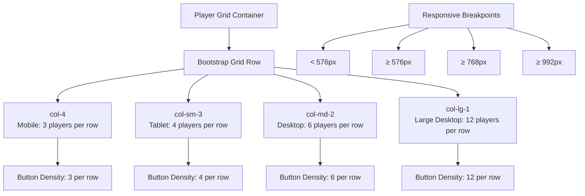
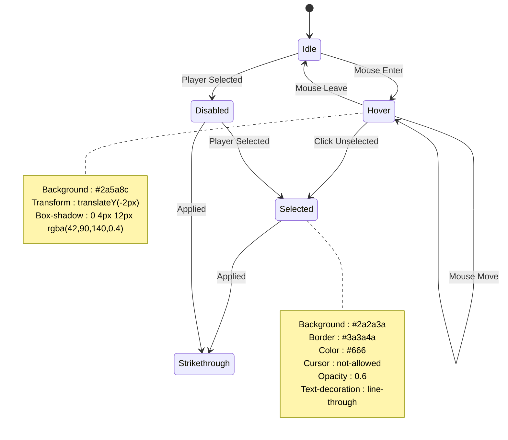
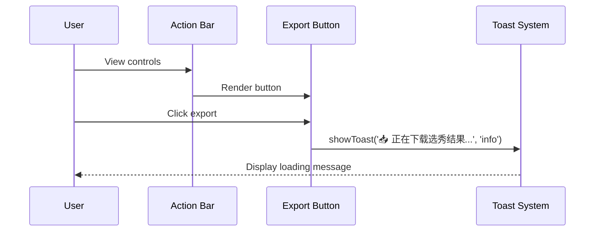
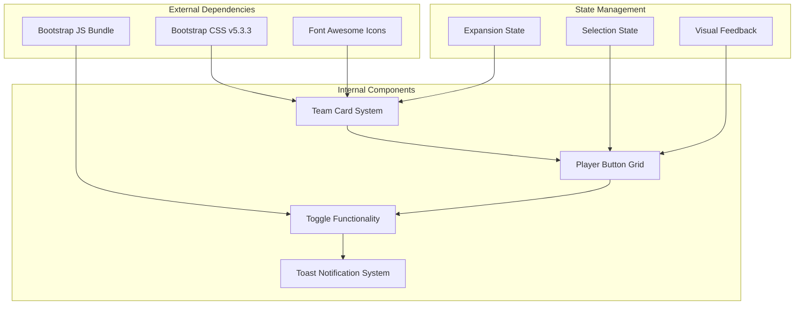

# Player Grid System

<cite>
**Referenced Files in This Document**
- [prototype.html](file://templates/prototype.html)
</cite>

## Table of Contents
1. [Introduction](#introduction)
2. [Project Structure](#project-structure)
3. [Core Components](#core-components)
4. [Architecture Overview](#architecture-overview)
5. [Detailed Component Analysis](#detailed-component-analysis)
6. [Dependency Analysis](#dependency-analysis)
7. [Performance Considerations](#performance-considerations)
8. [Troubleshooting Guide](#troubleshooting-guide)
9. [Conclusion](#conclusion)

## Introduction
This document provides comprehensive technical documentation for the player grid system implemented in the World Cup draft application. The system features a responsive team card layout with expandable/collapsible sections, a player selection interface with visual feedback states, and a summary dashboard for tracking selections across multiple participants. The implementation leverages Bootstrap for responsive grid behavior and custom CSS for theming and interactive states.

## Project Structure
The player grid system is implemented within a single HTML template file that contains all necessary markup, styling, and JavaScript functionality. The structure follows a modular approach with distinct sections for header information, team cards, player grids, action controls, and selection summaries.



**Diagram sources**
- [prototype.html:217-238](file://templates/prototype.html#L217-L238)
- [prototype.html:242-445](file://templates/prototype.html#L242-L445)
- [prototype.html:447-490](file://templates/prototype.html#L447-L490)

**Section sources**
- [prototype.html:1-548](file://templates/prototype.html#L1-L548)

## Core Components
The player grid system consists of several interconnected components that work together to provide a seamless user experience for team selection and player management.

### Team Card System
Each team is represented by a collapsible card component containing team metadata, player buttons, and interactive elements. The card system provides visual hierarchy and organization for multiple teams within the draft interface.

### Responsive Player Grid
The player selection interface utilizes Bootstrap's grid system with responsive column classes that adapt to different screen sizes. The grid ensures optimal player button density across mobile, tablet, and desktop displays.

### Visual Feedback States
The system implements comprehensive visual feedback through hover effects, selection styling, disabled states, and strikethrough text for selected players. These states provide clear user guidance and prevent accidental re-selection.

**Section sources**
- [prototype.html:55-133](file://templates/prototype.html#L55-L133)
- [prototype.html:242-445](file://templates/prototype.html#L242-L445)

## Architecture Overview
The player grid system follows a client-side architecture pattern with embedded JavaScript functionality. The system is designed as a self-contained module that can be easily integrated into larger applications.



**Diagram sources**
- [prototype.html:497-544](file://templates/prototype.html#L497-L544)

## Detailed Component Analysis

### Team Card Structure and Expansion Control
The team card system provides an expandable/collapsible interface controlled by the `toggleTeam` function. Each card consists of a header section with team information and a body containing the player grid.



**Diagram sources**
- [prototype.html:244-444](file://templates/prototype.html#L244-L444)
- [prototype.html:498-509](file://templates/prototype.html#L498-L509)

#### Team Card Header Elements
The team card header displays essential team information including:
- National flag emoji for visual identification
- Team name for clear labeling
- Selection counter showing picked vs total players
- Interactive toggle icon for expansion control

#### Player Button Design Specifications
Each player button contains three distinct elements arranged vertically:
- **Jersey Number**: Displayed in light blue (#8af) with bold weight and reduced font size
- **Player Name**: Center-aligned with medium font weight and appropriate sizing
- **Position Badge**: Small badge displaying position abbreviations (FW/MF) with subtle background

**Section sources**
- [prototype.html:74-88](file://templates/prototype.html#L74-L88)
- [prototype.html:114-132](file://templates/prototype.html#L114-L132)

### Responsive Grid System Implementation
The player grid utilizes Bootstrap's responsive grid system with carefully chosen column classes for optimal player button distribution across screen sizes.



**Diagram sources**
- [prototype.html:255-312](file://templates/prototype.html#L255-L312)
- [prototype.html:327-377](file://templates/prototype.html#L327-L377)

#### Column Class Strategy
The responsive column classes are strategically chosen to balance player visibility and interaction area:
- **Mobile (col-4)**: Three players per row for comfortable thumb interaction
- **Small Tablet (col-sm-3)**: Four players per row for improved density
- **Medium Desktop (col-md-2)**: Six players per row for maximum utilization
- **Large Desktop (col-lg-1)**: Twelve players per row for extensive team rosters

**Section sources**
- [prototype.html:255-443](file://templates/prototype.html#L255-L443)

### Visual Feedback State Management
The player selection interface implements comprehensive visual feedback states to guide user interactions and prevent errors.



**Diagram sources**
- [prototype.html:101-113](file://templates/prototype.html#L101-L113)

#### State Definitions and Behaviors
- **Idle State**: Default appearance with subtle hover effect
- **Hover State**: Enhanced visual feedback with elevation and shadow
- **Selected State**: Permanently disabled with strikethrough text
- **Disabled State**: Prevents re-selection with reduced opacity

#### Transition Effects
The system implements smooth transitions for state changes:
- **Hover Transitions**: 0.2-second duration for immediate feedback
- **Icon Rotation**: 0.3-second transition for toggle animations
- **Toast Animations**: Automatic dismissal after 3-second display period

**Section sources**
- [prototype.html:82-88](file://templates/prototype.html#L82-L88)
- [prototype.html:101-113](file://templates/prototype.html#L101-L113)

### Team Selection Counters and National Identification
The system provides real-time selection tracking through team counters and integrates national flag emojis for visual team identification.

```mermaid
graph LR
A[Team Card] --> B[Flag Emoji<br/>🇧🇷 🇦🇷 🇫🇷]
A --> C[Team Name<br/>巴西/阿根廷/France]
A --> D[Selection Counter<br/>(已选 X/Y)]
E[Selection Counter] --> F[Picked Players<br/>Current count]
E --> G[Total Players<br/>Maximum capacity]
H[Summary Dashboard] --> I[Participant Columns<br/>每参与者一列]
H --> J[Selection History<br/>按轮次显示]
H --> K[Current Pick Highlight<br/>金黄色标识]
```

**Diagram sources**
- [prototype.html:247-250](file://templates/prototype.html#L247-L250)
- [prototype.html:319-322](file://templates/prototype.html#L319-L322)
- [prototype.html:460-482](file://templates/prototype.html#L460-L482)

#### Counter Implementation Details
The selection counters dynamically update to reflect current team composition:
- **Format**: "(已选 X/Y)" where X is selected players and Y is total team roster
- **Placement**: Positioned within team header alongside flag and name
- **Real-time Updates**: Automatically adjust as players are selected

#### Flag Emoji Integration
National team identification uses Unicode regional indicator emojis:
- **Brazil**: 🇧🇷 (Brazil)
- **Argentina**: 🇦🇷 (Argentina)  
- **France**: 🇫🇷 (France)
- **Portugal**: 🇵🇹 (Portugal)
- **Spain**: 🇪🇸 (Spain)

**Section sources**
- [prototype.html:247-250](file://templates/prototype.html#L247-L250)
- [prototype.html:319-322](file://templates/prototype.html#L319-L322)
- [prototype.html:464-468](file://templates/prototype.html#L464-L468)

### Action Bar and Export Functionality
The system includes a dedicated action bar for administrative controls and export capabilities.



**Diagram sources**
- [prototype.html:447-450](file://templates/prototype.html#L447-L450)
- [prototype.html:538-541](file://templates/prototype.html#L538-L541)

**Section sources**
- [prototype.html:447-450](file://templates/prototype.html#L447-L450)
- [prototype.html:538-541](file://templates/prototype.html#L538-L541)

## Dependency Analysis
The player grid system maintains loose coupling between components while ensuring cohesive functionality through shared state management and event handling.



**Diagram sources**
- [prototype.html:7](file://templates/prototype.html#L7)
- [prototype.html:544](file://templates/prototype.html#L544)

### Component Coupling Analysis
- **Team Card ↔ Player Grid**: Tight coupling through shared selection state
- **Toggle Function ↔ Team Card**: Direct DOM manipulation coupling
- **Toast System ↔ Player Buttons**: Event-driven coupling through click handlers
- **Responsive Grid ↔ Bootstrap**: Framework-level coupling for layout behavior

### State Synchronization
The system maintains state consistency through:
- **Event-driven updates**: Immediate state changes on user interactions
- **DOM attribute synchronization**: Consistent class and attribute updates
- **Visual feedback loops**: Real-time state representation through styling

**Section sources**
- [prototype.html:497-544](file://templates/prototype.html#L497-L544)

## Performance Considerations
The player grid system is optimized for performance through efficient DOM manipulation and minimal JavaScript overhead.

### Rendering Optimizations
- **CSS Transitions**: Hardware-accelerated animations for smooth state changes
- **Selective DOM Updates**: Targeted element modifications rather than full re-renders
- **Event Delegation**: Efficient event handling through querySelectorAll patterns

### Memory Management
- **Toast Cleanup**: Automatic removal of toast notifications after display period
- **Event Listener Management**: Single registration pattern prevents memory leaks
- **State Cleanup**: Proper class removal and attribute restoration

### Responsive Performance
- **Bootstrap Grid**: Optimized CSS grid system for cross-browser compatibility
- **Media Query Optimization**: Efficient breakpoint handling for different screen sizes
- **Touch-Friendly Design**: Appropriate sizing for mobile device interaction

## Troubleshooting Guide
Common issues and solutions for the player grid system:

### Team Card Expansion Issues
**Problem**: Team cards fail to expand or collapse
**Solution**: Verify `toggleTeam` function is properly bound to card headers and DOM elements exist

### Player Button State Problems
**Problem**: Selected players remain clickable or don't show strikethrough
**Solution**: Check CSS specificity for `.player-btn.selected` and ensure proper class application order

### Responsive Grid Malfunctions
**Problem**: Player buttons don't resize appropriately across screen sizes
**Solution**: Verify Bootstrap column classes are correctly applied and CSS media queries are functioning

### Visual Feedback Not Working
**Problem**: Hover effects or state changes aren't visible
**Solution**: Check CSS hover selectors and ensure proper transition timing values

**Section sources**
- [prototype.html:498-509](file://templates/prototype.html#L498-L509)
- [prototype.html:101-113](file://templates/prototype.html#L101-L113)

## Conclusion
The player grid system provides a robust, responsive, and visually appealing interface for team selection in the World Cup draft application. The implementation successfully balances functionality with aesthetics through careful use of Bootstrap's responsive grid system, thoughtful visual feedback states, and intuitive user interaction patterns. The modular architecture ensures maintainability while the comprehensive state management provides reliable user experience across different devices and interaction scenarios.