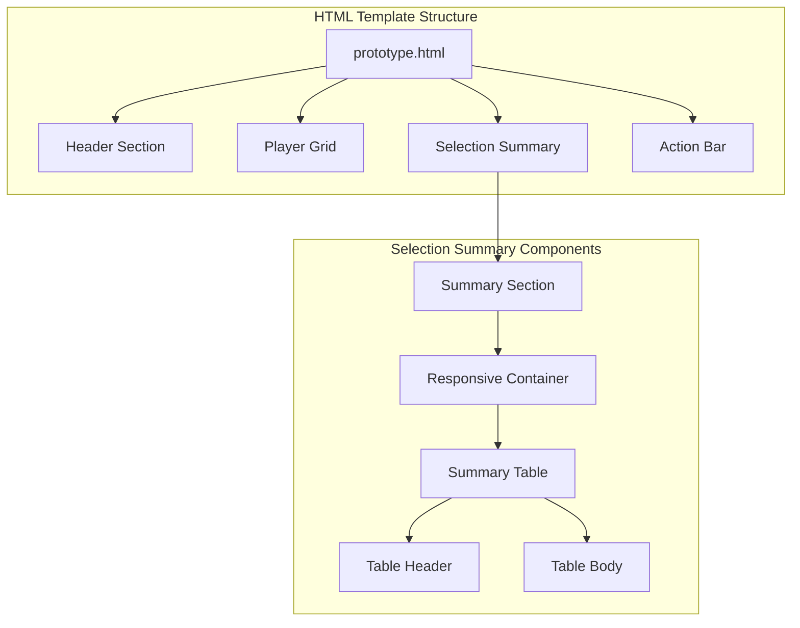
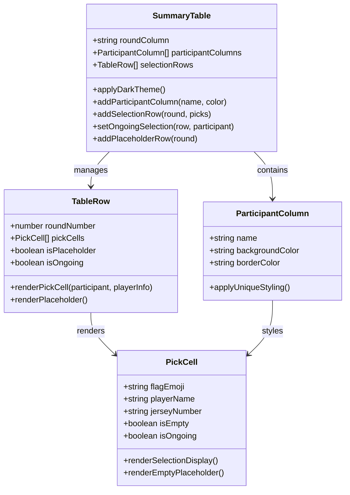
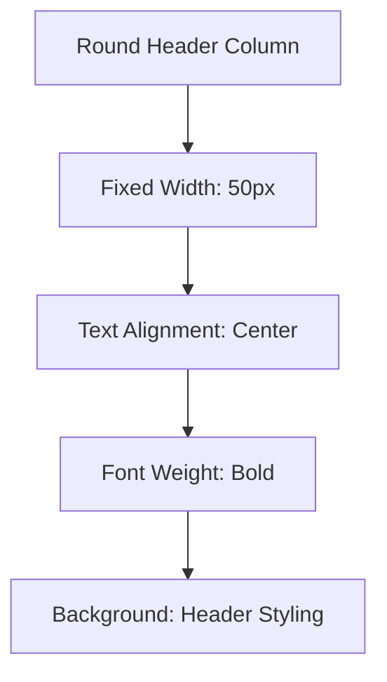
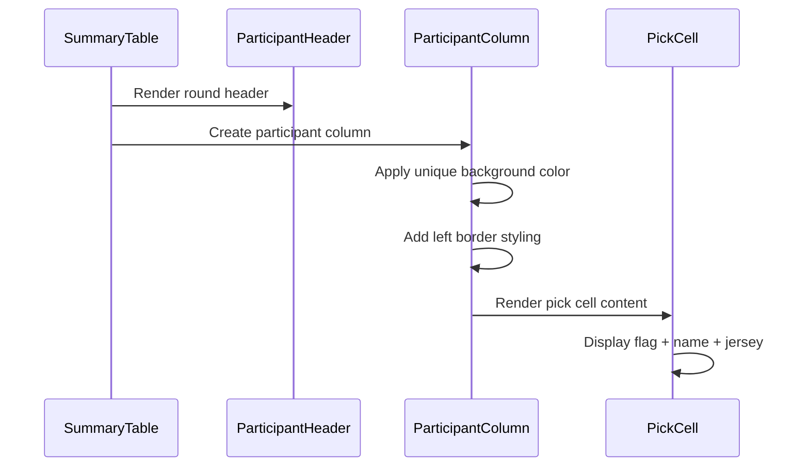
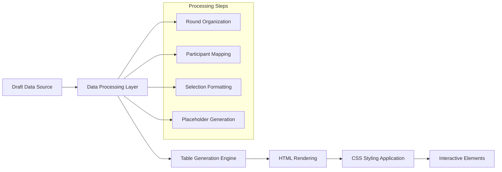
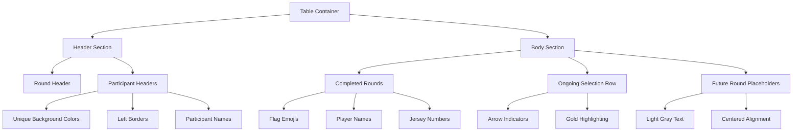
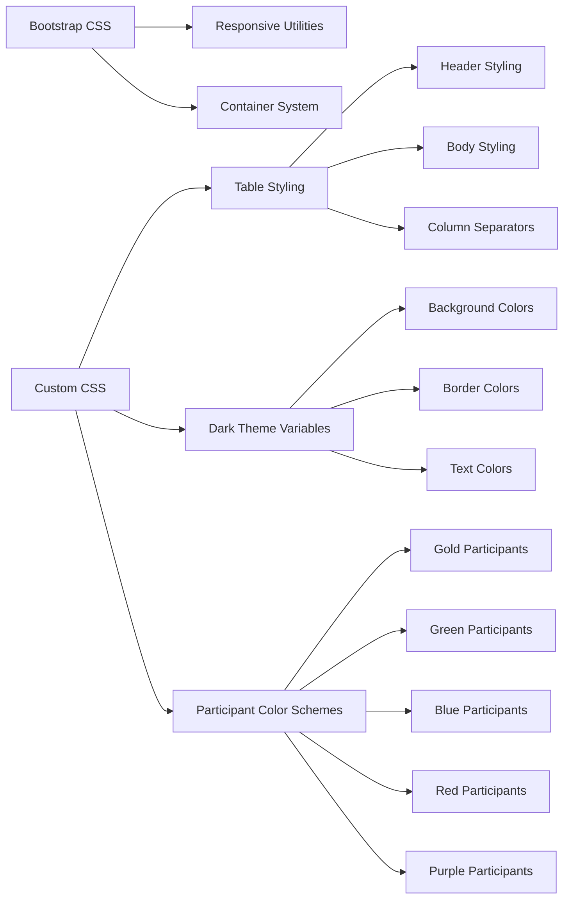

# Selection Summary Table

<cite>
**Referenced Files in This Document**
- [prototype.html](file://templates/prototype.html)
</cite>

## Table of Contents
1. [Introduction](#introduction)
2. [Project Structure](#project-structure)
3. [Core Components](#core-components)
4. [Architecture Overview](#architecture-overview)
5. [Detailed Component Analysis](#detailed-component-analysis)
6. [Dependency Analysis](#dependency-analysis)
7. [Performance Considerations](#performance-considerations)
8. [Troubleshooting Guide](#troubleshooting-guide)
9. [Conclusion](#conclusion)

## Introduction
This document provides comprehensive documentation for the selection summary table that displays multi-participant selection results in the World Cup draft application. The table presents round-by-round selections across multiple participants with distinct visual styling, responsive design, and interactive elements.

## Project Structure
The selection summary table is implemented within a larger HTML template that includes player selection interface, team cards, and various UI components. The table is part of the overall draft management system.



**Diagram sources**
- [prototype.html:447-485](file://templates/prototype.html#L447-L485)

**Section sources**
- [prototype.html:1-548](file://templates/prototype.html#L1-L548)

## Core Components
The selection summary table consists of several key components that work together to present draft results effectively:

### Table Structure
- **Round Header Column**: Dedicated "轮次" (Round) column with fixed width
- **Participant Columns**: Separate columns for each participant with unique styling
- **Selection Display Format**: Flag emoji + player name + jersey number
- **Visual Indicators**: Arrow symbols for ongoing selections
- **Placeholder Rows**: Special rows for future rounds

### Styling System
- **Dark Theme Integration**: Uses CSS custom properties for consistent theming
- **Color Coding**: Unique background colors for each participant
- **Border System**: Left borders separate participant columns
- **Hover Effects**: Subtle row highlighting on interaction
- **Responsive Design**: Horizontal scrolling for small screens

**Section sources**
- [prototype.html:447-485](file://templates/prototype.html#L447-L485)
- [prototype.html:134-178](file://templates/prototype.html#L134-L178)

## Architecture Overview
The selection summary table follows a structured approach to display multi-participant draft results with clear visual separation and intuitive presentation.



**Diagram sources**
- [prototype.html:447-485](file://templates/prototype.html#L447-L485)
- [prototype.html:134-178](file://templates/prototype.html#L134-L178)

## Detailed Component Analysis

### Round Header Column
The leftmost column displays the round numbers with a fixed width of 50 pixels. This column serves as the primary identifier for each selection round.



**Diagram sources**
- [prototype.html:454](file://templates/prototype.html#L454)

**Section sources**
- [prototype.html:452-461](file://templates/prototype.html#L452-L461)

### Participant Column System
Each participant has a dedicated column with unique visual characteristics:

#### Color Coding Implementation
- **张三**: Gold/Amber background (`rgba(255,215,0,0.08)`)
- **李四**: Green background (`rgba(0,255,0,0.05)`)
- **王五**: Blue background (`rgba(0,150,255,0.05)`)
- **赵六**: Red background (`rgba(255,100,100,0.05)`)
- **陈七**: Purple background (`rgba(200,100,255,0.05)`)

#### Border System
- Left border separates participant columns from each other
- Border color matches the dark theme's accent color
- Creates clear visual boundaries between participants



**Diagram sources**
- [prototype.html:455-459](file://templates/prototype.html#L455-L459)
- [prototype.html:169-171](file://templates/prototype.html#L169-L171)

**Section sources**
- [prototype.html:455-459](file://templates/prototype.html#L455-L459)
- [prototype.html:169-171](file://templates/prototype.html#L169-L171)

### Selection Display Format
Each pick cell follows a standardized format that combines visual and textual elements:

#### Display Structure
- **Flag Emoji**: Country flag representing the player's nationality
- **Player Name**: Full name of the selected player
- **Jersey Number**: Player's jersey number in "#XX" format

#### Example Format
```
🇧🇷 内马尔 #10
```

#### Ongoing Selection Indicator
- Special arrow symbol (`←`) indicates the current participant's turn
- Gold color highlighting for visual emphasis
- Clear indication of active selection process

**Section sources**
- [prototype.html:465-477](file://templates/prototype.html#L465-L477)
- [prototype.html:475](file://templates/prototype.html#L475)

### Placeholder System
The table includes special placeholder rows for future rounds:

#### Placeholder Types
- **Full Row Placeholders**: Span all participant columns
- **Centered Text**: "— 后续轮次等待选择 —" for upcoming rounds
- **Simple Placeholders**: Single dash ("—") for empty future rounds

#### Styling Features
- Light gray color (`#444`) for subtle appearance
- Centered text alignment for readability
- Full-width spanning for proper layout

**Section sources**
- [prototype.html:479-481](file://templates/prototype.html#L479-L481)
- [prototype.html:176-178](file://templates/prototype.html#L176-L178)

### Responsive Design Implementation
The table adapts to different screen sizes through Bootstrap's responsive utilities:

#### Mobile Responsiveness
- **Horizontal Scrolling**: Container allows horizontal panning on small screens
- **Reduced Font Sizes**: Smaller text for better mobile readability
- **Flexible Layout**: Maintains functionality across device sizes

#### Media Query Details
- Breakpoint: 576px (mobile devices)
- Font size reduction: From 0.8rem to 0.7rem
- Optimized touch targets for mobile interaction

**Section sources**
- [prototype.html:450](file://templates/prototype.html#L450)
- [prototype.html:207-212](file://templates/prototype.html#L207-L212)

### Dark Theme Integration
The table seamlessly integrates with the application's dark theme:

#### Color System
- **Background**: Dark blue card background (`var(--card-bg)`)
- **Accent Colors**: Gold highlights for headers and active elements
- **Border Colors**: Subtle gray borders matching the theme
- **Text Colors**: High contrast white text for readability

#### Consistent Styling
- CSS custom properties for theme flexibility
- Uniform border styling across all components
- Consistent hover effects and transitions

**Section sources**
- [prototype.html:9-14](file://templates/prototype.html#L9-L14)
- [prototype.html:135-141](file://templates/prototype.html#L135-L141)
- [prototype.html:153-168](file://templates/prototype.html#L153-L168)

## Architecture Overview

### Data Flow Architecture
The selection summary table processes and displays draft results through a structured data flow:



**Diagram sources**
- [prototype.html:447-485](file://templates/prototype.html#L447-L485)

### Visual Hierarchy System
The table establishes clear visual hierarchy through strategic styling:



**Diagram sources**
- [prototype.html:447-485](file://templates/prototype.html#L447-L485)
- [prototype.html:134-178](file://templates/prototype.html#L134-L178)

## Detailed Component Analysis

### Hover Effects and Interactions
The table implements subtle hover effects for enhanced user experience:

#### Row Hover Behavior
- **Background Fade**: Light background change on hover
- **Smooth Transition**: CSS transitions for smooth effect
- **Consistent Styling**: Matches overall dark theme aesthetic

#### Interactive Elements
- **Clickable Rows**: Visual feedback on interaction
- **Focus States**: Proper keyboard navigation support
- **Touch Targets**: Adequate sizing for mobile devices

**Section sources**
- [prototype.html:166-168](file://templates/prototype.html#L166-L168)

### Empty Pick Handling
The system provides clear visual indicators for empty selections:

#### Empty State Styling
- **Subtle Color**: Light gray text for low visual impact
- **Consistent Format**: Maintains table structure despite missing data
- **Placeholder Text**: Dash characters for standardization

#### Future Round Management
- **Automatic Generation**: Placeholder rows for upcoming rounds
- **Dynamic Content**: Updates based on draft progress
- **Visual Continuity**: Maintains table layout consistency

**Section sources**
- [prototype.html:476-477](file://templates/prototype.html#L476-L477)
- [prototype.html:176-178](file://templates/prototype.html#L176-L178)

### Performance Considerations
The table implementation prioritizes performance and responsiveness:

#### Efficient Rendering
- **Minimal DOM Manipulation**: Static table structure reduces reflows
- **CSS-Based Styling**: Leverages browser optimization for visual effects
- **Optimized Selectors**: Specific class targeting minimizes style calculations

#### Memory Efficiency
- **Static Content**: Fixed table structure prevents dynamic element creation
- **Reusable Styles**: Shared CSS classes reduce memory footprint
- **Event Delegation**: Minimal event listeners for interactive elements

## Dependency Analysis

### CSS Dependencies
The selection summary table relies on several CSS frameworks and custom styles:



**Diagram sources**
- [prototype.html:7](file://templates/prototype.html#L7)
- [prototype.html:9-14](file://templates/prototype.html#L9-L14)
- [prototype.html:134-178](file://templates/prototype.html#L134-L178)

### JavaScript Integration
The table works alongside JavaScript functionality for enhanced interactivity:

#### Event Handling
- **Toggle Functionality**: Team expansion/collapse controls
- **Toast Notifications**: User feedback system
- **Export Capabilities**: Data export functionality

#### Dynamic Updates
- **Real-time Status**: Live draft progress updates
- **Interactive Elements**: Clickable components throughout interface
- **Responsive Behavior**: Adaptive layout changes

**Section sources**
- [prototype.html:497-548](file://templates/prototype.html#L497-L548)

## Performance Considerations
The selection summary table is designed for optimal performance across different devices and screen sizes:

### Rendering Optimization
- **Static Layout**: Fixed table structure prevents layout thrashing
- **Efficient Selectors**: Targeted CSS classes minimize rendering overhead
- **Minimal JavaScript**: Pure CSS hover effects reduce script execution

### Mobile Performance
- **Hardware Acceleration**: CSS transforms for smooth animations
- **Touch Optimization**: Properly sized interactive areas
- **Responsive Scaling**: Adaptive font sizes for different devices

## Troubleshooting Guide

### Common Issues and Solutions

#### Color Visibility Problems
**Issue**: Participant colors appear too subtle on certain displays
**Solution**: Adjust alpha transparency values in CSS variables
- Check background color definitions in custom properties
- Verify contrast ratios meet accessibility standards

#### Text Overflow on Mobile
**Issue**: Player names and country flags cause horizontal overflow
**Solution**: Implement text truncation or adjust font sizes
- Use CSS `text-overflow: ellipsis` for long names
- Consider responsive font scaling for smaller screens

#### Hover Effect Not Working
**Issue**: Row hover states not activating properly
**Solution**: Verify CSS specificity and z-index values
- Check for conflicting styles in parent containers
- Ensure proper CSS cascade order

#### Placeholder Display Issues
**Issue**: Placeholder rows not appearing correctly
**Solution**: Verify CSS class application and media queries
- Confirm `empty-pick` class is properly applied
- Check responsive breakpoint configurations

**Section sources**
- [prototype.html:176-178](file://templates/prototype.html#L176-L178)
- [prototype.html:207-212](file://templates/prototype.html#L207-L212)

## Conclusion
The selection summary table provides an elegant solution for displaying multi-participant draft results with comprehensive visual indicators, responsive design, and seamless dark theme integration. The implementation balances functionality with aesthetics, providing clear visual cues while maintaining excellent performance across different devices and screen sizes.

The table's modular design allows for easy maintenance and potential enhancements, while the consistent styling system ensures visual coherence with the broader application interface. The thoughtful use of color coding, placeholder systems, and responsive behavior creates an intuitive user experience for managing complex draft scenarios.