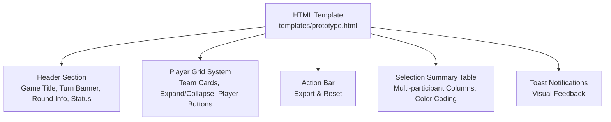
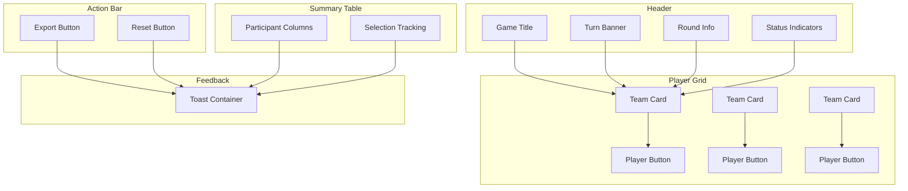
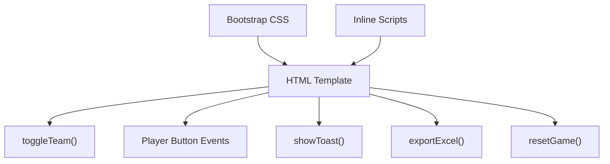

# User Interface Guide

<cite>
**Referenced Files in This Document**
- [prototype.html](file://templates/prototype.html)
</cite>

## Table of Contents
1. [Introduction](#introduction)
2. [Project Structure](#project-structure)
3. [Core Components](#core-components)
4. [Architecture Overview](#architecture-overview)
5. [Detailed Component Analysis](#detailed-component-analysis)
6. [Dependency Analysis](#dependency-analysis)
7. [Performance Considerations](#performance-considerations)
8. [Troubleshooting Guide](#troubleshooting-guide)
9. [Conclusion](#conclusion)

## Introduction
This user interface guide documents the interactive elements of WorldCupGame, focusing on the header, player grid system, action bar, selection summary table, responsive design behavior, visual feedback mechanisms, and accessibility features. It provides a structured walkthrough of each UI component, including how they work together and how users interact with them.

## Project Structure
The project consists of a single HTML prototype that defines the layout, styles, and basic interactivity for the game interface. It uses Bootstrap for responsive grid and components, and vanilla JavaScript for interactive behaviors such as expanding/collapsing team sections, selecting players, exporting results, resetting the game, and displaying toast notifications.

**Diagram sources**
- [prototype.html](file://templates/prototype.html)

**Section sources**
- [prototype.html](file://templates/prototype.html)

## Core Components
This section outlines the primary UI components and their roles within the interface.

- Header Section: Displays the game title, current player turn, round information, and game status indicators.
- Player Grid System: Presents teams as collapsible cards containing player buttons with jersey numbers, names, and position badges.
- Action Bar: Provides export and reset actions for managing the game state.
- Selection Summary Table: Tracks picks across multiple participants with color-coded backgrounds and selection states.
- Toast Notifications: Delivers contextual feedback for user actions.

**Section sources**
- [prototype.html](file://templates/prototype.html)

## Architecture Overview
The interface is built around a single HTML page with embedded styles and scripts. The structure separates concerns into distinct sections: header, player grid, action bar, and summary table. Interactions are handled via lightweight JavaScript functions that manipulate DOM elements and display notifications.

**Diagram sources**
- [prototype.html](file://templates/prototype.html)

## Detailed Component Analysis

### Header Section
The header displays:
- Game title prominently at the top.
- Turn banner indicating whose turn it is and prompting selection.
- Round information showing current round, pick order, and total selections.
- Game status indicators including a live badge and total rounds count.

Interactions:
- The turn banner pulses gently to draw attention to the active player’s turn.
- Round information updates dynamically to reflect progress.

Accessibility:
- Uses semantic headings and clear text for screen readers.
- Color contrast ensures readability against dark backgrounds.

Responsive behavior:
- On small screens, typography scales down for better legibility.

**Section sources**
- [prototype.html](file://templates/prototype.html)

### Player Grid System
The grid organizes teams as collapsible cards:
- Team card header shows flag, team name, and selection progress.
- Clicking the header toggles the visibility of the player list.
- Each player button displays:
  - Jersey number
  - Player name
  - Position badge
- Visual states:
  - Hover effects highlight buttons.
  - Selected/disabled buttons indicate unavailable choices.
  - Toggle icons rotate to reflect expanded/collapsed states.

Interactions:
- Expand/collapse team sections via click on the card header.
- Select a player by clicking an available button; selection applies visual styling and disables the button.
- Toast notifications confirm successful selections.

Accessibility:
- Buttons are focusable and actionable via keyboard.
- Disabled states communicate unavailability clearly.

Responsive behavior:
- Player buttons stack and resize across breakpoints for optimal touch targets.

**Section sources**
- [prototype.html](file://templates/prototype.html)

### Action Bar
The action bar hosts two primary controls:
- Export button triggers a simulated export process and shows an informational toast.
- Reset button prompts confirmation and clears selections, showing a warning toast.

Interactions:
- Export simulates downloading results.
- Reset confirms destructive action and clears selections.

Accessibility:
- Buttons are labeled and styled for clear identification.
- Confirmation dialog ensures user intent for reset.

**Section sources**
- [prototype.html](file://templates/prototype.html)

### Selection Summary Table
The summary table tracks picks across multiple participants:
- Participant columns are color-coded for easy identification.
- Each row corresponds to a round; cells show the chosen player or placeholder for future picks.
- Visual cues:
  - Selected participant column highlights with a subtle background.
  - “Selected” indicator appears in the active participant’s cell during their turn.
  - Empty picks are represented with neutral placeholders.

Interactions:
- No interactive elements; designed for passive observation of selections.

Accessibility:
- Clear borders and spacing improve readability.
- Color coding complements text labels.

**Section sources**
- [prototype.html](file://templates/prototype.html)

### Visual Feedback Mechanisms
Toast notifications provide contextual feedback:
- Success toasts confirm selections.
- Info toasts indicate ongoing operations like exports.
- Warning toasts inform about resets.

Interactions:
- Toasts appear in a fixed container and auto-dismiss after a short delay.
- Dismissible via close button.

Accessibility:
- Role attributes and proper markup ensure assistive technologies announce messages.

**Section sources**
- [prototype.html](file://templates/prototype.html)

### Responsive Design Behavior
The interface adapts to various screen sizes:
- Typography and spacing adjust for smaller screens.
- Player buttons reflow into compact layouts across breakpoints.
- Summary table remains readable with reduced font sizes.

Media queries:
- Adjust font sizes and paddings for mobile devices.

**Section sources**
- [prototype.html](file://templates/prototype.html)

### Accessibility Features and Keyboard Navigation
- Semantic HTML and clear labeling for interactive elements.
- Focus states and keyboard operability for buttons and headers.
- Sufficient color contrast and readable fonts.
- Toasts include role attributes for screen reader announcements.

Best practices:
- Ensure focus order follows visual layout.
- Provide visible focus indicators.
- Avoid relying solely on color to convey meaning.

**Section sources**
- [prototype.html](file://templates/prototype.html)

## Dependency Analysis
The prototype relies on external resources and internal scripts:
- Bootstrap CSS for responsive grid and component styling.
- Inline JavaScript for interactive behaviors:
  - Team expansion/collapse
  - Player selection
  - Toast notifications
  - Export and reset actions

**Diagram sources**
- [prototype.html](file://templates/prototype.html)

**Section sources**
- [prototype.html](file://templates/prototype.html)

## Performance Considerations
- Lightweight DOM manipulation for team toggling and button states.
- Minimal script overhead with inline functions.
- Efficient toast creation and cleanup to prevent memory leaks.
- CSS animations are minimal and hardware-accelerated where possible.

Recommendations:
- Debounce frequent UI updates if extending functionality.
- Consider virtualizing large lists if the number of teams/players grows significantly.

[No sources needed since this section provides general guidance]

## Troubleshooting Guide
Common issues and resolutions:
- Team sections not toggling:
  - Verify the header click handler is attached and the target element exists.
- Player buttons not responding:
  - Ensure event listeners are bound to non-selected/disabled buttons.
- Toasts not appearing:
  - Confirm the toast container exists and is appended to the DOM.
- Export/Reset actions not triggering:
  - Check that the respective functions are defined and invoked on button clicks.

Debugging tips:
- Use browser dev tools to inspect event listeners and DOM state.
- Temporarily log messages in functions to trace execution flow.

**Section sources**
- [prototype.html](file://templates/prototype.html)

## Conclusion
WorldCupGame’s interface combines a clean header, an intuitive player grid with expandable sections, a functional action bar, and a color-coded selection summary. With responsive design and thoughtful visual feedback, it delivers a cohesive user experience. The included accessibility features and keyboard navigation support ensure inclusivity across diverse users.