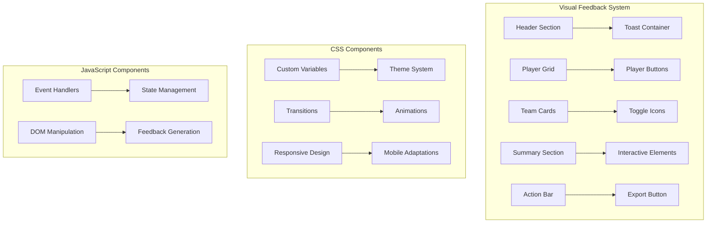
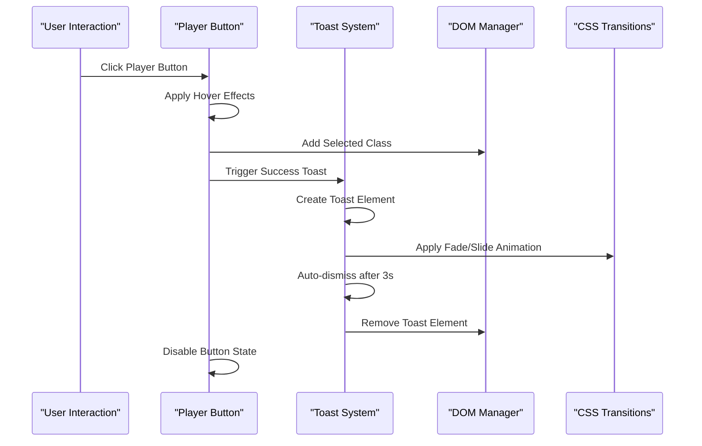
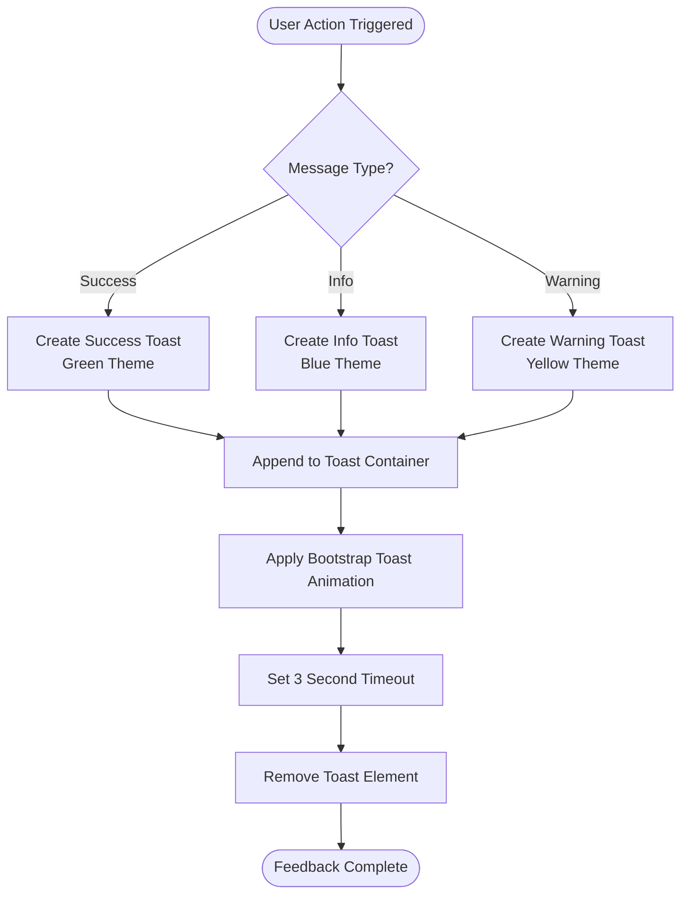
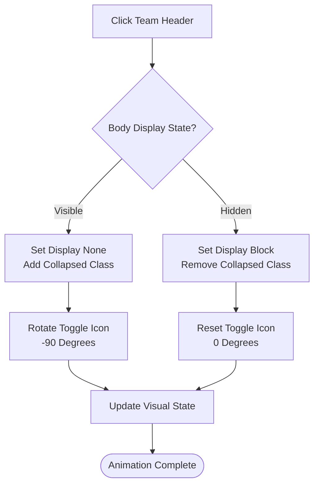
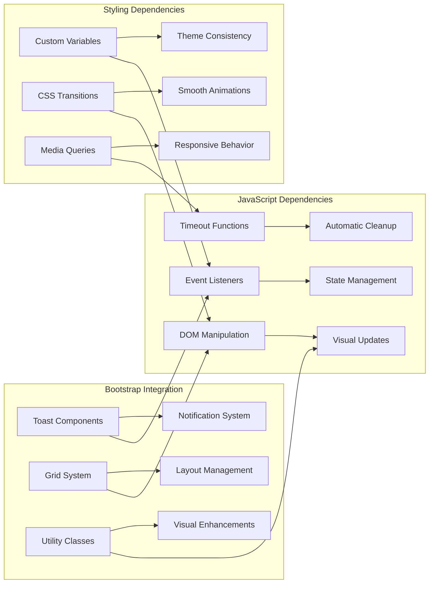

# Visual Feedback System

<cite>
**Referenced Files in This Document**
- [prototype.html](file://templates/prototype.html)
</cite>

## Table of Contents
1. [Introduction](#introduction)
2. [Project Structure](#project-structure)
3. [Core Components](#core-components)
4. [Architecture Overview](#architecture-overview)
5. [Detailed Component Analysis](#detailed-component-analysis)
6. [Dependency Analysis](#dependency-analysis)
7. [Performance Considerations](#performance-considerations)
8. [Troubleshooting Guide](#troubleshooting-guide)
9. [Conclusion](#conclusion)

## Introduction

The visual feedback system in this World Cup Player Selection interface provides comprehensive user interaction feedback through multiple mechanisms. This system encompasses toast notifications for contextual messaging, player button selection states with hover effects, team card toggle animations, and responsive design adaptations for mobile devices. The implementation leverages modern CSS transitions, Bootstrap integration, and JavaScript event handling to create an engaging and intuitive user experience.

## Project Structure

The visual feedback system is implemented within a single HTML template file that contains all necessary styling, markup, and JavaScript functionality. The structure follows a modular approach with distinct sections for different feedback mechanisms.



**Diagram sources**
- [prototype.html:8-213](file://templates/prototype.html#L8-L213)
- [prototype.html:497-544](file://templates/prototype.html#L497-L544)

**Section sources**
- [prototype.html:1-548](file://templates/prototype.html#L1-L548)

## Core Components

The visual feedback system consists of four primary components that work together to provide comprehensive user interaction feedback:

### Theme System and Custom Variables
The system utilizes a custom CSS variable-based theming approach with consistent color palettes for grass green, gold accents, dark backgrounds, and card backgrounds. These variables ensure visual consistency across all interface elements.

### Toast Notification System
A sophisticated toast notification system provides contextual feedback for user actions with automatic dismissal after 3 seconds and support for different message types (success, info, warning).

### Interactive Player Button States
Player selection buttons implement comprehensive state management including hover effects, active selection styling, disabled states, and visual feedback mechanisms.

### Team Card Toggle Animations
Team cards feature smooth expand/collapse animations with rotating toggle icons and responsive layout adjustments.

**Section sources**
- [prototype.html:8-213](file://templates/prototype.html#L8-L213)
- [prototype.html:497-544](file://templates/prototype.html#L497-L544)

## Architecture Overview

The visual feedback system architecture integrates CSS animations, JavaScript event handling, and Bootstrap components to create a cohesive user experience.



**Diagram sources**
- [prototype.html:511-520](file://templates/prototype.html#L511-L520)
- [prototype.html:522-536](file://templates/prototype.html#L522-L536)

## Detailed Component Analysis

### Toast Notification System

The toast notification system provides contextual feedback for user actions with automatic dismissal and multiple message types.

#### Implementation Details
- **Container Placement**: Fixed-position container in the top-right corner
- **Message Types**: Support for success, info, warning, and error states
- **Automatic Dismissal**: 3-second timeout with programmatic removal
- **Bootstrap Integration**: Leverages Bootstrap's toast component classes

#### Visual Feedback Mechanisms
- **Success Messages**: Green-themed notifications for successful actions
- **Info Messages**: Blue-themed notifications for informational feedback
- **Warning Messages**: Yellow/orange-themed notifications for warnings
- **Auto-dismissal**: Smooth fade-out animation with element removal



**Diagram sources**
- [prototype.html:522-536](file://templates/prototype.html#L522-L536)

**Section sources**
- [prototype.html:200-205](file://templates/prototype.html#L200-L205)
- [prototype.html:522-536](file://templates/prototype.html#L522-L536)

### Player Button Selection States

The player button system implements comprehensive state management with hover effects, selection styling, and disabled states.

#### State Classes and Behaviors
- **Default State**: Standard blue-gray styling with subtle hover effects
- **Hover State**: Enhanced visual feedback with elevation and shadow effects
- **Selected State**: Disabled styling with reduced opacity and strikethrough
- **Disabled State**: Non-interactive state with visual indicators

#### Visual Effects and Transitions
- **Hover Effects**: Background color change, slight elevation, and shadow enhancement
- **Selection Feedback**: Immediate visual indication of chosen players
- **Transition Duration**: 0.2-second smooth transitions for all state changes
- **Responsive Sizing**: Adaptive button sizing for different screen sizes

```mermaid
stateDiagram-v2
[*] --> Default
Default --> Hover : Mouse Enter
Hover --> Default : Mouse Leave
Default --> Selected : Click & Select
Selected --> Disabled : Mark as Used
Disabled --> Selected : Reset State
Selected --> Default : Reset Selection
state Default {
[*] --> Normal
Normal --> Hover : Hover Effect
}
state Hover {
[*] --> Elevated
Elevated --> Shadow : Add Shadow
}
state Selected {
[*] --> Disabled
Disabled --> Strikethrough : Apply Text Decoration
}
```

**Diagram sources**
- [prototype.html:89-133](file://templates/prototype.html#L89-L133)

**Section sources**
- [prototype.html:89-133](file://templates/prototype.html#L89-L133)
- [prototype.html:511-520](file://templates/prototype.html#L511-L520)

### Team Card Toggle Animations

The team card system provides smooth expand/collapse functionality with animated toggle icons and responsive content layouts.

#### Animation Features
- **Icon Rotation**: 90-degree rotation animation for toggle indicators
- **Content Visibility**: Smooth display/none transitions for card bodies
- **Transition Duration**: 0.3-second duration for all animations
- **Responsive Layout**: Flexible grid system adapting to screen size

#### Toggle State Management
- **Expanded State**: Display card body with rotated toggle icon
- **Collapsed State**: Hide card body with standard toggle icon
- **Icon Transformation**: CSS transform for smooth rotation animation



**Diagram sources**
- [prototype.html:498-509](file://templates/prototype.html#L498-L509)
- [prototype.html:82-88](file://templates/prototype.html#L82-L88)

**Section sources**
- [prototype.html:498-509](file://templates/prototype.html#L498-L509)
- [prototype.html:82-88](file://templates/prototype.html#L82-L88)

### Responsive Design Adaptations

The interface implements comprehensive responsive design patterns optimized for mobile device interaction.

#### Mobile-Specific Optimizations
- **Touch-Friendly Sizing**: Reduced font sizes and button dimensions for mobile screens
- **Adaptive Typography**: Font scaling based on viewport width
- **Flexible Grid System**: Bootstrap grid classes for optimal content arrangement
- **Touch Target Optimization**: Sufficient spacing for finger-friendly interactions

#### Breakpoint-Specific Adjustments
- **Small Screens (<576px)**: Compact typography and reduced spacing
- **Medium Screens (≥576px)**: Standard desktop layouts with enhanced details
- **Large Screens (≥768px)**: Full-width layouts with expanded content areas

**Section sources**
- [prototype.html:207-212](file://templates/prototype.html#L207-L212)

### CSS Animations and Transitions

The system employs various CSS animations and transitions to enhance the user experience through smooth visual feedback.

#### Keyframe Animations
- **Pulse Animation**: Subtle scaling animation for turn banners
- **Rotation Transitions**: Smooth 90-degree rotations for toggle icons
- **Elevation Effects**: Transform-based hover animations for buttons

#### Transition Properties
- **Duration Consistency**: 0.2 to 0.3 seconds for all interactive transitions
- **Timing Functions**: Smooth easing for natural movement perception
- **Property Coverage**: Comprehensive transitions for color, transform, and opacity

**Section sources**
- [prototype.html:44-48](file://templates/prototype.html#L44-L48)
- [prototype.html:83](file://templates/prototype.html#L83)
- [prototype.html:96](file://templates/prototype.html#L96)

## Dependency Analysis

The visual feedback system demonstrates clear separation of concerns with well-defined dependencies between components.



**Diagram sources**
- [prototype.html:8-213](file://templates/prototype.html#L8-L213)
- [prototype.html:497-544](file://templates/prototype.html#L497-L544)

**Section sources**
- [prototype.html:8-213](file://templates/prototype.html#L8-L213)
- [prototype.html:497-544](file://templates/prototype.html#L497-L544)

## Performance Considerations

The visual feedback system is designed with performance optimization in mind through several key strategies:

### Efficient Animation Implementation
- **Hardware Acceleration**: Transform-based animations leverage GPU acceleration
- **Minimal DOM Manipulation**: Batched updates reduce reflow operations
- **CSS Transitions**: Preferred over JavaScript animations for performance

### Memory Management
- **Automatic Cleanup**: Toast elements are automatically removed after display
- **Event Listener Management**: Proper cleanup prevents memory leaks
- **Efficient State Tracking**: Minimal state storage reduces memory overhead

### Responsive Performance
- **Viewport-Based Calculations**: Dynamic sizing reduces layout thrashing
- **Optimized Media Queries**: Strategic breakpoint usage minimizes recalculations
- **Touch Event Optimization**: Efficient touch handling for mobile devices

## Troubleshooting Guide

Common issues and solutions for the visual feedback system:

### Toast Notifications Not Appearing
- **Check Container Existence**: Verify `.toast-container` element exists in DOM
- **Verify Bootstrap Integration**: Ensure Bootstrap CSS/JS are loaded
- **Inspect Console Errors**: Look for JavaScript errors preventing toast creation

### Button State Issues
- **Class Conflicts**: Check for conflicting CSS classes affecting button states
- **Event Handler Problems**: Verify click event listeners are properly attached
- **CSS Specificity**: Ensure hover and selected states aren't overridden

### Animation Performance Problems
- **Hardware Acceleration**: Verify transforms are supported by target browsers
- **Animation Duration**: Check for excessively long transition durations
- **DOM Complexity**: Reduce nested elements in animated containers

### Responsive Design Issues
- **Viewport Meta Tag**: Ensure proper viewport configuration for mobile
- **Breakpoint Testing**: Test at various screen sizes and orientations
- **Touch Target Size**: Verify buttons meet minimum touch interaction requirements

**Section sources**
- [prototype.html:522-536](file://templates/prototype.html#L522-L536)
- [prototype.html:511-520](file://templates/prototype.html#L511-L520)

## Conclusion

The visual feedback system successfully implements comprehensive user interaction feedback through a well-architected combination of CSS animations, JavaScript event handling, and Bootstrap integration. The system provides immediate and meaningful feedback for user actions while maintaining excellent performance and responsive behavior across all device types.

Key strengths of the implementation include:
- **Consistent Theming**: Custom CSS variables ensure visual coherence
- **Smooth Animations**: Well-timed transitions enhance user experience
- **Responsive Design**: Mobile-first approach with adaptive layouts
- **Performance Optimization**: Hardware-accelerated animations and efficient state management

The modular architecture allows for easy maintenance and extension, making it suitable for future enhancements and additional feedback mechanisms.